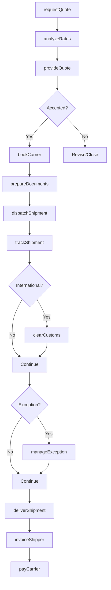
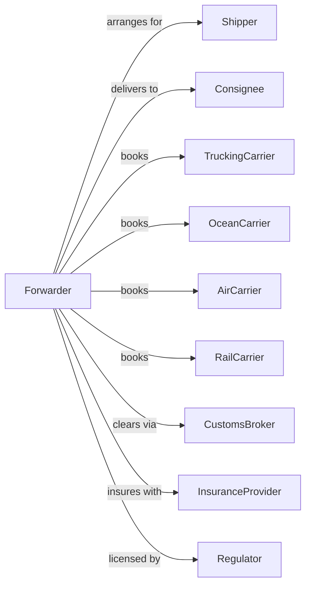

# Freight Transportation Arrangement

> Business-as-Code definition for freight forwarding and brokerage operations. Models the complete logistics intermediary lifecycle from quote through carrier selection, booking, documentation, and tracking.

## Overview

Freight transportation arrangement involves acting as intermediary between shippers and carriers, arranging multimodal transportation, preparing documentation, and managing customs clearance. This definition exposes actions for managing freight quotes, carrier selection, booking, tracking, and logistics coordination across all transport modes.

## Actors

| Actor | Description |
|-------|-------------|
| Shipper | Company needing freight transport |
| Consignee | Recipient of shipped goods |
| TruckingCarrier | Motor carrier for ground transport |
| OceanCarrier | Steamship line for ocean freight |
| AirCarrier | Airline for air cargo |
| RailCarrier | Railroad for rail transport |
| CustomsBroker | Handles import/export clearance |
| InsuranceProvider | Covers cargo liability |
| Regulator | FMC, DOT licensing |

## Roles

| Role | Description |
|------|-------------|
| FreightBroker | Matches shippers with carriers |
| FreightForwarder | Arranges multimodal shipments |
| CustomsAgent | Prepares customs documentation |
| RateAnalyst | Prices and quotes shipments |
| LoadPlanner | Coordinates capacity and routing |
| DocumentSpecialist | Prepares shipping paperwork |
| TrackingCoordinator | Monitors shipment status |
| AccountManager | Manages customer relationships |
| CarrierVetter | Qualifies motor carriers by checking insurance, authority, and safety records |

## Entities

| Entity | Description |
|--------|-------------|
| Shipment | Freight movement being arranged |
| Quote | Price proposal for transportation |
| Booking | Confirmed carrier reservation |
| BillOfLading | Shipping contract document |
| CustomsEntry | Import/export declaration |
| Carrier | Transportation provider |
| Rate | Price for lane and service |
| Tracking | Shipment location updates |
| Invoice | Charges for services |
| Margin | Profit on arranged freight |

## Actions

| Action | Description |
|--------|-------------|
| requestQuote | Get pricing for shipment |
| analyzeRates | Compare carrier options |
| provideQuote | Send rate to shipper |
| bookCarrier | Reserve capacity with carrier |
| prepareDocuments | Create shipping paperwork |
| dispatchShipment | Coordinate pickup |
| trackShipment | Monitor freight location |
| clearCustoms | File import/export entries |
| manageException | Handle delays and issues |
| deliverShipment | Confirm delivery completion |
| invoiceShipper | Bill for services |
| payCarrier | Remit to transport provider |
| auditFreight | Verify carrier charges |
| reportAnalytics | Provide shipping insights |

## Events

| Event | Description |
|-------|-------------|
| quoteRequested | Pricing inquiry received |
| ratesAnalyzed | Carrier options compared |
| quoteProvided | Rate sent to customer |
| carrierBooked | Capacity reserved |
| documentsReady | Paperwork completed |
| shipmentDispatched | Pickup coordinated |
| shipmentTracked | Location updated |
| customsCleared | Entry approved |
| exceptionManaged | Issue resolved |
| shipmentDelivered | Delivery confirmed |
| shipperInvoiced | Bill sent |
| carrierPaid | Provider remitted |
| freightAudited | Charges verified |
| analyticsReported | Insights delivered |

## Searches

| Search | Description |
|--------|-------------|
| getRates | Get carrier pricing by lane |
| trackShipment | Query shipment location |
| findCarriers | List carriers by service |
| getQuote | Retrieve quote details |
| getBooking | View booking information |
| getDocuments | Download shipping paperwork |
| getInvoices | List customer invoices |
| getCustomsStatus | Check clearance progress |

## Workflow



## Actor Relationships



## Usage

### Calling Actions

```typescript
import { arrangeFreightTransportation } from '@headlessly/arrange-freight-transportation'

const broker = arrangeFreightTransportation()

// Request quote for multimodal shipment
const quote = await broker.requestQuote({
  origin: { city: 'Shanghai', country: 'CN' },
  destination: { city: 'Chicago', state: 'IL', country: 'US' },
  cargo: {
    description: 'Auto parts',
    weight: 15000,
    volume: 45,
    containers: 2,
    containerType: '40HC'
  },
  incoterms: 'CIF',
  serviceLevel: 'standard'
})

// Book with selected carrier
const booking = await broker.bookCarrier({
  quoteId: quote.id,
  carrierId: quote.options[0].carrierId,
  shipper: { name: 'China Auto Parts', contact: 'export@cap.cn' },
  consignee: { name: 'US Auto Assembly', contact: 'import@usaa.com' }
})

// Track shipment in transit
const tracking = await broker.trackShipment({
  bookingId: booking.id
})
```

### Event-Driven Automation

```typescript
// Auto-book preferred carrier
broker.quoteRequested(async ({ quoteId, shipperId }) => {
  const shipper = await broker.getShipperPreferences({ shipperId })
  const rates = await broker.analyzeRates({ quoteId })

  const preferred = rates.find(r =>
    shipper.preferredCarriers.includes(r.carrierId)
  )

  if (preferred && preferred.rate <= shipper.maxRate) {
    await broker.bookCarrier({
      quoteId,
      carrierId: preferred.carrierId,
      autoBook: true
    })
  }
})

// Auto-manage customs holds
broker.customsHold(async ({ bookingId, holdReason }) => {
  await broker.manageException({
    bookingId,
    type: 'customs-hold',
    reason: holdReason
  })

  await sendAlert({
    to: 'customs-team@broker.com',
    subject: `Customs Hold: ${bookingId}`,
    body: `Shipment held at customs. Reason: ${holdReason}`
  })
})

// Auto-invoice on delivery
broker.shipmentDelivered(async ({ bookingId, deliveryTime }) => {
  const booking = await broker.getBooking({ bookingId })

  await broker.invoiceShipper({
    bookingId,
    amount: booking.charges.total,
    dueDate: addDays(new Date(), 30)
  })

  await broker.payCarrier({
    bookingId,
    carrierId: booking.carrierId,
    amount: booking.carrierCost
  })
})
```
