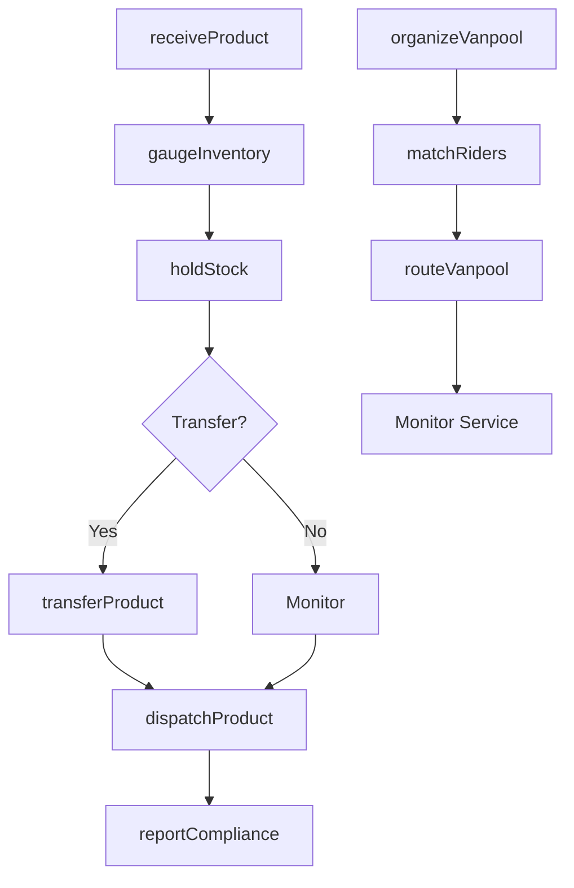
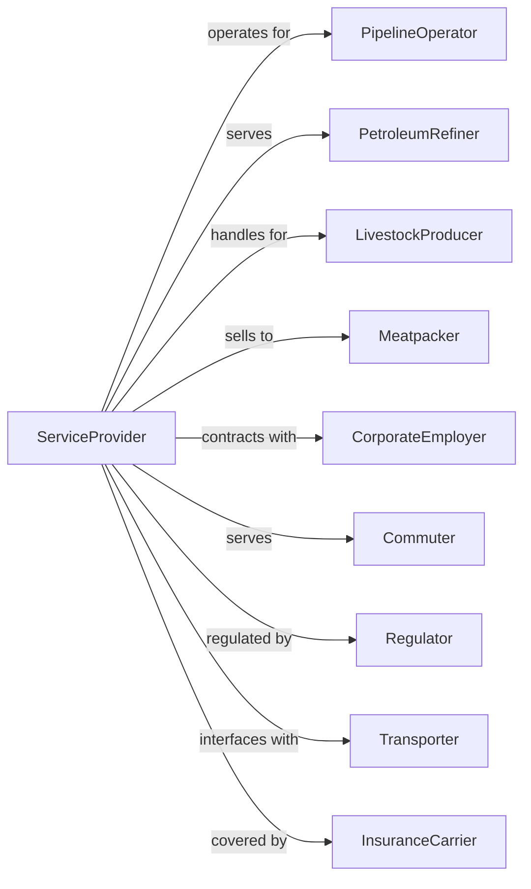

# All Other Support Activities for Transportation

> Business-as-Code definition for miscellaneous transportation support services. Models the complete service lifecycle for pipeline terminal operations, livestock stockyards, vanpool coordination, and other specialized transportation support not classified elsewhere.

## Overview

All other support activities for transportation comprises establishments providing services such as independent pipeline terminal facilities, livestock stockyards for holding and transfer, vanpool and carpool coordination services, and other specialized transportation support not elsewhere classified. This definition exposes actions for managing terminal operations, livestock handling, shared transportation coordination, and ancillary support services.

## Actors

| Actor | Description |
|-------|-------------|
| PipelineOperator | Owner of pipelines using terminal |
| PetroleumRefiner | Ships products through terminals |
| LivestockProducer | Rancher or farmer using stockyard |
| Meatpacker | Buys livestock from stockyards |
| CorporateEmployer | Sponsors vanpool programs |
| Commuter | Participates in shared transportation |
| Regulator | Oversees terminal and stockyard operations |
| Transporter | Trucking company using facilities |
| InsuranceCarrier | Provides coverage for operations |

## Roles

| Role | Description |
|------|-------------|
| TerminalOperator | Manages pipeline terminal facility |
| YardMaster | Oversees stockyard operations |
| VanpoolCoordinator | Organizes shared commute services |
| TankGauger | Measures and certifies tank contents |
| PenRider | Manages livestock in holding pens |
| DispatchAgent | Schedules facility usage |
| SafetyOfficer | Ensures regulatory compliance |
| MaintenanceTech | Maintains facility equipment |

## Entities

| Entity | Description |
|--------|-------------|
| Terminal | Pipeline storage and transfer facility |
| StorageTank | Container for petroleum products |
| Stockyard | Livestock holding and transfer facility |
| Pen | Enclosed area for holding livestock |
| Vanpool | Shared commuter vehicle service |
| TransferTicket | Document for product custody change |
| LivestockManifest | Record of animals at facility |
| Meter | Device measuring product flow |
| LoadingRack | Equipment for product transfer |
| RideSchedule | Vanpool pickup and route plan |

## Actions

| Action | Description |
|--------|-------------|
| receiveProduct | Accept petroleum into terminal |
| transferProduct | Move product between tanks or pipelines |
| dispatchProduct | Release product for outbound shipment |
| gaugeInventory | Measure tank contents |
| receiveStock | Accept livestock into stockyard |
| holdStock | Maintain livestock in pens |
| transferStock | Move livestock to buyer transport |
| organizeVanpool | Establish shared commute service |
| matchRiders | Connect commuters with vanpools |
| routeVanpool | Plan pickup and dropoff schedule |
| maintainFacility | Perform equipment upkeep |
| reportCompliance | Submit regulatory documentation |

## Events

| Event | Description |
|-------|-------------|
| productReceived | Petroleum accepted at terminal |
| productTransferred | Product moved successfully |
| productDispatched | Outbound shipment released |
| inventoryGauged | Tank contents measured |
| stockReceived | Livestock accepted at yard |
| stockHeld | Animals in holding pens |
| stockTransferred | Livestock moved to transport |
| vanpoolOrganized | Shared service established |
| ridersMatched | Commuters connected |
| vanpoolRouted | Schedule planned |
| facilityMaintained | Equipment serviced |
| complianceReported | Documentation submitted |

## Searches

| Search | Description |
|--------|-------------|
| getTerminalInventory | Check tank levels and capacity |
| getStockyardCapacity | View available pen space |
| getVanpoolRoutes | List active shared commute routes |
| getTransferSchedule | View planned product movements |
| getLivestockManifest | List animals at facility |
| getRiderDemand | Check commuter interest by area |
| getMaintenanceSchedule | View planned service work |
| getComplianceStatus | Check regulatory filing status |

## Workflow



## Actor Relationships



## Usage

### Calling Actions

```typescript
import { coordinateTransportationServices } from '@headlessly/coordinate-transportation-services'

const support = coordinateTransportationServices()

// Check terminal tank levels and capacity
const inventory = await support.getTerminalInventory({ terminal: 'gulf-coast-t1', product: 'jet-fuel' })

// View available vanpool routes
const routes = await support.getVanpoolRoutes({ region: 'metro-houston', status: 'active' })

// Receive petroleum product at terminal
const receipt = await support.receiveProduct({
  terminalId: 'TRM-GULF-01',
  pipelineId: 'PIPE-TX-2345',
  product: 'unleaded-gasoline',
  volume: 50000,
  grade: '87-octane'
})

// Organize corporate vanpool
const vanpool = await support.organizeVanpool({
  employer: 'Acme Corp',
  origin: 'Downtown Metro Station',
  destination: 'Industrial Park',
  capacity: 12,
  schedule: 'weekdays',
  departures: ['07:00', '17:30']
})

// Receive livestock at stockyard
const livestock = await support.receiveStock({
  producer: 'Johnson Ranch',
  headCount: 150,
  species: 'cattle',
  class: 'feeder',
  estimatedWeight: 700,
  holdDuration: 48
})
```

### Event-Driven Automation

```typescript
// Auto-gauge inventory after product receipt
support.productReceived(async ({ terminalId, tankId, volume }) => {
  await support.gaugeInventory({
    terminalId,
    tankId,
    certify: true
  })

  await notifyOperator({
    message: `Received ${volume} barrels at ${tankId}`
  })
})

// Auto-notify buyers when livestock arrives
support.stockReceived(async ({ stockyardId, headCount, species, class: livestockClass }) => {
  const interestedBuyers = await findBuyers({
    species,
    class: livestockClass,
    minQuantity: headCount
  })

  for (const buyer of interestedBuyers) {
    await notifyBuyer({
      buyer,
      stockyardId,
      headCount,
      availableDate: addHours(now(), 24)
    })
  }
})

// Auto-match riders to vanpools
support.vanpoolOrganized(async ({ vanpoolId, route, capacity }) => {
  const waitingRiders = await support.getRiderDemand({
    route: route.corridor,
    maxDistance: 2
  })

  for (const rider of waitingRiders.slice(0, capacity)) {
    await support.matchRiders({
      vanpoolId,
      riderId: rider.id,
      pickupLocation: rider.preferredPickup
    })
  }
})
```
