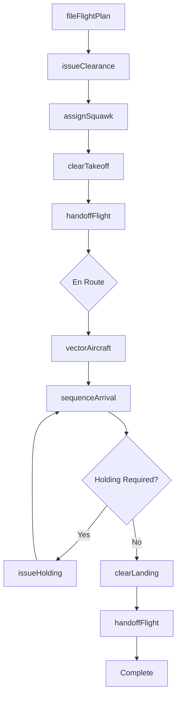
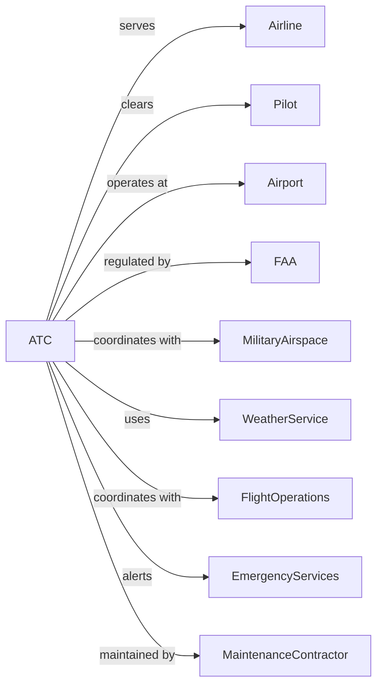

# Air Traffic Control

> Business-as-Code definition for air traffic control service operations. Models the complete flight management lifecycle from flight plan clearance through departure, en route navigation, approach sequencing, and landing coordination in controlled airspace.

## Overview

Air traffic control involves providing services to regulate the flow of air traffic for safety and efficiency. Services include tower control at airports, approach and departure control, and en route center operations. This definition exposes actions for managing flight clearances, radar separation, runway assignments, and coordination between aircraft and ground operations.

## Actors

| Actor | Description |
|-------|-------------|
| Airline | Air carrier operating scheduled flights |
| Pilot | Aircraft commander receiving clearances |
| Airport | Facility requiring traffic control services |
| FAA | Federal Aviation Administration oversight |
| MilitaryAirspace | Coordinates restricted area access |
| WeatherService | Provides aviation meteorological data |
| FlightOperations | Airline dispatch and operations |
| EmergencyServices | Responds to aircraft emergencies |
| MaintenanceContractor | Services ATC equipment |

## Roles

| Role | Description |
|------|-------------|
| TowerController | Manages airport surface and local traffic |
| ApproachController | Sequences arriving aircraft |
| DepartureController | Manages departing traffic |
| CenterController | Handles en route traffic |
| FlowController | Manages traffic flow initiatives |
| Supervisor | Oversees ATC operations |
| TrafficManagement | Coordinates sector capacity |
| SystemsSpecialist | Maintains radar and communications |

## Entities

| Entity | Description |
|--------|-------------|
| Flight | Aircraft with filed flight plan |
| FlightPlan | Route and altitude filed by pilot |
| Clearance | Authorization for specific action |
| Sector | Defined airspace under controller authority |
| Runway | Active landing or takeoff surface |
| Radar | Surveillance system tracking aircraft |
| Transponder | Aircraft identification equipment |
| ATIS | Automatic terminal information service |
| NOTAM | Notice to air missions |
| Separation | Required distance between aircraft |

## Actions

| Action | Description |
|--------|-------------|
| fileFlightPlan | Submit route and altitude request |
| issueClearance | Authorize flight action |
| assignSquawk | Provide transponder code |
| sequenceArrival | Order arriving aircraft |
| clearTakeoff | Authorize departure |
| handoffFlight | Transfer control to next sector |
| vectorAircraft | Provide heading for spacing |
| clearLanding | Authorize runway landing |
| issueHolding | Assign holding pattern |
| declareEmergency | Initiate emergency response |
| coordinateMilitary | Clear restricted airspace |
| updateATIS | Broadcast terminal information |

## Events

| Event | Description |
|-------|-------------|
| flightPlanFiled | Route submitted |
| clearanceIssued | Authorization given |
| squawkAssigned | Transponder code set |
| arrivalSequenced | Landing order determined |
| takeoffCleared | Departure authorized |
| flightHandedOff | Control transferred |
| aircraftVectored | Heading assigned |
| landingCleared | Runway authorized |
| holdingIssued | Pattern assigned |
| emergencyDeclared | Priority handling initiated |
| militaryCoordinated | Restricted area cleared |
| atisUpdated | Information broadcast |

## Searches

| Search | Description |
|--------|-------------|
| getFlightPlan | Retrieve filed route and altitude |
| trackFlight | Get real-time position and altitude |
| getSectorTraffic | List aircraft in sector |
| getRunwayStatus | Check active runways and conditions |
| getWeather | Retrieve aviation weather |
| getDelays | List ground stops and flow control |
| getNOTAMs | Get notices to air missions |
| getAirspaceStatus | Check restricted area activation |

## Workflow



## Actor Relationships



## Usage

### Calling Actions

```typescript
import { supportAirTraffic } from '@headlessly/support-air-traffic'

const atc = supportAirTraffic()

// File flight plan
const plan = await atc.fileFlightPlan({
  callsign: 'UAL123',
  aircraft: 'B738',
  departure: 'KORD',
  destination: 'KLAX',
  route: 'CMSKY Q64 DBQ J94 DEN J80 GUP',
  altitude: 'FL350',
  departureTime: '1400Z'
})

// Get current sector traffic
const traffic = await atc.getSectorTraffic({
  sector: 'ZAU-91',
  includeAltitudes: true
})

// Track specific flight
const position = await atc.trackFlight({
  callsign: 'UAL123'
})
```

### Event-Driven Automation

```typescript
// Auto-issue holding during congestion
atc.arrivalSequenced(async ({ airport, arrivalRate, demand }) => {
  if (demand > arrivalRate * 1.2) {
    const excessFlights = demand - arrivalRate

    await atc.initiateFlowControl({
      airport,
      holdingPattern: getAvailableHold(airport),
      expectedDelay: calculateDelay(excessFlights)
    })
  }
})

// Auto-coordinate emergency response
atc.emergencyDeclared(async ({ callsign, emergencyType, position }) => {
  // Clear path for emergency aircraft
  await atc.prioritizeAircraft({ callsign, priority: 'emergency' })

  // Alert emergency services
  await atc.notifyEmergencyServices({
    airport: getNearestAirport(position),
    aircraftType: getAircraftType(callsign),
    emergencyType,
    eta: calculateETA(position)
  })
})

// Auto-update ATIS on condition change
atc.weatherUpdated(async ({ airport, ceiling, visibility, wind }) => {
  await atc.updateATIS({
    airport,
    ceiling,
    visibility,
    wind,
    runways: determineActiveRunways(wind),
    approaches: determineAvailableApproaches(ceiling, visibility)
  })
})
```
