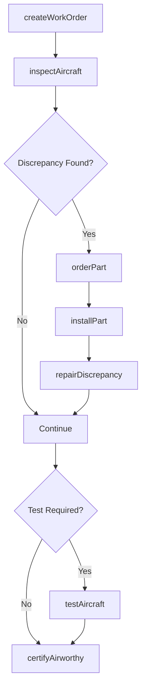
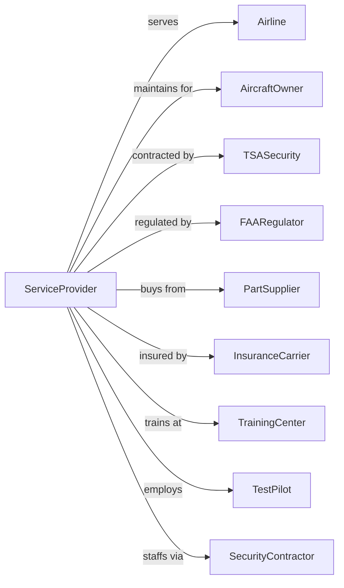

# Other Support Activities for Air Transportation

> Business-as-Code definition for specialized air transportation support services. Models the complete aviation services lifecycle including aircraft maintenance, passenger security screening, flight testing, and aviation consulting services.

## Overview

Other support activities for air transportation comprises specialized services including aircraft line maintenance and repair, passenger and baggage screening, aircraft testing, aviation consulting, and flight crew services. This definition exposes actions for managing maintenance work orders, security screening operations, test flight coordination, and aviation support services.

## Actors

| Actor | Description |
|-------|-------------|
| Airline | Air carrier requiring support services |
| AircraftOwner | Private or corporate aircraft operator |
| TSASecurity | Transportation Security Administration |
| FAARegulator | Federal Aviation Administration oversight |
| PartSupplier | Provides aircraft parts and components |
| InsuranceCarrier | Aviation liability coverage |
| TrainingCenter | Provides crew and maintenance training |
| TestPilot | Conducts aircraft test flights |
| SecurityContractor | Provides screening personnel |

## Roles

| Role | Description |
|------|-------------|
| LineMechanic | Performs aircraft maintenance |
| ScreeningOfficer | Conducts passenger and baggage screening |
| InspectorTech | Performs aircraft inspections |
| TestPilot | Flies aircraft test operations |
| QualityController | Ensures maintenance standards |
| SecuritySupervisor | Manages screening operations |
| AviationConsultant | Provides technical advisory services |
| DispatchCoordinator | Manages service scheduling |

## Entities

| Entity | Description |
|--------|-------------|
| Aircraft | Airplane requiring service |
| WorkOrder | Maintenance task assignment |
| Inspection | Aircraft condition assessment |
| TestFlight | Post-maintenance verification flight |
| Screening | Passenger or baggage security check |
| Part | Aircraft component or spare |
| Discrepancy | Identified maintenance issue |
| Certificate | FAA approval documentation |
| SecurityQueue | Passenger screening line |
| MaintenanceLog | Aircraft service history |

## Actions

| Action | Description |
|--------|-------------|
| createWorkOrder | Initiate maintenance task |
| inspectAircraft | Assess aircraft condition |
| repairDiscrepancy | Fix identified issue |
| orderPart | Request aircraft component |
| installPart | Mount component on aircraft |
| testAircraft | Conduct verification flight |
| certifyAirworthy | Issue maintenance release |
| screenPassenger | Conduct security check |
| screenBaggage | Inspect luggage contents |
| resolveAlarm | Investigate security alert |
| trainPersonnel | Provide certification training |
| consultClient | Deliver advisory services |

## Events

| Event | Description |
|-------|-------------|
| workOrderCreated | Maintenance task initiated |
| aircraftInspected | Condition assessed |
| discrepancyRepaired | Issue fixed |
| partOrdered | Component requested |
| partInstalled | Component mounted |
| aircraftTested | Verification completed |
| airworthyCertified | Release issued |
| passengerScreened | Security check completed |
| baggageScreened | Luggage inspected |
| alarmResolved | Alert investigated |
| personnelTrained | Certification completed |
| clientConsulted | Advisory delivered |
| discrepancyFound | Aircraft inspection issue identified |
| screeningStatsReported | Security screening statistics reported |

## Searches

| Search | Description |
|--------|-------------|
| getWorkOrders | List maintenance tasks |
| getAircraftStatus | Check maintenance status |
| findParts | Search component inventory |
| getScreeningStats | Review security throughput |
| getDiscrepancies | List open maintenance items |
| getCertifications | Check personnel qualifications |
| getTestFlights | List scheduled verifications |
| getSecurityAlerts | Review alarm history |

## Workflow



## Actor Relationships



## Usage

### Calling Actions

```typescript
import { coordinateAviationServices } from '@headlessly/coordinate-aviation-services'

const aviation = coordinateAviationServices()

// Create maintenance work order
const workOrder = await aviation.createWorkOrder({
  aircraftId: 'N12345',
  type: 'line-maintenance',
  task: 'engine-oil-change',
  priority: 'routine',
  requestedBy: 'UAL-MX'
})

// Check aircraft maintenance status
const status = await aviation.getAircraftStatus({
  tailNumber: 'N12345'
})

// Get security screening throughput
const stats = await aviation.getScreeningStats({
  checkpoint: 'TSA-A',
  date: 'today',
  interval: 'hourly'
})
```

### Event-Driven Automation

```typescript
// Auto-order parts for discrepancies
aviation.discrepancyFound(async ({ aircraftId, partNumber, severity }) => {
  if (severity === 'grounding') {
    const part = await aviation.findParts({ partNumber, inStock: true })

    if (part) {
      await aviation.orderPart({
        partNumber,
        aircraftId,
        expedite: true
      })
    } else {
      await createAOGRequest({
        aircraftId,
        partNumber,
        urgency: 'critical'
      })
    }
  }
})

// Auto-schedule test flight after major maintenance
aviation.partInstalled(async ({ workOrderId, partType }) => {
  if (requiresTestFlight(partType)) {
    const workOrder = await aviation.getWorkOrders({ id: workOrderId })

    await aviation.scheduleTestFlight({
      aircraftId: workOrder.aircraftId,
      reason: `post-install-${partType}`,
      pilotRequirements: getTestPilotReqs(partType)
    })
  }
})

// Auto-adjust staffing for screening volumes
aviation.screeningStatsReported(async ({ checkpoint, waitTime, forecast }) => {
  if (waitTime > 15 || forecast.nextHour > capacity * 0.9) {
    await requestAdditionalStaff({
      checkpoint,
      additionalLanes: calculateNeededLanes(forecast),
      duration: '2h'
    })
  }
})
```
