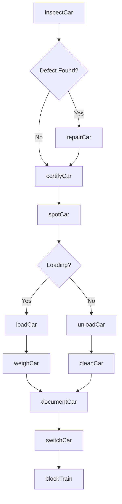
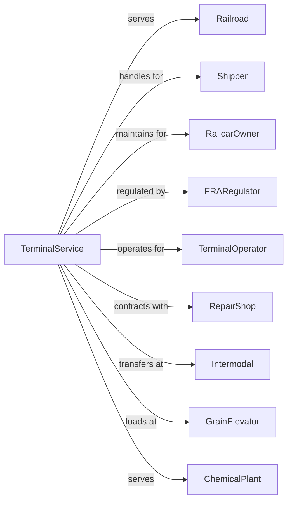

# Support Activities for Rail Transportation

> Business-as-Code definition for rail transportation support services. Models the complete rail support lifecycle including railcar servicing, car loading and unloading, terminal operations, and freight car switching services.

## Overview

Support activities for rail transportation comprises establishments providing specialized services for railroads including railcar servicing and routine repair, loading and unloading of rail cars, and operating independent rail terminals. This definition exposes actions for managing railcar maintenance, terminal operations, car spotting, and freight handling services.

## Actors

| Actor | Description |
|-------|-------------|
| Railroad | Class I, II, or III railroad carrier |
| Shipper | Company requiring rail freight service |
| RailcarOwner | Leasing company or private car owner |
| FRARegulator | Federal Railroad Administration oversight |
| TerminalOperator | Manages independent rail yard |
| RepairShop | Provides railcar maintenance |
| Intermodal | Container transfer facility |
| GrainElevator | Bulk loading facility |
| ChemicalPlant | Industrial shipper with rail access |

## Roles

| Role | Description |
|------|-------------|
| CarInspector | Examines railcars for defects |
| CarRepairman | Performs railcar maintenance |
| SwitchOperator | Moves cars within yard |
| LoadingCrew | Handles freight loading |
| Yardmaster | Coordinates terminal operations |
| ClerkAgent | Processes car documentation |
| CranOperator | Operates intermodal cranes |
| BrakemanHelper | Assists with car movements |

## Entities

| Entity | Description |
|--------|-------------|
| Railcar | Freight car requiring service |
| Terminal | Rail yard or interchange facility |
| Track | Rail line within terminal |
| Switch | Track device for routing cars |
| LoadingDock | Facility for freight transfer |
| Inspection | Car condition assessment |
| Repair | Maintenance work on railcar |
| Waybill | Car movement documentation |
| Consist | Group of cars moved together |
| Defect | Identified car problem |

## Actions

| Action | Description |
|--------|-------------|
| inspectCar | Examine railcar condition |
| repairCar | Fix identified defects |
| spotCar | Position car at loading location |
| loadCar | Transfer freight into car |
| unloadCar | Remove freight from car |
| switchCar | Move car within terminal |
| interchangeCar | Transfer car between railroads |
| blockTrain | Assemble cars for destination |
| cleanCar | Prepare car for next loading |
| documentCar | Process waybill and records |
| weighCar | Determine car gross weight |
| certifyCar | Approve car for movement |

## Events

| Event | Description |
|-------|-------------|
| carInspected | Condition assessed |
| carRepaired | Defects fixed |
| carSpotted | Positioned at dock |
| carLoaded | Freight transferred in |
| carUnloaded | Freight removed |
| carSwitched | Moved within yard |
| carInterchanged | Transferred to other railroad |
| trainBlocked | Cars assembled |
| carCleaned | Prepared for loading |
| carDocumented | Records processed |
| carWeighed | Weight recorded |
| carCertified | Approved for movement |

## Searches

| Search | Description |
|--------|-------------|
| findCars | Locate railcars in terminal |
| getCarStatus | Check car location and condition |
| getTrackCapacity | Review track availability |
| getLoadingSchedule | List scheduled car spots |
| getRepairQueue | View cars awaiting service |
| getInterchanges | List pending car transfers |
| getWeightTickets | Retrieve car weights |
| getDefects | List open car repairs |

## Workflow



## Actor Relationships



## Usage

### Calling Actions

```typescript
import { supportRailServices } from '@headlessly/support-rail-services'

const rail = supportRailServices()

// Spot car for loading
const spot = await rail.spotCar({
  carId: 'BNSF-123456',
  destination: 'Track-7-Dock-A',
  requestedTime: '08:00',
  commodity: 'grain'
})

// Get car status
const car = await rail.getCarStatus({
  carId: 'BNSF-123456'
})

// Find cars in terminal
const cars = await rail.findCars({
  terminal: 'chicago-yard',
  status: 'awaiting-loading'
})
```

### Event-Driven Automation

```typescript
// Auto-schedule repairs for defects
rail.carInspected(async ({ carId, defects }) => {
  for (const defect of defects) {
    if (defect.severity === 'bad-order') {
      await rail.scheduleRepair({
        carId,
        defectType: defect.type,
        priority: 'high',
        shopTrack: getAvailableShopTrack()
      })
    }
  }
})

// Auto-notify shipper of car placement
rail.carSpotted(async ({ carId, location, shipper }) => {
  await sendNotification({
    to: shipper.email,
    subject: 'Car Spotted for Loading',
    body: `Car ${carId} has been placed at ${location}. Please complete loading within 24 hours.`
  })
})

// Auto-process interchange
rail.carDocumented(async ({ carId, destination, connectingRailroad }) => {
  if (connectingRailroad) {
    await rail.interchangeCar({
      carId,
      toRailroad: connectingRailroad,
      interchangePoint: getInterchangePoint(destination),
      waybill: await rail.getWaybill({ carId })
    })
  }
})
```
