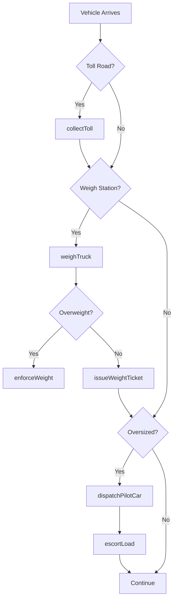
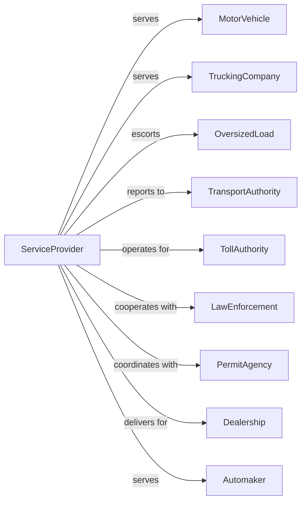

# Other Support Activities for Road Transportation

> Business-as-Code definition for miscellaneous road transportation support services. Models the complete service lifecycle for toll operations, weigh stations, pilot car services, bridge and tunnel operations, and independent driving services.

## Overview

Other support activities for road transportation comprises services to road network users including bridge, tunnel, and highway toll operations, truck weigh stations, pilot car escort services for oversized loads, and independent driving services. This definition exposes actions for managing toll collection, weight verification, escort coordination, and road service operations.

## Actors

| Actor | Description |
|-------|-------------|
| MotorVehicle | Vehicle using road infrastructure |
| TruckingCompany | Commercial carrier using highways |
| OversizedLoad | Wide or heavy shipment needing escort |
| TransportAuthority | State highway oversight authority |
| TollAuthority | Manages toll road operations |
| LawEnforcement | Enforces weight and traffic laws |
| PermitAgency | Issues oversize load permits |
| Dealership | Uses driveaway services |
| Automaker | Ships vehicles via driveaway |

## Roles

| Role | Description |
|------|-------------|
| TollCollector | Processes toll payments |
| WeighMaster | Operates truck scales |
| PilotCarDriver | Escorts oversized loads |
| BridgeOperator | Manages drawbridge operations |
| TunnelController | Monitors tunnel traffic |
| DriveawayOperator | Delivers vehicles independently |
| Dispatcher | Coordinates escort services |
| ComplianceOfficer | Enforces weight regulations |

## Entities

| Entity | Description |
|--------|-------------|
| TollPlaza | Toll collection point |
| WeighStation | Truck scale facility |
| PilotCar | Escort vehicle for oversized loads |
| Bridge | Toll bridge or drawbridge |
| Tunnel | Toll tunnel facility |
| Transponder | Electronic toll device |
| WeightTicket | Certified scale reading |
| Permit | Oversize or overweight authorization |
| EscortRoute | Planned path for oversized load |
| DriveawayVehicle | Car being delivered independently |

## Actions

| Action | Description |
|--------|-------------|
| collectToll | Process toll payment |
| issueTranponder | Provide electronic toll device |
| weighTruck | Measure commercial vehicle weight |
| issueWeightTicket | Document certified weight |
| dispatchPilotCar | Assign escort for oversized load |
| escortLoad | Guide oversized shipment on route |
| operateBridge | Control drawbridge opening |
| controlTunnel | Manage tunnel traffic flow |
| deliverVehicle | Drive car to destination |
| enforceWeight | Issue overweight violation |
| processViolation | Handle toll or weight infraction |
| reportTraffic | Update road condition status |

## Events

| Event | Description |
|-------|-------------|
| tollCollected | Payment processed |
| transponderIssued | Device provided |
| truckWeighed | Weight measured |
| weightTicketIssued | Document provided |
| pilotCarDispatched | Escort assigned |
| loadEscorted | Oversized guided |
| bridgeOperated | Drawbridge cycled |
| tunnelControlled | Traffic managed |
| vehicleDelivered | Car arrived at destination |
| weightEnforced | Violation issued |
| violationProcessed | Infraction handled |
| trafficReported | Conditions updated |
| vehiclePassed | Vehicle cleared inspection or weigh station |
| permitIssued | Oversize or overweight permit granted |

## Searches

| Search | Description |
|--------|-------------|
| getTollRates | Retrieve current pricing |
| getWeighStationStatus | Check if station is open |
| getPilotCarAvailability | Find available escorts |
| getBridgeSchedule | View drawbridge openings |
| getTunnelConditions | Check tunnel status |
| getViolationHistory | Review infractions |
| getTransponderAccount | Check toll balance |
| getTrafficConditions | View road status |

## Workflow



## Actor Relationships



## Usage

### Calling Actions

```typescript
import { coordinateTollRoads } from '@headlessly/coordinate-toll-roads'

const road = coordinateTollRoads()

// Check toll rates
const rates = await road.getTollRates({
  route: 'I-95-Express',
  vehicleClass: 'passenger',
  time: 'peak'
})

// Dispatch pilot car for oversized load
const escort = await road.dispatchPilotCar({
  loadPermit: 'OW-2024-12345',
  origin: 'Houston, TX',
  destination: 'Dallas, TX',
  loadDimensions: { width: 14, height: 16, length: 80 },
  departureTime: '2024-04-15T06:00:00'
})

// Check weigh station status
const station = await road.getWeighStationStatus({
  location: 'I-10-Mile-Marker-234'
})
```

### Event-Driven Automation

```typescript
// Auto-process electronic tolls
road.vehiclePassed(async ({ transponder, tollPoint, vehicleClass }) => {
  await road.collectToll({
    transponder,
    tollPoint,
    rate: getRateForClass(vehicleClass, getCurrentTime()),
    method: 'electronic'
  })
})

// Auto-dispatch pilot cars for permitted loads
road.permitIssued(async ({ permitId, route, departureTime }) => {
  const permit = await road.getPermitDetails({ permitId })

  if (permit.requiresEscort) {
    await road.dispatchPilotCar({
      loadPermit: permitId,
      route,
      departureTime,
      escortType: determineEscortRequirements(permit)
    })
  }
})

// Auto-alert for overweight violations
road.truckWeighed(async ({ weighTicket, maxLegal, actualWeight }) => {
  if (actualWeight > maxLegal) {
    await road.enforceWeight({
      weighTicket,
      overweightAmount: actualWeight - maxLegal,
      notifyLawEnforcement: actualWeight > maxLegal * 1.1
    })
  }
})
```
