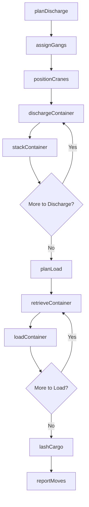
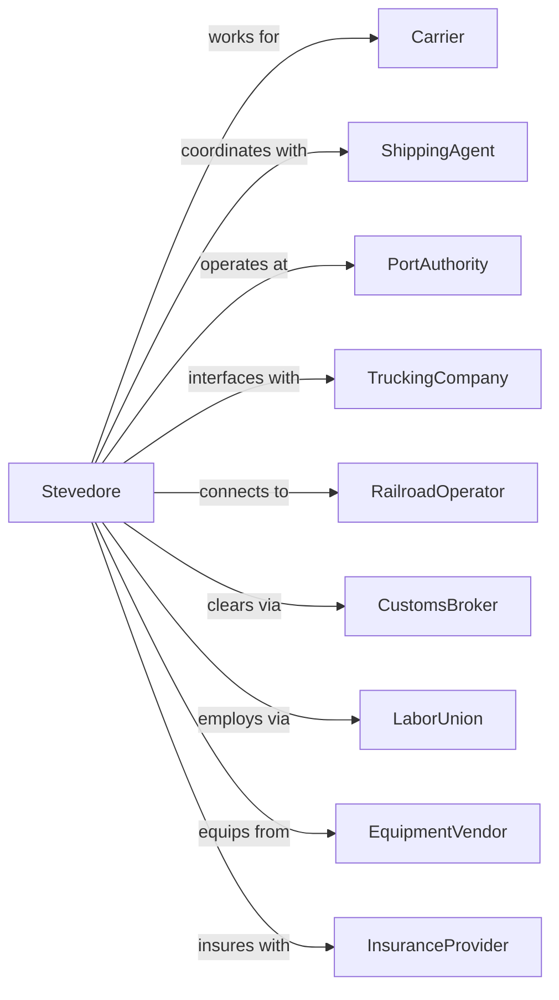

# Marine Cargo Handling

> Business-as-Code definition for stevedoring and terminal cargo operations. Models the complete cargo handling lifecycle from vessel arrival through discharge, storage, and loading.

## Overview

Marine cargo handling involves providing stevedoring services to load and discharge cargo from vessels, including container handling, bulk operations, and breakbulk cargo. This definition exposes actions for managing gang assignments, crane operations, yard management, and vessel turnaround at marine terminals.

## Actors

| Actor | Description |
|-------|-------------|
| Carrier | Shipping line requiring cargo handling |
| ShippingAgent | Represents carrier for operations |
| PortAuthority | Provides terminal infrastructure |
| TruckingCompany | Delivers and receives cargo |
| RailroadOperator | Intermodal rail connections |
| CustomsBroker | Handles cargo clearance |
| LaborUnion | Represents longshoremen |
| EquipmentVendor | Supplies handling equipment |
| InsuranceProvider | Covers cargo and liability |

## Roles

| Role | Description |
|------|-------------|
| TerminalManager | Oversees cargo operations |
| VesselPlanner | Plans stowage and discharge |
| GangForeman | Supervises longshoremen crew |
| CraneOperator | Operates ship-to-shore cranes |
| YardPlanner | Manages container storage |
| GateClerk | Processes truck transactions |
| EquipmentDispatcher | Assigns handling equipment |
| SafetyOfficer | Ensures OSHA compliance |
| Longshoreman | Union dockworker who loads and unloads cargo from vessels |

## Entities

| Entity | Description |
|--------|-------------|
| Vessel | Ship being worked |
| Container | TEU/FEU shipping unit |
| Crane | Ship-to-shore gantry crane |
| Gang | Longshoremen work crew |
| Yard | Container storage area |
| Chassis | Trailer for container transport |
| Stowage | Container position on vessel |
| Gate | Truck entry/exit point |
| Manifest | Cargo list for vessel |
| Bay | Section of ship hold |

## Actions

| Action | Description |
|--------|-------------|
| planDischarge | Create unload sequence |
| assignGangs | Allocate labor crews |
| positionCranes | Move cranes to work bays |
| dischargeContainer | Remove container from vessel |
| stackContainer | Place in yard position |
| planLoad | Create load sequence |
| retrieveContainer | Get container from yard |
| loadContainer | Place container on vessel |
| processGate | Handle truck in/out |
| transferIntermodal | Move to/from rail |
| lashCargo | Secure containers on vessel |
| reportMoves | Document productivity |
| inspectDamage | Check cargo condition |
| allocateEquipment | Assign handling gear |

## Events

| Event | Description |
|-------|-------------|
| dischargePlanned | Unload sequence created |
| gangsAssigned | Labor crews allocated |
| cranesPositioned | Equipment ready |
| containerDischarged | Unit removed from vessel |
| containerStacked | Unit placed in yard |
| loadPlanned | Load sequence created |
| containerRetrieved | Unit pulled from yard |
| containerLoaded | Unit placed on vessel |
| gateProcessed | Truck transaction complete |
| intermodalTransferred | Rail move completed |
| cargoLashed | Containers secured |
| movesReported | Productivity documented |
| damageInspected | Condition checked |
| equipmentAllocated | Gear assigned |

## Searches

| Search | Description |
|--------|-------------|
| getVesselStatus | View work progress |
| findContainer | Locate unit in terminal |
| getGangAssignments | List crew allocations |
| getYardInventory | View containers in storage |
| getCraneStatus | Check equipment availability |
| getGateTrucks | List trucks at gate |
| getProductivity | View moves per hour |
| getBayPlan | View vessel stowage |

## Workflow



## Actor Relationships



## Usage

### Calling Actions

```typescript
import { handleMarineCargo } from '@headlessly/handle-marine-cargo'

const stevedore = handleMarineCargo()

// Plan vessel discharge
const dischargePlan = await stevedore.planDischarge({
  vesselId: 'MSC-OSCAR',
  manifest: {
    totalContainers: 2000,
    hazmat: 45,
    reefers: 120,
    oversize: 8
  },
  bays: [1, 3, 5, 7, 9, 11],
  priority: 'reefers-first'
})

// Assign gangs for work shift
const gangs = await stevedore.assignGangs({
  vesselId: 'MSC-OSCAR',
  shift: 'day',
  cranes: 4,
  gangSize: 6
})

// Track container location
const container = await stevedore.findContainer({
  containerId: 'MSCU-1234567'
})
```

### Event-Driven Automation

```typescript
// Auto-dispatch equipment
stevedore.gangsAssigned(async ({ vesselId, gangCount }) => {
  const equipment = calculateEquipmentNeeds(gangCount)

  await stevedore.allocateEquipment({
    vesselId,
    equipment: {
      topHandlers: equipment.topHandlers,
      chassis: equipment.chassis,
      bombCarts: equipment.bombCarts
    }
  })
})

// Auto-report productivity
stevedore.containerLoaded(async ({ vesselId, containerId, timestamp }) => {
  const stats = await stevedore.getProductivity({ vesselId })

  if (stats.movesThisHour % 50 === 0) {
    await sendReport({
      to: 'operations@terminal.com',
      subject: `Productivity Update: ${vesselId}`,
      body: `Current rate: ${stats.movesPerHour} MPH`
    })
  }
})

// Auto-inspect reefer containers
stevedore.containerDischarged(async ({ containerId, containerType }) => {
  if (containerType === 'reefer') {
    await stevedore.inspectDamage({
      containerId,
      checks: ['temperature', 'genset', 'seals']
    })

    // Connect to terminal power
    await connectReeferPower({ containerId })
  }
})
```
