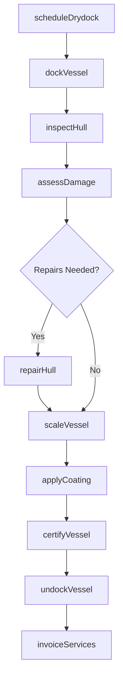
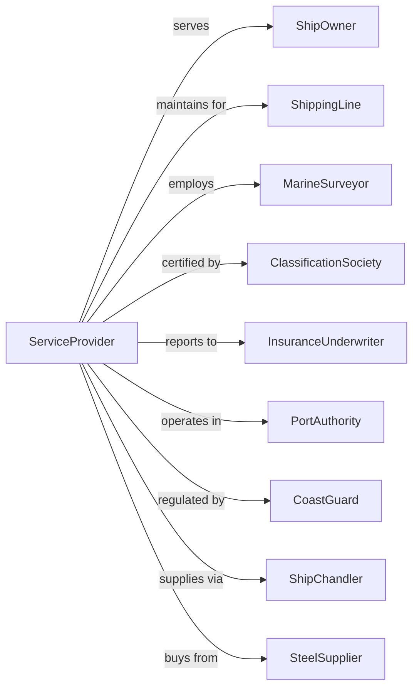

# Other Support Activities for Water Transportation

> Business-as-Code definition for miscellaneous water transportation support services. Models the complete marine support lifecycle including ship repair, floating drydock operations, cargo surveys, vessel inspection, and marine services not classified elsewhere.

## Overview

Other support activities for water transportation comprises establishments providing services such as floating drydock operations for routine ship repair and maintenance, ship scaling, marine cargo checking and surveying, and vessel inspection services. This definition exposes actions for managing ship repair, drydock scheduling, cargo surveys, and marine inspection services.

## Actors

| Actor | Description |
|-------|-------------|
| ShipOwner | Vessel operator requiring services |
| ShippingLine | Fleet owner needing maintenance |
| MarineSurveyor | Cargo and vessel inspection firm |
| ClassificationSociety | Lloyd's, ABS, DNV certifier |
| InsuranceUnderwriter | Hull and cargo coverage provider |
| PortAuthority | Harbor regulatory body |
| CoastGuard | Maritime safety regulator |
| ShipChandler | Supplies and provisions vendor |
| SteelSupplier | Provides repair materials |

## Roles

| Role | Description |
|------|-------------|
| DockMaster | Manages drydock operations |
| ShipFitter | Performs hull repairs |
| MarineSurveyor | Inspects cargo and vessels |
| SteelWorker | Conducts metal repairs and scaling |
| CargoChecker | Verifies freight condition |
| QualityInspector | Ensures repair standards |
| DivingTech | Performs underwater inspections |
| CoatingsSpec | Applies protective coatings |

## Entities

| Entity | Description |
|--------|-------------|
| Vessel | Ship requiring service |
| FloatingDrydock | Submersible repair platform |
| SurveyReport | Cargo or vessel inspection document |
| RepairOrder | Work authorization for ship |
| Hull | Vessel outer structure |
| Cargo | Freight requiring inspection |
| Certificate | Class or condition certification |
| ScaleReport | Hull cleaning documentation |
| DamageAssessment | Survey of vessel condition |
| Coating | Protective paint or treatment |

## Actions

| Action | Description |
|--------|-------------|
| scheduleDrydock | Book vessel for repair facility |
| dockVessel | Position ship on floating drydock |
| inspectHull | Examine vessel structure |
| assessDamage | Document vessel condition issues |
| repairHull | Fix structural damage |
| scaleVessel | Remove marine growth and scale |
| applyCoating | Apply protective paint |
| surveyCargoCondition | Inspect freight for damage |
| issueSurveyReport | Document inspection findings |
| certifyVessel | Issue class certification |
| undockVessel | Release ship from drydock |
| invoiceServices | Bill for completed work |

## Events

| Event | Description |
|-------|-------------|
| drydockScheduled | Repair slot booked |
| vesselDocked | Ship positioned on dock |
| hullInspected | Structure examined |
| damageAssessed | Condition documented |
| hullRepaired | Damage fixed |
| vesselScaled | Growth removed |
| coatingApplied | Paint completed |
| cargoSurveyed | Freight inspected |
| surveyReportIssued | Findings documented |
| vesselCertified | Class issued |
| vesselUndocked | Ship released |
| servicesInvoiced | Bill sent |

## Searches

| Search | Description |
|--------|-------------|
| getDrydockSchedule | View repair slot availability |
| getVesselStatus | Check ship repair progress |
| getSurveyReports | Retrieve inspection documents |
| getCertifications | List vessel class status |
| getRepairHistory | Review past maintenance |
| getCargoSurveys | List freight inspections |
| getDamageReports | Review vessel assessments |
| getCapacity | Check drydock availability |

## Workflow



## Actor Relationships



## Usage

### Calling Actions

```typescript
import { supportMarineServices } from '@headlessly/support-marine-services'

const marine = supportMarineServices()

// Schedule drydock for vessel
const booking = await marine.scheduleDrydock({
  vesselName: 'MV Ocean Trader',
  imo: '9876543',
  loa: 180,
  beam: 28,
  services: ['hull-inspection', 'scaling', 'coating'],
  preferredDate: '2024-05-01',
  estimatedDuration: 14
})

// Get vessel repair status
const status = await marine.getVesselStatus({
  vesselName: 'MV Ocean Trader'
})

// Request cargo survey
const survey = await marine.surveyCargoCondition({
  vesselName: 'MV Sea Spirit',
  cargo: 'steel-coils',
  holdNumbers: [1, 2, 3],
  surveyType: 'discharge-condition'
})
```

### Event-Driven Automation

```typescript
// Auto-notify classification society of completed repairs
marine.hullRepaired(async ({ vesselId, repairType, completion }) => {
  await notifyClassSociety({
    vessel: vesselId,
    repairType,
    completionDate: completion,
    requestInspection: true
  })
})

// Auto-schedule coating after scaling
marine.vesselScaled(async ({ vesselId, drydockId }) => {
  await marine.scheduleCoating({
    vesselId,
    drydockId,
    coatingType: getRecommendedCoating(vesselId),
    startTime: 'next-available'
  })
})

// Auto-generate invoice on undocking
marine.vesselUndocked(async ({ vesselId, services, duration }) => {
  await marine.invoiceServices({
    vesselId,
    lineItems: calculateCharges(services, duration),
    dueDate: addDays(today(), 30)
  })
})
```
