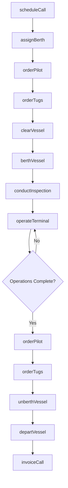
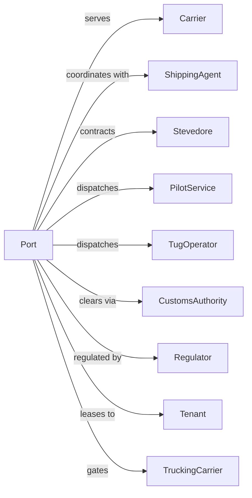

# Port and Harbor Operations

> Business-as-Code definition for port authority and marine terminal operations. Models the complete port lifecycle from vessel scheduling through berth assignment, terminal operations, and departure clearance.

## Overview

Port and harbor operations involve managing maritime facilities including docks, piers, berths, and channels to facilitate vessel arrivals, cargo operations, and departures. This definition exposes actions for managing vessel scheduling, berth assignments, pilotage coordination, and port infrastructure across container, bulk, and cruise terminals.

## Actors

| Actor | Description |
|-------|-------------|
| Carrier | Shipping line calling at port |
| ShippingAgent | Represents carrier at port |
| Stevedore | Provides cargo handling services |
| PilotService | Harbor pilots for navigation |
| TugOperator | Vessel assist services |
| CustomsAuthority | Border control and clearance |
| Regulator | Coast Guard and port authority |
| Tenant | Terminal operator leasing facilities |
| TruckingCarrier | Ground transport for cargo |

## Roles

| Role | Description |
|------|-------------|
| PortDirector | Oversees port operations |
| HarborMaster | Controls vessel traffic |
| BerthPlanner | Schedules dock assignments |
| PilotCoordinator | Arranges pilotage services |
| SecurityOfficer | Manages ISPS compliance |
| GateOperator | Controls terminal access |
| MaintenanceManager | Maintains port infrastructure |
| EnvironmentalOfficer | Monitors environmental compliance |
| DredgeMaster | Oversees harbor dredging operations to maintain navigable channel depths |

## Entities

| Entity | Description |
|--------|-------------|
| Berth | Dock position for vessel |
| Terminal | Facility for cargo type |
| Channel | Navigable waterway |
| Vessel | Ship calling at port |
| Pilot | Licensed harbor navigator |
| Tug | Assist vessel |
| Gate | Entry/exit checkpoint |
| Tariff | Port charges and fees |
| BerthWindow | Scheduled dock time |
| VesselCall | Ship visit record |

## Actions

| Action | Description |
|--------|-------------|
| scheduleCall | Book vessel arrival |
| assignBerth | Allocate dock position |
| orderPilot | Request harbor pilot |
| orderTugs | Request assist vessels |
| clearVessel | Approve port entry |
| berthVessel | Dock ship at terminal |
| operateTerminal | Manage cargo operations |
| conductInspection | Perform security or safety check |
| unberthVessel | Release ship from dock |
| departVessel | Authorize port exit |
| invoiceCall | Bill for port services |
| maintainInfrastructure | Service docks and equipment |
| dredgeChannel | Maintain navigable depth |
| manageGate | Control terminal access |

## Events

| Event | Description |
|-------|-------------|
| callScheduled | Vessel arrival booked |
| berthAssigned | Dock position allocated |
| pilotOrdered | Harbor pilot requested |
| tugsOrdered | Assist vessels requested |
| vesselCleared | Entry approved |
| vesselBerthed | Ship docked |
| terminalOperating | Cargo operations active |
| inspectionConducted | Check completed |
| vesselUnberthed | Ship released from dock |
| vesselDeparted | Ship exited port |
| callInvoiced | Bill issued |
| infrastructureMaintained | Service completed |
| channelDredged | Depth restored |
| gateManaged | Access controlled |

## Searches

| Search | Description |
|--------|-------------|
| getVesselSchedule | List expected arrivals |
| getBerthAvailability | Check dock openings |
| getTerminalStatus | View operations status |
| findPilots | List available pilots |
| getChannelConditions | Check draft and tide |
| getVesselLocation | Track ship position |
| getTariffs | Get port fee schedule |
| getCallHistory | Review past vessel visits |

## Workflow



## Actor Relationships



## Usage

### Calling Actions

```typescript
import { managePorts } from '@headlessly/manage-ports'

const port = managePorts()

// Check berth availability for incoming vessel
const berths = await port.getBerthAvailability({ terminal: 'container-terminal-3', dateRange: ['2024-08-10', '2024-08-14'] })

// Check channel draft conditions
const channel = await port.getChannelConditions({ channel: 'main-ship-channel', date: '2024-08-10' })

// Schedule vessel call
const vesselCall = await port.scheduleCall({
  vessel: { name: 'MSC OSCAR', imo: '9703291', loa: 395, beam: 59, draft: 16 },
  eta: '2024-06-15T08:00',
  terminal: 'container-terminal-1',
  agent: 'maritime-agency-co',
  cargoType: 'container',
  expectedContainers: { load: 1500, discharge: 2000 }
})

// Assign berth
const berth = await port.assignBerth({
  callId: vesselCall.id,
  preferredBerths: ['CT1-B3', 'CT1-B4'],
  windowStart: '2024-06-15T10:00',
  windowEnd: '2024-06-16T22:00'
})

// Order pilot for arrival
await port.orderPilot({
  callId: vesselCall.id,
  pilotStation: 'sea-buoy',
  boardingTime: '2024-06-15T06:00'
})
```

### Event-Driven Automation

```typescript
// Auto-order tugs based on vessel size
port.vesselCleared(async ({ callId, vessel }) => {
  const tugsRequired = calculateTugRequirement(vessel.loa, vessel.draft)

  await port.orderTugs({
    callId,
    tugs: tugsRequired,
    service: 'arrival'
  })
})

// Auto-invoice on departure
port.vesselDeparted(async ({ callId }) => {
  const call = await port.getCallHistory({ callId })

  await port.invoiceCall({
    callId,
    charges: {
      berthage: calculateBerthage(call.berthHours, call.vessel.loa),
      pilotage: call.pilotCharges,
      towage: call.tugCharges,
      wharfage: call.cargoCharges
    }
  })
})

// Auto-alert for delayed vessels
port.callScheduled(async ({ callId, eta }) => {
  setInterval(async () => {
    const vessel = await port.getVesselLocation({ callId })

    if (vessel.revisedEta && vessel.revisedEta > eta) {
      await sendAlert({
        to: 'operations@port.com',
        subject: `Delayed Arrival: ${vessel.name}`,
        body: `New ETA: ${vessel.revisedEta}`
      })

      await port.assignBerth({
        callId,
        reschedule: true
      })
    }
  }, 3600000)
})
```
