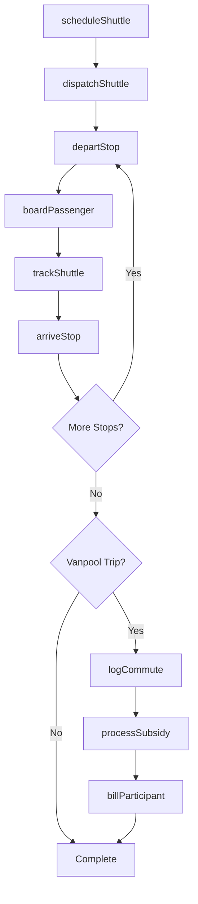
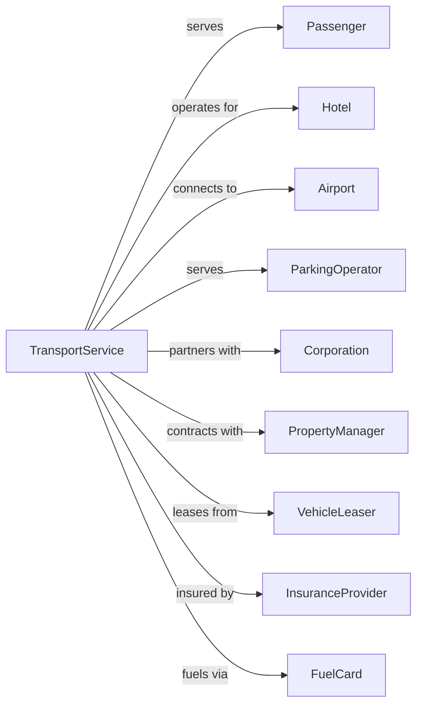

# All Other Transit and Ground Passenger Transportation

> Business-as-Code definition for miscellaneous ground passenger transportation operations. Models the complete service lifecycle for shuttle services, vanpools, carpools, and other non-scheduled passenger ground transportation.

## Overview

All other transit and ground passenger transportation includes shuttle services, vanpools, carpools, airport shuttles, hotel shuttles, and parking lot shuttles not classified elsewhere. This definition exposes actions for managing route-based shuttles, on-demand services, corporate vanpool programs, and passenger coordination for specialized ground transportation needs.

## Actors

| Actor | Description |
|-------|-------------|
| Passenger | Individual using shuttle or vanpool service |
| Hotel | Property providing guest shuttle service |
| Airport | Terminal requiring passenger transport |
| ParkingOperator | Lot needing shuttle to terminals |
| Corporation | Company sponsoring vanpool program |
| PropertyManager | Manages residential shuttle service |
| VehicleLeaser | Provides vans and shuttle vehicles |
| InsuranceProvider | Covers passenger and vehicle liability |
| FuelCard | Provides fleet fueling services |

## Roles

| Role | Description |
|------|-------------|
| ShuttleDriver | Operates shuttle vehicle on route |
| VanpoolDriver | Commuter driving shared vanpool |
| Dispatcher | Coordinates shuttle timing and routes |
| ProgramCoordinator | Manages vanpool participant groups |
| FleetSupervisor | Oversees vehicle maintenance |
| CustomerService | Handles passenger inquiries |
| RouteOptimizer | Designs efficient shuttle routes |
| BillingAdmin | Processes subsidy and passenger payments |

## Entities

| Entity | Description |
|--------|-------------|
| Shuttle | Vehicle operating fixed or on-demand route |
| Van | Passenger van for vanpool service |
| Route | Shuttle path with designated stops |
| Stop | Pickup or dropoff location |
| Schedule | Timing of shuttle departures |
| Vanpool | Group of commuters sharing vehicle |
| Participant | Member of vanpool program |
| Subsidy | Employer or transit agency contribution |
| Trip | Single shuttle or vanpool run |
| Manifest | List of passengers for trip |

## Actions

| Action | Description |
|--------|-------------|
| scheduleShuttle | Plan shuttle departures and route |
| dispatchShuttle | Assign vehicle and driver to route |
| trackShuttle | Monitor real-time vehicle location |
| boardPassenger | Allow rider to enter shuttle |
| departStop | Begin movement from boarding point |
| arriveStop | Reach designated dropoff location |
| formVanpool | Create commuter group and assign vehicle |
| enrollParticipant | Add member to vanpool |
| logCommute | Record vanpool trip for subsidy |
| processSubsidy | Apply employer or agency contribution |
| billParticipant | Charge member share of vanpool cost |
| maintainVehicle | Service shuttle or vanpool van |

## Events

| Event | Description |
|-------|-------------|
| shuttleScheduled | Departures and route planned |
| shuttleDispatched | Vehicle and driver assigned |
| shuttleTracked | Location updated |
| passengerBoarded | Rider entered shuttle |
| stopDeparted | Movement started from location |
| stopArrived | Reached dropoff point |
| vanpoolFormed | Commuter group created |
| participantEnrolled | Member added to vanpool |
| commuteLogged | Trip recorded |
| subsidyProcessed | Contribution applied |
| participantBilled | Member charged |
| vehicleMaintained | Service completed |

## Searches

| Search | Description |
|--------|-------------|
| getShuttleSchedule | Retrieve departure times for route |
| trackShuttle | Get real-time shuttle location |
| findRoutes | List shuttles serving location |
| getVanpools | List vanpool groups by area |
| getParticipants | List members of vanpool |
| getCommuteHistory | Review logged trips |
| getSubsidyBalance | Check available employer contribution |
| getStopArrivals | List upcoming shuttles at stop |

## Workflow



## Actor Relationships



## Usage

### Calling Actions

```typescript
import { transportTransitGround } from '@headlessly/transport-transit-ground'

const transport = transportTransitGround()

// Get hotel shuttle schedule
const schedule = await transport.getShuttleSchedule({
  routeId: 'hotel-airport-express',
  date: '2024-03-15'
})

// Track shuttle in real-time
const location = await transport.trackShuttle({
  routeId: 'hotel-airport-express',
  vehicleId: 'SHUTTLE-05'
})

// Form a corporate vanpool
const vanpool = await transport.formVanpool({
  employer: 'Tech Corp',
  originArea: 'North Suburbs',
  destination: 'Downtown Campus',
  departureTime: '07:30',
  returnTime: '17:30',
  participants: participantList
})

// Enroll new participant
await transport.enrollParticipant({
  vanpoolId: vanpool.id,
  participant: {
    name: 'John Smith',
    pickupLocation: '100 Oak Street',
    email: 'john@techcorp.com'
  }
})
```

### Event-Driven Automation

```typescript
// Auto-notify passengers of shuttle arrival
transport.stopArrived(async ({ routeId, stopId, vehicleId }) => {
  const waitingPassengers = await transport.getWaitingList({ stopId })

  for (const passenger of waitingPassengers) {
    await sendPushNotification({
      to: passenger.deviceId,
      title: 'Shuttle Arriving',
      body: `Your shuttle has arrived at ${stopId}`
    })
  }
})

// Auto-process monthly vanpool billing
transport.commuteLogged(async ({ vanpoolId, participantId, date }) => {
  if (isEndOfMonth(date)) {
    const participants = await transport.getParticipants({ vanpoolId })

    for (const participant of participants) {
      const trips = await transport.getCommuteHistory({
        participantId: participant.id,
        month: currentMonth()
      })

      await transport.processSubsidy({
        participantId: participant.id,
        trips: trips.length,
        employer: participant.employer
      })

      await transport.billParticipant({
        participantId: participant.id,
        trips: trips.length,
        netAmount: calculateNetCost(trips)
      })
    }
  }
})

// Auto-dispatch replacement for breakdown
transport.vehicleBreakdown(async ({ vehicleId, routeId, location }) => {
  const nearestVehicle = await transport.findAvailableShuttle({
    near: location,
    routeCompatible: routeId
  })

  await transport.dispatchShuttle({
    vehicleId: nearestVehicle.id,
    takeOverRoute: routeId,
    startAt: location
  })
})
```
