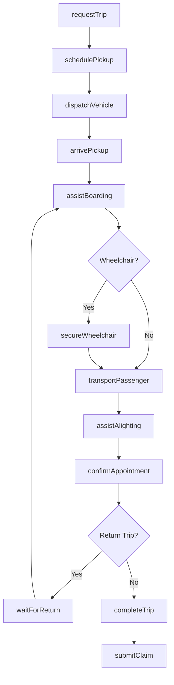
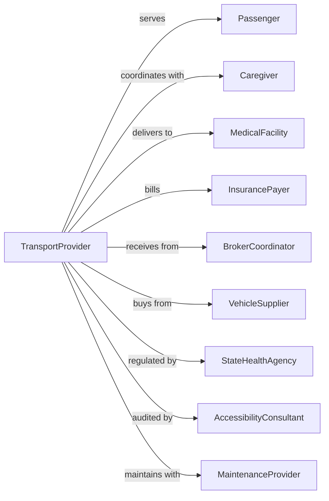

# Special Needs Transportation

> Business-as-Code definition for special needs transportation operations. Models the complete non-emergency medical and accessibility transportation lifecycle for elderly and disabled passengers from scheduling through specialized vehicle operations and passenger care.

## Overview

Special needs transportation involves providing transportation services for disabled and elderly passengers using specially equipped vehicles with wheelchair lifts, ramps, and accessibility features. Services include medical appointments, dialysis transport, adult day care, and general mobility assistance. This definition exposes actions for managing accessible vehicle dispatch, passenger assistance, healthcare coordination, and compliance with ADA requirements.

## Actors

| Actor | Description |
|-------|-------------|
| Passenger | Elderly or disabled individual requiring transport |
| Caregiver | Family member or aide coordinating transportation |
| MedicalFacility | Hospital, clinic, or dialysis center destination |
| InsurancePayer | Medicare, Medicaid, or private payer |
| BrokerCoordinator | NEMT broker assigning trip requests |
| VehicleSupplier | Provides accessible vans and equipment |
| StateHealthAgency | Regulates non-emergency medical transport |
| AccessibilityConsultant | Ensures ADA compliance |
| MaintenanceProvider | Services lifts and accessibility equipment |

## Roles

| Role | Description |
|------|-------------|
| Driver | Operates accessible vehicle and assists passengers |
| Dispatcher | Schedules trips and assigns vehicles |
| PassengerAttendant | Provides physical assistance during transport |
| SchedulingCoordinator | Manages appointment coordination |
| ComplianceOfficer | Ensures ADA and HIPAA compliance |
| FleetManager | Maintains accessible vehicles |
| BillingSpecialist | Processes payer claims |
| TrainingCoordinator | Conducts sensitivity and safety training |

## Entities

| Entity | Description |
|--------|-------------|
| AccessibleVan | Wheelchair-accessible vehicle with lift |
| Wheelchair | Passenger mobility device |
| Trip | Scheduled transport with pickup and destination |
| Passenger | Individual with mobility needs and preferences |
| MedicalAppointment | Healthcare visit requiring transport |
| Driver | Certified operator with passenger assistance training |
| Claim | Billing submission to payer |
| StandingOrder | Recurring trip schedule for regular appointments |
| Lift | Vehicle wheelchair lift or ramp |
| Securement | Wheelchair tie-down and restraint system |

## Actions

| Action | Description |
|--------|-------------|
| requestTrip | Submit transport request for passenger |
| schedulePickup | Confirm time and location for pickup |
| dispatchVehicle | Assign accessible van to trip |
| arrivePickup | Driver arrives at pickup location |
| assistBoarding | Help passenger enter vehicle safely |
| secureWheelchair | Fasten wheelchair tie-downs |
| transportPassenger | Drive to destination |
| assistAlighting | Help passenger exit vehicle |
| confirmAppointment | Verify passenger checked in at facility |
| waitForReturn | Remain for return trip if scheduled |
| completeTrip | Finish transport and document service |
| submitClaim | Bill payer for completed trip |

## Events

| Event | Description |
|-------|-------------|
| tripRequested | Transport request received |
| pickupScheduled | Time and location confirmed |
| vehicleDispatched | Accessible van assigned |
| arrivedAtPickup | Driver at pickup location |
| boardingAssisted | Passenger entered vehicle |
| wheelchairSecured | Tie-downs fastened |
| passengerTransported | En route to destination |
| alightingAssisted | Passenger exited vehicle |
| appointmentConfirmed | Check-in verified |
| waitedForReturn | On standby for return trip |
| tripCompleted | Transport documented |
| claimSubmitted | Billing sent to payer |

## Searches

| Search | Description |
|--------|-------------|
| findTrips | List scheduled trips by date or passenger |
| getAvailableVehicles | List accessible vans for dispatch |
| trackVehicle | Get real-time location of transport |
| getPassengerProfile | Retrieve mobility needs and preferences |
| getStandingOrders | List recurring trip schedules |
| getClaimStatus | Check billing submission status |
| getDriverCertifications | Review driver training records |
| getAppointmentSchedule | List medical appointments requiring transport |

## Workflow



## Actor Relationships



## Usage

### Calling Actions

```typescript
import { transportSpecialNeeds } from '@headlessly/transport-special-needs'

const transport = transportSpecialNeeds()

// Request dialysis transport
const trip = await transport.requestTrip({
  passenger: {
    id: 'PAT-12345',
    name: 'Mary Johnson',
    mobility: 'wheelchair',
    wheelchairType: 'power'
  },
  pickup: {
    address: '100 Senior Living Dr, Apt 204',
    time: '2024-03-18T09:00:00',
    instructions: 'Ring apartment bell, wait at front entrance'
  },
  destination: {
    name: 'Metro Dialysis Center',
    address: '500 Medical Center Blvd',
    appointmentTime: '10:00'
  },
  returnTrip: true,
  estimatedReturnTime: '14:00',
  payer: 'medicaid'
})

// Track vehicle during transport
const location = await transport.trackVehicle({
  tripId: trip.id
})

// Get passenger profile for driver
const profile = await transport.getPassengerProfile({
  passengerId: 'PAT-12345'
})
```

### Event-Driven Automation

```typescript
// Auto-notify caregiver of pickup
transport.arrivedAtPickup(async ({ tripId, driverName, vehicleId }) => {
  const trip = await transport.findTrips({ id: tripId })

  await sendSMS({
    to: trip.passenger.caregiver.phone,
    message: `Driver ${driverName} has arrived for ${trip.passenger.name}'s pickup.`
  })
})

// Auto-confirm appointment arrival
transport.alightingAssisted(async ({ tripId, arrivalTime }) => {
  const trip = await transport.findTrips({ id: tripId })

  await notifyFacility({
    facility: trip.destination.name,
    patient: trip.passenger.name,
    arrivalTime
  })
})

// Auto-submit claims for completed trips
transport.tripCompleted(async ({ tripId, mileage, waitTime, serviceCodes }) => {
  const trip = await transport.findTrips({ id: tripId })

  await transport.submitClaim({
    tripId,
    payer: trip.payer,
    serviceCodes,
    mileage,
    waitTime,
    pickupTime: trip.actualPickup,
    dropoffTime: trip.actualDropoff
  })
})
```
