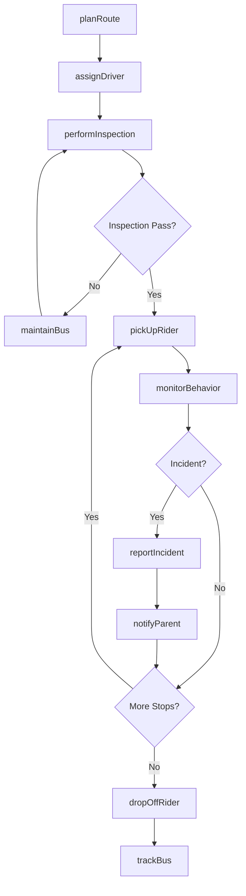
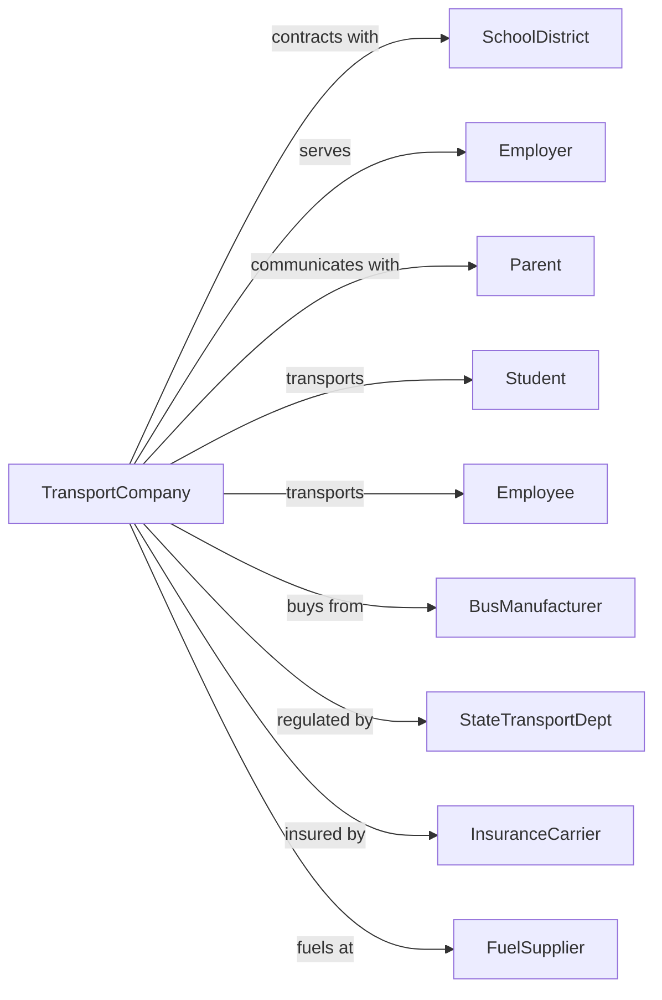

# School and Employee Bus Transportation

> Business-as-Code definition for school and employee bus transportation operations. Models the complete pupil and worker transportation lifecycle from route planning through driver management, safety compliance, and daily operations for school districts and corporate shuttle services.

## Overview

School and employee bus transportation involves providing buses and motor vehicles to transport students to and from school or employees to and from work. Services include yellow school bus operations, special education transport, and corporate shuttle services. This definition exposes actions for managing routes, driver compliance, student safety, and fleet operations for contracted transportation services.

## Actors

| Actor | Description |
|-------|-------------|
| SchoolDistrict | Educational institution contracting bus services |
| Employer | Company providing employee shuttle service |
| Parent | Guardian of transported student |
| Student | Pupil transported to and from school |
| Employee | Worker using corporate shuttle |
| BusManufacturer | Supplies school buses and shuttles |
| StateTransportDept | Regulates school bus safety standards |
| InsuranceCarrier | Provides student transportation coverage |
| FuelSupplier | Provides diesel or alternative fuels |

## Roles

| Role | Description |
|------|-------------|
| BusDriver | Operates school bus or shuttle safely |
| Dispatcher | Assigns routes and manages schedules |
| RoutePlanner | Designs efficient pickup routes |
| SafetyTrainer | Conducts driver and student safety training |
| FleetManager | Maintains buses and compliance records |
| MonitorAide | Assists students and maintains order |
| MechanicTech | Services and repairs buses |
| ContractManager | Handles district and employer agreements |

## Entities

| Entity | Description |
|--------|-------------|
| SchoolBus | Yellow bus equipped for student transport |
| Shuttle | Vehicle for employee transportation |
| Route | Fixed path with designated stops |
| Stop | Pickup and dropoff location |
| Student | Pupil with assigned bus and stop |
| Driver | Certified operator with CDL and endorsements |
| Schedule | Daily timing for routes and runs |
| Contract | Service agreement with district or employer |
| Inspection | Vehicle safety check record |
| Incident | Safety or discipline event report |

## Actions

| Action | Description |
|--------|-------------|
| planRoute | Design efficient pickup sequence |
| assignDriver | Dispatch certified driver to route |
| performInspection | Complete pre-trip safety check |
| pickUpRider | Board student or employee at stop |
| monitorBehavior | Ensure safe conduct on bus |
| dropOffRider | Discharge passenger at destination |
| trackBus | Monitor real-time vehicle location |
| reportIncident | Document safety or behavior issue |
| notifyParent | Alert guardian of student status |
| adjustRoute | Modify stops for weather or conditions |
| trainDriver | Conduct safety and procedure training |
| maintainBus | Service vehicle per schedule |

## Events

| Event | Description |
|-------|-------------|
| routePlanned | Pickup sequence designed |
| driverAssigned | Operator dispatched to route |
| inspectionPerformed | Pre-trip check completed |
| riderPickedUp | Passenger boarded at stop |
| behaviorMonitored | Conduct checked during trip |
| riderDroppedOff | Passenger discharged |
| busTracked | Location updated |
| incidentReported | Issue documented |
| parentNotified | Guardian alerted |
| routeAdjusted | Stops modified |
| driverTrained | Training completed |
| busMaintained | Service completed |
| weatherWarningIssued | Weather warning issued affecting routes |

## Searches

| Search | Description |
|--------|-------------|
| findRoutes | List routes for school or employer |
| getSchedule | Retrieve daily timing for route |
| trackBus | Get real-time bus location |
| getStudentRoster | List students assigned to route |
| getDriverStatus | Check driver availability and compliance |
| getIncidents | Review reported issues |
| getInspections | Retrieve vehicle inspection history |
| getContractDetails | Review service agreement terms |

## Workflow



## Actor Relationships



## Usage

### Calling Actions

```typescript
import { busSchoolPassengers } from '@headlessly/bus-school-passengers'

const transport = busSchoolPassengers()

// Plan a school route
const route = await transport.planRoute({
  school: 'Lincoln Elementary',
  students: studentList,
  startTime: '07:15',
  arrivalTime: '07:45',
  maxRideTime: 45
})

// Assign driver to route
const assignment = await transport.assignDriver({
  routeId: route.id,
  date: '2024-03-15',
  preferences: { seniority: true }
})

// Track bus in real-time
const location = await transport.trackBus({
  routeId: route.id,
  date: 'today'
})
```

### Event-Driven Automation

```typescript
// Auto-notify parents of bus arrival
transport.riderPickedUp(async ({ routeId, stopId, timestamp }) => {
  const students = await transport.getStudentRoster({ routeId, stopId })

  for (const student of students) {
    await sendPushNotification({
      to: student.parent.deviceId,
      title: 'Bus Update',
      body: `${student.name} boarded the bus at ${formatTime(timestamp)}`
    })
  }
})

// Auto-escalate behavior incidents
transport.incidentReported(async ({ routeId, studentId, severity, description }) => {
  if (severity === 'high') {
    const student = await transport.getStudentDetails({ studentId })

    await notifySchool({
      school: student.school,
      incident: description,
      student: studentId,
      requiresAction: true
    })

    await transport.notifyParent({
      studentId,
      message: `Behavior incident reported on bus. School will follow up.`
    })
  }
})

// Auto-adjust routes for weather
transport.weatherWarningIssued(async ({ severity, affectedArea }) => {
  if (severity === 'severe') {
    const routes = await transport.findRoutes({ area: affectedArea })

    for (const route of routes) {
      await transport.adjustRoute({
        routeId: route.id,
        action: 'delay',
        minutes: 30,
        reason: 'weather'
      })
    }
  }
})
```
