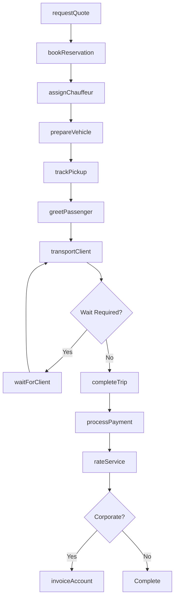
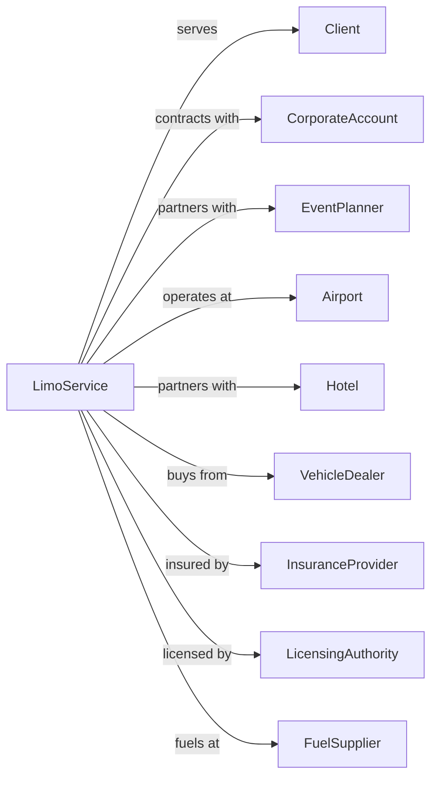

# Limousine Service

> Business-as-Code definition for limousine service operations. Models the complete luxury ground transportation lifecycle from reservation through chauffeur dispatch, passenger service, and billing for executive sedans, stretch limousines, and specialty vehicles.

## Overview

Limousine service involves providing specialty and luxury passenger transportation via limousine, luxury sedan, or executive vehicle generally on a reserved basis. Services include airport transfers, corporate transportation, wedding and event services, and hourly charters. This definition exposes actions for managing reservations, fleet dispatch, chauffeur operations, and premium passenger services.

## Actors

| Actor | Description |
|-------|-------------|
| Client | Individual or company booking luxury transport |
| CorporateAccount | Business with ongoing transportation contract |
| EventPlanner | Coordinates transportation for weddings and events |
| Airport | Pickup and dropoff location with special access |
| Hotel | Partner for guest transportation services |
| VehicleDealer | Supplies limousines and luxury sedans |
| InsuranceProvider | Covers commercial auto and liability |
| LicensingAuthority | Issues TCP or livery permits |
| FuelSupplier | Provides premium fuel for fleet |

## Roles

| Role | Description |
|------|-------------|
| Chauffeur | Licensed driver providing luxury service |
| Dispatcher | Assigns vehicles and routes reservations |
| ReservationAgent | Books trips and manages client requests |
| FleetManager | Maintains vehicles and manages fleet |
| AccountManager | Handles corporate client relationships |
| DetailTech | Cleans and prepares vehicles |
| BillingClerk | Processes invoices and payments |
| QualityManager | Ensures service standards and training |

## Entities

| Entity | Description |
|--------|-------------|
| Limousine | Stretch limousine or party bus |
| Sedan | Executive luxury sedan or SUV |
| Reservation | Booked trip with pickup and destination |
| Client | Customer with contact and billing info |
| Chauffeur | Driver with certification and availability |
| Route | Planned path with stops and timing |
| Invoice | Bill for services rendered |
| Contract | Agreement with corporate account |
| Amenity | Refreshments, WiFi, or special requests |
| Permit | Operating license for livery service |

## Actions

| Action | Description |
|--------|-------------|
| requestQuote | Provide pricing for requested service |
| bookReservation | Confirm trip with vehicle and chauffeur |
| assignChauffeur | Dispatch driver to reservation |
| prepareVehicle | Detail and stock vehicle for trip |
| trackPickup | Monitor chauffeur arrival at location |
| greetPassenger | Welcome client and assist with luggage |
| transportClient | Drive passenger to destination |
| waitForClient | Remain available during appointment |
| completeTrip | Conclude service at final destination |
| processPayment | Charge client for service |
| rateService | Collect feedback on chauffeur and trip |
| invoiceAccount | Bill corporate client for services |

## Events

| Event | Description |
|-------|-------------|
| quoteRequested | Pricing inquiry received |
| reservationBooked | Trip confirmed |
| chauffeurAssigned | Driver dispatched to reservation |
| vehiclePrepared | Car detailed and ready |
| pickupTracked | Chauffeur approaching location |
| passengerGreeted | Client met and welcomed |
| clientTransported | En route to destination |
| arrivedForClient | On standby during appointment |
| tripCompleted | Service concluded |
| paymentProcessed | Charge completed |
| serviceRated | Feedback collected |
| accountInvoiced | Corporate bill sent |

## Searches

| Search | Description |
|--------|-------------|
| checkAvailability | Find available vehicles and chauffeurs |
| getQuote | Calculate pricing for requested service |
| findReservations | List bookings by date or client |
| trackVehicle | Get real-time chauffeur location |
| getClientHistory | Review past trips for client |
| getFleetStatus | Check vehicle availability and condition |
| getAccountBalance | Review corporate account billing |
| getChauffeurSchedule | View driver assignments |

## Workflow



## Actor Relationships



## Usage

### Calling Actions

```typescript
import { driveLimousine } from '@headlessly/drive-limousine'

const limo = driveLimousine()

// Get quote for service
const quote = await limo.getQuote({
  vehicleType: 'stretch-limo',
  pickupAddress: '123 Main St, Beverly Hills',
  dropoffAddress: 'LAX Airport',
  pickupTime: '2024-03-15T18:00:00',
  passengers: 6,
  amenities: ['champagne', 'red-carpet']
})

// Book the reservation
const reservation = await limo.bookReservation({
  quoteId: quote.id,
  client: { name: 'Jane Smith', phone: '555-0100', email: 'jane@example.com' },
  specialInstructions: 'Birthday celebration, please decorate'
})

// Track chauffeur en route
const location = await limo.trackVehicle({
  reservationId: reservation.id
})
```

### Event-Driven Automation

```typescript
// Auto-notify client of chauffeur arrival
limo.pickupTracked(async ({ reservationId, eta, chauffeur }) => {
  if (eta <= 10) {
    const reservation = await limo.findReservations({ id: reservationId })

    await sendSMS({
      to: reservation.client.phone,
      message: `Your chauffeur ${chauffeur.name} will arrive in ${eta} minutes. Vehicle: ${chauffeur.vehicle}`
    })
  }
})

// Auto-extend waiting time for VIP clients
limo.arrivedForClient(async ({ reservationId, waitMinutes, clientTier }) => {
  if (clientTier === 'vip' && waitMinutes > 15) {
    await limo.extendWaiting({
      reservationId,
      additionalMinutes: 30,
      waiveCharge: true
    })
  }
})

// Auto-send feedback request after trip
limo.tripCompleted(async ({ reservationId, client, chauffeur }) => {
  await sendEmail({
    to: client.email,
    subject: 'How was your ride?',
    template: 'feedback-request',
    data: { reservationId, chauffeurName: chauffeur.name }
  })
})
```
