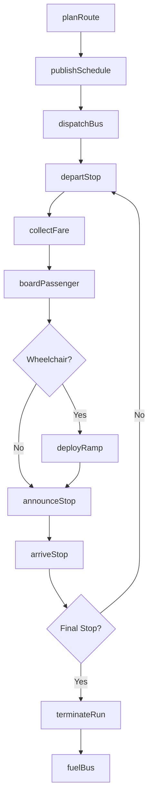
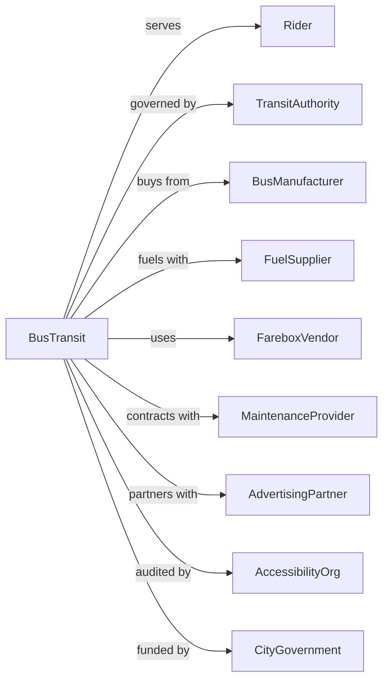

# Bus and Other Motor Vehicle Transit Systems

> Business-as-Code definition for urban bus transit system operations. Models the complete fixed-route bus service lifecycle from route planning through fare collection, vehicle dispatch, and passenger transportation within metropolitan areas.

## Overview

Bus and motor vehicle transit systems operate local and suburban passenger transportation using buses over regular routes and schedules within metropolitan areas. Services include standard bus routes, express services, bus rapid transit, and paratransit. This definition exposes actions for managing bus schedules, fare collection, fleet operations, and passenger services for urban transit.

## Actors

| Actor | Description |
|-------|-------------|
| Rider | Passenger using fixed-route bus service |
| TransitAuthority | Regional body governing bus operations |
| BusManufacturer | Supplies transit buses and parts |
| FuelSupplier | Provides diesel, CNG, or electric charging |
| FareboxVendor | Supplies fare collection equipment |
| MaintenanceProvider | Services buses and facilities |
| AdvertisingPartner | Manages bus advertising revenue |
| AccessibilityOrg | Ensures ADA compliance |
| CityGovernment | Provides funding and right-of-way |

## Roles

| Role | Description |
|------|-------------|
| BusOperator | Drives bus and assists passengers |
| Dispatcher | Assigns buses and manages service |
| MaintenanceTech | Repairs and services buses |
| FareInspector | Verifies passenger fare payment |
| RoutePlanner | Designs routes and schedules |
| CustomerServiceAgent | Handles rider inquiries |
| SafetyTrainer | Conducts operator safety training |
| FuelTech | Manages fueling and charging operations |

## Entities

| Entity | Description |
|--------|-------------|
| Bus | Transit vehicle for passenger transport |
| Route | Fixed path with designated stops |
| Stop | Designated boarding location with signage |
| Schedule | Timetable of bus arrivals and departures |
| Fare | Payment required for travel |
| Transfer | Document allowing route change |
| Run | Single trip from terminus to terminus |
| Block | Sequence of runs assigned to one bus |
| Garage | Bus storage and maintenance facility |
| Shelter | Covered waiting area at stops |

## Actions

| Action | Description |
|--------|-------------|
| planRoute | Design bus route with stops and timing |
| publishSchedule | Release timetable for public access |
| dispatchBus | Assign bus and operator to route |
| collectFare | Accept payment for boarding |
| boardPassenger | Allow rider to enter bus |
| departStop | Begin movement from boarding location |
| announceStop | Provide next stop information |
| arriveStop | Stop at designated location |
| deployRamp | Lower wheelchair ramp for accessibility |
| transferPassenger | Issue transfer for connecting route |
| terminateRun | Complete trip at route terminus |
| fuelBus | Refuel or recharge vehicle |

## Events

| Event | Description |
|-------|-------------|
| routePlanned | Bus route designed and approved |
| schedulePublished | Timetable released to public |
| busDispatched | Vehicle and operator assigned |
| fareCollected | Payment accepted from rider |
| passengerBoarded | Rider entered bus |
| busDeparted | Movement started from stop |
| stopAnnounced | Next stop broadcast to riders |
| busArrived | Reached designated stop |
| rampDeployed | Accessibility ramp lowered |
| passengerTransferred | Transfer issued to rider |
| runTerminated | Trip completed at terminus |
| busFueled | Vehicle refueled or charged |
| serviceDisrupted | Transit service disrupted or delayed |
| incidentReported | Safety or operational incident documented |
| ridershipExceeded | Bus capacity threshold surpassed |

## Searches

| Search | Description |
|--------|-------------|
| findRoutes | List routes serving specified stops |
| getSchedule | Retrieve timetable for route |
| trackBus | Get real-time location of vehicle |
| getArrivals | List upcoming buses at stop |
| findStops | Locate stops near address |
| getServiceAlerts | List delays and detours |
| getRidership | Get passenger counts by route |
| getFares | Retrieve pricing information |

## Workflow



## Actor Relationships



## Usage

### Calling Actions

```typescript
import { transitBus } from '@headlessly/transit-bus'

const bus = transitBus()

// Find routes between locations
const routes = await bus.findRoutes({
  origin: '100 Main Street',
  destination: '500 Business Park Drive',
  departureTime: '08:00'
})

// Get real-time arrivals at stop
const arrivals = await bus.getArrivals({
  stopId: 'STOP-1234',
  limit: 5
})

// Track specific bus
const location = await bus.trackBus({
  vehicleId: 'BUS-5678'
})
```

### Event-Driven Automation

```typescript
// Auto-announce service disruptions
bus.serviceDisrupted(async ({ routeId, alertType, message }) => {
  await broadcastToStops({
    routeId,
    announcement: message,
    displayDuration: 300
  })
})

// Auto-dispatch replacement for breakdowns
bus.incidentReported(async ({ vehicleId, incidentType, location }) => {
  if (incidentType === 'mechanical') {
    const nearestBus = await bus.findAvailableBus({
      near: location,
      routeCompatible: true
    })

    await bus.dispatchBus({
      vehicleId: nearestBus.id,
      takeOverAt: location
    })
  }
})

// Auto-adjust headways for high ridership
bus.ridershipExceeded(async ({ routeId, stopId, loadFactor }) => {
  if (loadFactor > 1.0) {
    await requestAdditionalService({
      routeId,
      effectiveFrom: stopId,
      tripsToAdd: 1
    })
  }
})
```
