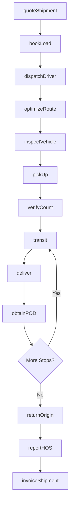
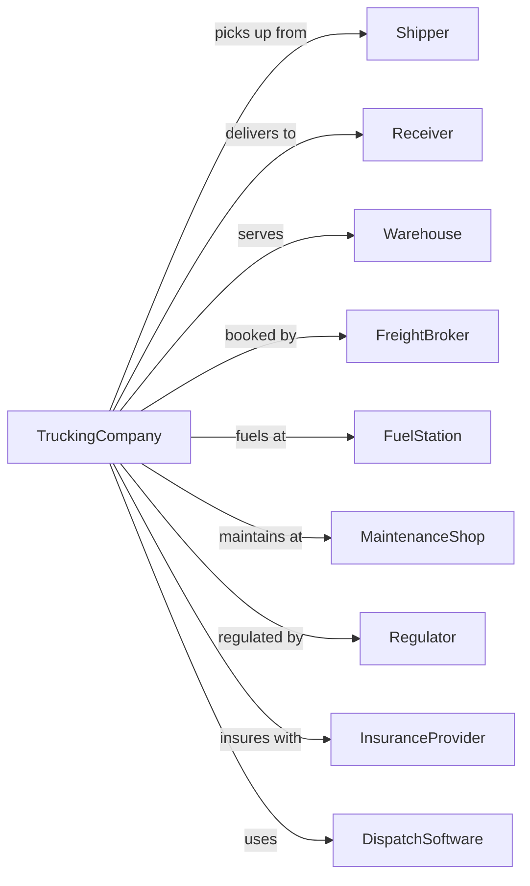

# General Freight Trucking, Local

> Business-as-Code definition for local freight trucking operations. Models the complete same-day delivery lifecycle from dispatch through pickup, route optimization, and delivery within metropolitan areas.

## Overview

Local general freight trucking involves providing same-day trucking services within a metropolitan area, handling palletized goods and general commodities in van trailers. This definition exposes actions for managing dispatch, route planning, pickup and delivery operations, and proof of delivery for local cartage services.

## Actors

| Actor | Description |
|-------|-------------|
| Shipper | Company sending local freight |
| Receiver | Company receiving delivery |
| Warehouse | Distribution center for pickup/delivery |
| FreightBroker | Arranges trucking capacity |
| FuelStation | Provides diesel fuel |
| MaintenanceShop | Services trucks and trailers |
| Regulator | DOT and state transport authority |
| InsuranceProvider | Covers cargo and liability |
| DispatchSoftware | TMS for routing and tracking |

## Roles

| Role | Description |
|------|-------------|
| Driver | Operates truck and makes deliveries |
| Dispatcher | Assigns loads and routes drivers |
| DockWorker | Loads and unloads freight |
| FleetManager | Oversees truck maintenance and compliance |
| CustomerService | Handles shipper inquiries |
| BillingClerk | Processes invoices and collections |
| SafetyManager | Ensures DOT compliance |
| RouteOptimizer | Plans efficient delivery sequences |
| LumperService | Independent contractor who loads or unloads trailers at warehouses |

## Entities

| Entity | Description |
|--------|-------------|
| Truck | Straight truck or tractor for local runs |
| Trailer | Van or flatbed trailer |
| Shipment | Freight with origin and destination |
| Route | Planned sequence of stops |
| Stop | Pickup or delivery location |
| BOL | Bill of lading document |
| POD | Proof of delivery confirmation |
| Pallet | Unit of freight handling |
| Driver | Assigned operator with HOS status |
| Rate | Price for local haul |

## Actions

| Action | Description |
|--------|-------------|
| quoteShipment | Provide rate for local haul |
| bookLoad | Accept shipment for delivery |
| dispatchDriver | Assign driver and truck to route |
| optimizeRoute | Calculate efficient stop sequence |
| pickUp | Collect freight at shipper |
| verifyCount | Confirm piece count and condition |
| transit | Drive between stops |
| deliver | Complete delivery at receiver |
| obtainPOD | Get signature for proof of delivery |
| returnOrigin | Drive back to terminal |
| invoiceShipment | Bill shipper for service |
| trackShipment | Monitor location and status |
| reportHOS | Log driver hours of service |
| inspectVehicle | Complete pre-trip inspection |

## Events

| Event | Description |
|-------|-------------|
| shipmentQuoted | Rate provided to shipper |
| loadBooked | Shipment accepted |
| driverDispatched | Assignment sent to driver |
| routeOptimized | Stop sequence calculated |
| freightPickedUp | Cargo collected |
| countVerified | Pieces confirmed |
| shipmentInTransitUpdated | En route between stops |
| delivered | Delivery completed |
| podObtained | Signature captured |
| returnedToTerminal | Driver back at base |
| shipmentInvoiced | Bill sent to shipper |
| shipmentTracked | Location updated |
| hosReported | Hours logged |
| vehicleInspected | Pre-trip completed |

## Searches

| Search | Description |
|--------|-------------|
| findAvailableTrucks | List trucks ready for dispatch |
| trackShipment | Get shipment location and ETA |
| getDriverStatus | Check driver availability and HOS |
| findRoutes | List planned routes for day |
| getPOD | Retrieve proof of delivery |
| getShipmentHistory | Review past deliveries |
| getRates | Get pricing for lane |
| getTrafficConditions | Check real-time road conditions |

## Workflow



## Actor Relationships



## Usage

### Calling Actions

```typescript
import { truckLocalFreight } from '@headlessly/truck-local-freight'

const carrier = truckLocalFreight()

// Get quote for local delivery
const quote = await carrier.quoteShipment({
  origin: '123 Industrial Blvd, Chicago',
  destination: '456 Warehouse Dr, Chicago',
  pallets: 6,
  weight: 4500,
  serviceLevel: 'same-day'
})

// Book the load
const shipment = await carrier.bookLoad({
  quoteId: quote.id,
  shipper: { name: 'ABC Manufacturing', contact: 'shipping@abc.com' },
  receiver: { name: 'XYZ Distribution', contact: 'receiving@xyz.com' },
  readyTime: '08:00',
  deliveryWindow: { start: '10:00', end: '14:00' }
})

// Track delivery in progress
const status = await carrier.trackShipment({
  shipmentId: shipment.id
})
```

### Event-Driven Automation

```typescript
// Auto-notify receiver of ETA
carrier.shipmentInTransitUpdated(async ({ shipmentId, currentLocation, eta }) => {
  const shipment = await carrier.trackShipment({ shipmentId })

  if (isWithinMinutes(eta, 30)) {
    await sendNotification({
      to: shipment.receiver.contact,
      subject: 'Delivery Arriving Soon',
      body: `Your shipment will arrive in approximately 30 minutes.`
    })
  }
})

// Auto-invoice on POD
carrier.podObtained(async ({ shipmentId, signature, timestamp }) => {
  await carrier.invoiceShipment({
    shipmentId,
    podReference: signature,
    deliveryTime: timestamp
  })
})

// Auto-alert for late deliveries
carrier.delivered(async ({ shipmentId, actualTime, scheduledWindow }) => {
  if (actualTime > scheduledWindow.end) {
    await createTicket({
      type: 'late-delivery',
      shipmentId,
      minutesLate: minutesBetween(scheduledWindow.end, actualTime)
    })
  }
})
```
