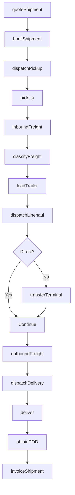
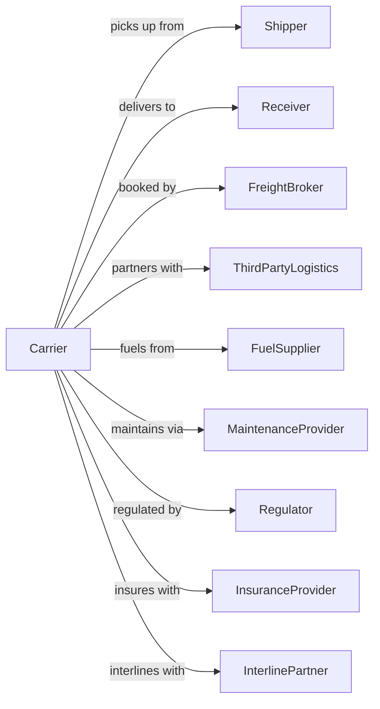

# General Freight Trucking, Long-Distance, Less Than Truckload

> Business-as-Code definition for LTL freight network operations. Models the complete hub-and-spoke lifecycle from pickup through terminal consolidation, linehaul, and final delivery.

## Overview

Long-distance LTL trucking involves combining multiple shipments onto single trailers for efficient movement through a terminal network. This definition exposes actions for managing local pickup, terminal operations, linehaul scheduling, and delivery within the hub-and-spoke model that characterizes LTL freight.

## Actors

| Actor | Description |
|-------|-------------|
| Shipper | Company sending LTL freight |
| Receiver | Destination for LTL delivery |
| FreightBroker | Arranges LTL capacity |
| ThirdPartyLogistics | Manages shipping for customers |
| FuelSupplier | Provides diesel for fleet |
| MaintenanceProvider | Services trucks and trailers |
| Regulator | FMCSA oversight |
| InsuranceProvider | Covers cargo and liability |
| InterlinePartner | Partner carrier for extended reach |

## Roles

| Role | Description |
|------|-------------|
| PickupDriver | Collects shipments from shippers |
| LineHaulDriver | Operates between terminals |
| DeliveryDriver | Makes final deliveries |
| DockWorker | Loads and unloads trailers |
| TerminalManager | Oversees local operations |
| Dispatcher | Coordinates pickup and delivery |
| LoadPlanner | Optimizes trailer builds |
| FreightClassifier | Determines class and pricing |

## Entities

| Entity | Description |
|--------|-------------|
| Shipment | Individual LTL consignment |
| Pallet | Unit of freight handling |
| Trailer | 28 or 53-foot LTL trailer |
| Terminal | Hub for freight consolidation |
| Dock | Loading bay at terminal |
| LineHaul | Movement between terminals |
| Route | Planned pickup or delivery sequence |
| ProNumber | Tracking number for shipment |
| FreightClass | NMFC classification 50-500 |
| Rate | Price based on class and weight |

## Actions

| Action | Description |
|--------|-------------|
| quoteShipment | Calculate rate for LTL move |
| bookShipment | Schedule freight for pickup |
| dispatchPickup | Send driver for collection |
| pickUp | Collect freight from shipper |
| inboundFreight | Receive shipment at origin terminal |
| classifyFreight | Determine NMFC class |
| loadTrailer | Build outbound trailer |
| dispatchLinehaul | Send trailer between terminals |
| transferTerminal | Unload and reload at hub |
| outboundFreight | Process at destination terminal |
| dispatchDelivery | Send driver for final delivery |
| deliver | Complete delivery to receiver |
| obtainPOD | Capture delivery signature |
| invoiceShipment | Bill for completed move |

## Events

| Event | Description |
|-------|-------------|
| shipmentQuoted | Rate calculated |
| shipmentBooked | Pickup scheduled |
| pickupDispatched | Driver assigned for collection |
| freightPickedUp | Shipment collected |
| freightInbounded | Arrived at origin terminal |
| freightClassified | NMFC class assigned |
| trailerLoaded | Outbound trailer built |
| linehaulDispatched | Trailer departed terminal |
| terminalTransferred | Processed at intermediate hub |
| freightOutbounded | Ready at destination terminal |
| deliveryDispatched | Driver assigned for delivery |
| freightDelivered | Shipment completed |
| podObtained | Signature captured |
| shipmentInvoiced | Bill submitted |

## Searches

| Search | Description |
|--------|-------------|
| getQuote | Calculate LTL rate |
| trackShipment | Get shipment status by PRO |
| getTerminalInventory | List freight at terminal |
| getLinehaulSchedule | View trailer departures |
| findPickupAppointments | List available pickup times |
| getDeliveryETA | Estimated delivery date |
| getFreightClass | Look up NMFC classification |
| getTransitTime | Standard days for lane |

## Workflow



## Actor Relationships



## Usage

### Calling Actions

```typescript
import { truckLTLFreight } from '@headlessly/truck-ltl-freight'

const ltlCarrier = truckLTLFreight()

// Get LTL quote
const quote = await ltlCarrier.quoteShipment({
  origin: { zip: '60601', city: 'Chicago', state: 'IL' },
  destination: { zip: '30301', city: 'Atlanta', state: 'GA' },
  pieces: 4,
  weight: 1200,
  freightClass: 70,
  dimensions: { length: 48, width: 40, height: 48 }
})

// Book shipment
const shipment = await ltlCarrier.bookShipment({
  quoteId: quote.id,
  shipper: { name: 'Midwest Parts', address: '123 Industrial' },
  receiver: { name: 'Southern Assembly', address: '456 Factory Rd' },
  pickupDate: '2024-06-15',
  pickupWindow: { start: '08:00', end: '17:00' }
})

// Track by PRO number
const status = await ltlCarrier.trackShipment({
  proNumber: shipment.proNumber
})
```

### Event-Driven Automation

```typescript
// Auto-notify on terminal arrival
ltlCarrier.freightOutbounded(async ({ proNumber, terminal }) => {
  const shipment = await ltlCarrier.trackShipment({ proNumber })

  await sendNotification({
    to: shipment.receiver.email,
    subject: 'Shipment Out for Delivery Tomorrow',
    body: `Your shipment ${proNumber} has arrived at our ${terminal} terminal and will be delivered tomorrow.`
  })
})

// Auto-reclass on inspection
ltlCarrier.freightInbounded(async ({ proNumber, actualDimensions }) => {
  const shipment = await ltlCarrier.trackShipment({ proNumber })
  const actualClass = await ltlCarrier.getFreightClass({ dimensions: actualDimensions })

  if (actualClass !== shipment.bookedClass) {
    await ltlCarrier.classifyFreight({
      proNumber,
      newClass: actualClass,
      reason: 'inspection-reweigh'
    })
  }
})

// Auto-schedule delivery appointment
ltlCarrier.terminalTransferred(async ({ proNumber, destinationTerminal }) => {
  const shipment = await ltlCarrier.trackShipment({ proNumber })

  if (shipment.receiver.requiresAppointment) {
    await requestDeliveryAppointment({
      receiver: shipment.receiver,
      proNumber,
      estimatedDelivery: shipment.eta
    })
  }
})
```
