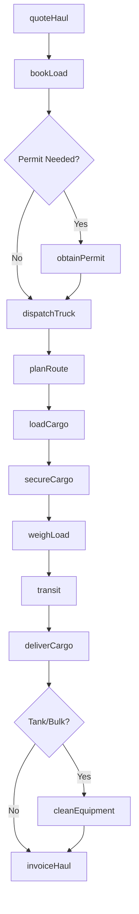
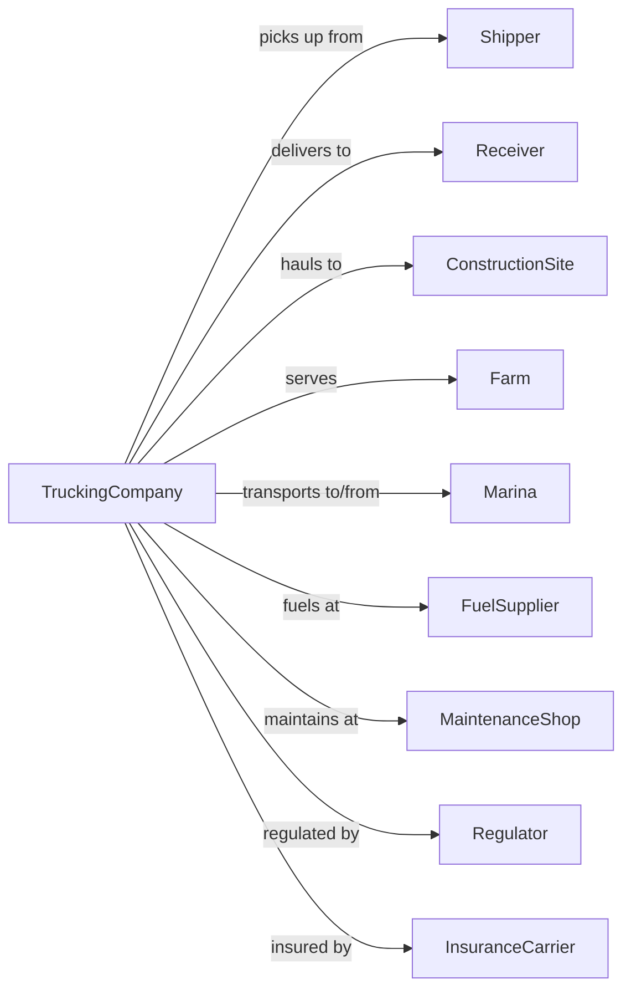

# Specialized Freight (except Used Goods) Trucking, Local

> Business-as-Code definition for local specialized freight trucking operations. Models the complete same-day hauling lifecycle for specialized commodities including agricultural products, bulk liquids, dump materials, livestock, and boats within metropolitan areas.

## Overview

Local specialized freight trucking involves providing same-day trucking services within a metropolitan area using specialized equipment for unique cargo types. This includes tank trucks for bulk liquids, dump trucks for aggregates, flatbeds for oversized loads, livestock trailers, and boat haulers. This definition exposes actions for managing dispatch, specialized loading, regulatory compliance, and delivery for local specialty hauling services.

## Actors

| Actor | Description |
|-------|-------------|
| Shipper | Company or individual sending specialized freight |
| Receiver | Destination for specialized cargo delivery |
| ConstructionSite | Receives dump materials and aggregates |
| Farm | Source or destination for agricultural products |
| Marina | Receives or sends boats for transport |
| FuelSupplier | Provides diesel and DEF for trucks |
| MaintenanceShop | Services specialized trailers and equipment |
| Regulator | DOT, state DMV, and environmental agencies |
| InsuranceCarrier | Provides cargo and liability coverage |

## Roles

| Role | Description |
|------|-------------|
| Driver | Operates specialized truck and handles cargo |
| Dispatcher | Assigns loads and coordinates pickups |
| LoadOperator | Operates cranes, pumps, or loading equipment |
| FleetManager | Maintains specialized equipment fleet |
| SafetyOfficer | Ensures compliance with hazmat and weight regulations |
| CustomerRep | Handles quotes and customer communications |
| MechanicTech | Services hydraulics, tanks, and specialty gear |
| Bookkeeper | Manages billing and receivables |

## Entities

| Entity | Description |
|--------|-------------|
| Truck | Specialized vehicle such as dump truck, tanker, or flatbed |
| Trailer | Specialized trailer for specific cargo types |
| Load | Cargo being transported with weight and specifications |
| Permit | Oversize, overweight, or hazmat transport permit |
| Route | Planned path considering weight restrictions and clearances |
| BOL | Bill of lading with cargo details |
| Tank | Bulk liquid container with capacity and product specs |
| WeighTicket | Certified weight measurement document |
| LoadSecurement | Chains, tarps, and tie-downs for cargo |
| HazmatDoc | Hazardous materials shipping documentation |

## Actions

| Action | Description |
|--------|-------------|
| quoteHaul | Provide rate for specialized local transport |
| bookLoad | Accept specialized freight for transport |
| obtainPermit | Secure required oversize or hazmat permits |
| dispatchTruck | Assign driver and equipment to load |
| planRoute | Calculate path with weight and height restrictions |
| loadCargo | Load specialized freight using appropriate method |
| secureCargo | Apply tie-downs, tarps, or containment |
| weighLoad | Obtain certified weight ticket |
| transit | Transport cargo to destination |
| deliverCargo | Unload at receiver using specialized method |
| cleanEquipment | Wash out tanks or clean trailers post-delivery |
| invoiceHaul | Bill customer for completed service |

## Events

| Event | Description |
|-------|-------------|
| haulQuoted | Rate provided to customer |
| loadBooked | Freight accepted for transport |
| permitObtained | Required permits secured |
| truckDispatched | Driver and equipment assigned |
| routePlanned | Transport path calculated |
| cargoLoaded | Freight loaded onto specialized equipment |
| cargoSecured | Load properly contained and secured |
| loadWeighed | Weight ticket obtained |
| shipmentInTransitUpdated | En route to delivery point |
| cargoDelivered | Freight unloaded at destination |
| equipmentCleaned | Tank or trailer cleaned for next load |
| haulInvoiced | Customer billed for service |

## Searches

| Search | Description |
|--------|-------------|
| findAvailableEquipment | List available specialized trucks and trailers |
| getDriverStatus | Check driver availability and certification |
| findPermitRequirements | Determine permits needed for load |
| getWeightLimits | Retrieve route weight and height restrictions |
| trackLoad | Get current location and status of shipment |
| getHaulHistory | Review completed specialized hauls |
| findWashoutStations | Locate tank cleaning facilities |
| getRateHistory | Get pricing for specific cargo types |

## Workflow



## Actor Relationships



## Usage

### Calling Actions

```typescript
import { truckSpecializedFreight } from '@headlessly/truck-specialized-freight'

const carrier = truckSpecializedFreight()

// Quote a local dump truck haul
const quote = await carrier.quoteHaul({
  cargoType: 'gravel',
  origin: '100 Quarry Road, Denver',
  destination: '500 Construction Ave, Denver',
  estimatedTons: 18,
  truckType: 'dump'
})

// Book the load
const load = await carrier.bookLoad({
  quoteId: quote.id,
  shipper: { name: 'Rocky Mountain Aggregates', contact: 'dispatch@rma.com' },
  receiver: { name: 'Metro Construction', contact: 'site@metro.com' },
  readyTime: '06:00',
  material: 'crushed gravel'
})

// Track in-progress haul
const status = await carrier.trackLoad({
  loadId: load.id
})
```

### Event-Driven Automation

```typescript
// Auto-notify when cargo loaded
carrier.cargoLoaded(async ({ loadId, weight, timestamp }) => {
  const load = await carrier.trackLoad({ loadId })

  await sendNotification({
    to: load.receiver.contact,
    subject: 'Load Departing',
    body: `${weight} tons loaded and en route. ETA: ${load.eta}`
  })
})

// Auto-schedule washout for tank loads
carrier.cargoDelivered(async ({ loadId, cargoType, trailerId }) => {
  if (cargoType === 'bulk-liquid') {
    const stations = await carrier.findWashoutStations({ near: load.destination })

    await scheduleWashout({
      trailerId,
      station: stations[0],
      productHauled: cargoType
    })
  }
})

// Auto-invoice on delivery confirmation
carrier.cargoDelivered(async ({ loadId, weightTicket, signature }) => {
  await carrier.invoiceHaul({
    loadId,
    weightTicket,
    deliveryProof: signature
  })
})
```
