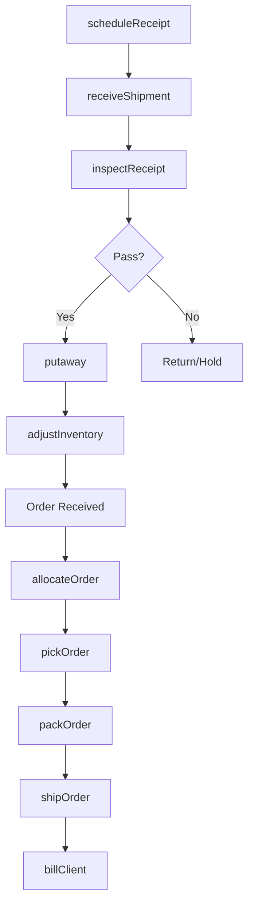
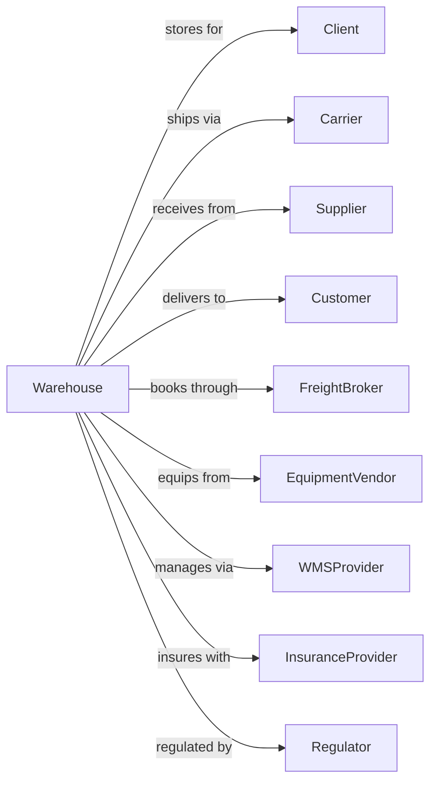

# General Warehousing and Storage

> Business-as-Code definition for third-party logistics and warehouse operations. Models the complete storage lifecycle from receiving through inventory management, order fulfillment, and shipment.

## Overview

General warehousing and storage involves operating facilities for merchandise storage, distribution, and fulfillment services using pallets, racks, and material handling equipment. This definition exposes actions for managing inbound receiving, putaway, inventory control, pick-pack-ship operations, and outbound shipping for diverse clients and products.

## Actors

| Actor | Description |
|-------|-------------|
| Client | Company storing goods at warehouse |
| Carrier | Trucking company for inbound/outbound |
| Supplier | Source of goods for receiving |
| Customer | End recipient of shipped orders |
| FreightBroker | Arranges transportation |
| EquipmentVendor | Supplies forklifts and racking |
| WMSProvider | Warehouse management system vendor |
| InsuranceProvider | Covers inventory and liability |
| Regulator | OSHA safety compliance |

## Roles

| Role | Description |
|------|-------------|
| WarehouseManager | Oversees facility operations |
| ReceivingClerk | Processes inbound shipments |
| PutawayOperator | Moves product to storage locations |
| InventorySpecialist | Manages stock levels and counts |
| Picker | Retrieves items for orders |
| Packer | Prepares orders for shipment |
| ShippingClerk | Processes outbound shipments |
| ForkliftOperator | Operates material handling equipment |
| WMSAdmin | Configures and maintains warehouse management system for slotting and task assignment |

## Entities

| Entity | Description |
|--------|-------------|
| Warehouse | Storage facility with capacity |
| Location | Specific bin, shelf, or rack position |
| Pallet | Unit of stored goods |
| SKU | Stock keeping unit identifier |
| Inventory | Quantity of product on hand |
| Receipt | Inbound shipment document |
| Order | Customer request for fulfillment |
| Shipment | Outbound delivery |
| BOL | Bill of lading for shipping |
| Client | Customer storing goods |

## Actions

| Action | Description |
|--------|-------------|
| scheduleReceipt | Book inbound appointment |
| receiveShipment | Accept goods at dock |
| inspectReceipt | Check quantity and condition |
| putaway | Move product to storage location |
| adjustInventory | Update stock levels |
| cycleCount | Verify inventory by location |
| allocateOrder | Reserve inventory for order |
| pickOrder | Retrieve items from locations |
| packOrder | Prepare items for shipment |
| shipOrder | Load and dispatch outbound |
| transferInventory | Move between locations |
| returnToStock | Process returns to inventory |
| reportInventory | Generate stock reports |
| billClient | Invoice for storage and handling |

## Events

| Event | Description |
|-------|-------------|
| receiptScheduled | Inbound appointment booked |
| shipmentReceived | Goods accepted at dock |
| receiptInspected | Quality check completed |
| productPutaway | Items placed in storage |
| inventoryAdjusted | Stock levels updated |
| cycleCounted | Location inventory verified |
| orderAllocated | Stock reserved for order |
| orderPicked | Items retrieved |
| orderPacked | Shipment prepared |
| orderShipped | Outbound dispatched |
| inventoryTransferred | Stock moved between locations |
| returnProcessed | Items returned to stock |
| inventoryReported | Stock report generated |
| clientBilled | Invoice sent |

## Searches

| Search | Description |
|--------|-------------|
| getInventory | List stock by SKU or location |
| findLocation | Locate available storage space |
| getReceipts | List inbound shipments |
| getOrders | List orders by status |
| trackShipment | Get outbound tracking |
| getClientInventory | List stock by client |
| getLowStock | Find items below reorder point |
| getCapacity | Check available warehouse space |

## Workflow



## Actor Relationships



## Usage

### Calling Actions

```typescript
import { storeGeneralWarehousing } from '@headlessly/store-general-warehousing'

const warehouse = storeGeneralWarehousing()

// Schedule inbound receipt
const receipt = await warehouse.scheduleReceipt({
  clientId: 'acme-corp',
  carrier: 'abc-trucking',
  expectedDate: '2024-06-15',
  expectedTime: '10:00',
  pallets: 24,
  poNumber: 'PO-2024-1234'
})

// Receive and putaway
await warehouse.receiveShipment({
  receiptId: receipt.id,
  actualPallets: 24,
  condition: 'good'
})

// Process outbound order
const order = await warehouse.allocateOrder({
  orderId: 'ORD-5678',
  items: [
    { sku: 'WIDGET-001', quantity: 100 },
    { sku: 'GADGET-002', quantity: 50 }
  ]
})

await warehouse.pickOrder({ orderId: order.id })
await warehouse.packOrder({ orderId: order.id, boxes: 3 })
await warehouse.shipOrder({ orderId: order.id, carrier: 'fedex' })
```

### Event-Driven Automation

```typescript
// Auto-notify on shipment receipt
warehouse.shipmentReceived(async ({ receiptId, clientId }) => {
  const receipt = await warehouse.getReceipts({ receiptId })

  await sendNotification({
    to: clientId,
    subject: 'Shipment Received',
    body: `Your shipment ${receipt.poNumber} has been received at our facility.`
  })
})

// Auto-reorder on low stock
warehouse.inventoryAdjusted(async ({ sku, newQuantity, clientId }) => {
  const item = await warehouse.getInventory({ sku, clientId })

  if (newQuantity <= item.reorderPoint) {
    await sendAlert({
      to: clientId,
      subject: 'Low Stock Alert',
      body: `SKU ${sku} is below reorder point. Current qty: ${newQuantity}`
    })
  }
})

// Auto-bill monthly storage
warehouse.monthEnd(async ({ month }) => {
  const clients = await warehouse.getClientInventory({})

  for (const client of clients) {
    const storage = calculateStorageCharges(client.palletDays)
    await warehouse.billClient({
      clientId: client.id,
      period: month,
      charges: storage
    })
  }
})
```
