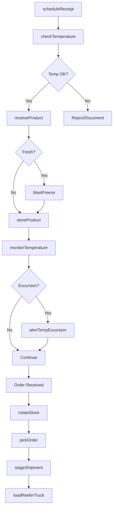
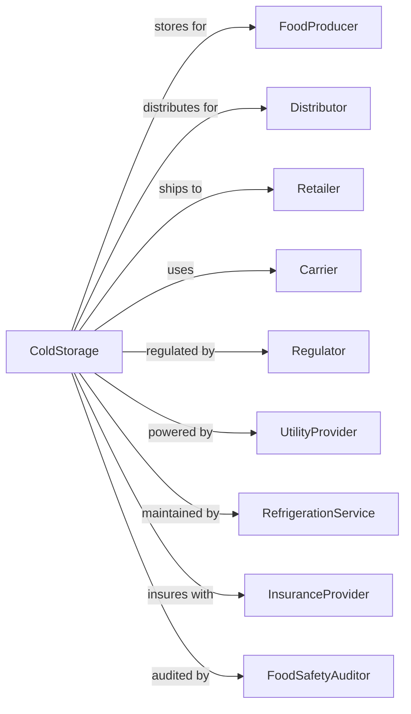

# Refrigerated Warehousing and Storage

> Business-as-Code definition for cold storage and frozen warehouse operations. Models the complete temperature-controlled storage lifecycle from receiving through cold chain management and shipment.

## Overview

Refrigerated warehousing and storage involves operating temperature-controlled facilities for frozen, chilled, and climate-sensitive products including food, pharmaceuticals, and chemicals. This definition exposes actions for managing cold chain integrity, blast freezing, tempering, and FIFO rotation.

## Actors

| Actor | Description |
|-------|-------------|
| FoodProducer | Manufacturer of frozen/fresh products |
| Distributor | Company distributing refrigerated goods |
| Retailer | Grocery or foodservice customer |
| Carrier | Refrigerated trucking company |
| Regulator | FDA and USDA food safety authorities |
| UtilityProvider | Electricity for refrigeration |
| RefrigerationService | Maintains cooling systems |
| InsuranceProvider | Covers inventory and spoilage |
| FoodSafetyAuditor | Certifies compliance |

## Roles

| Role | Description |
|------|-------------|
| ColdStorageManager | Oversees facility operations |
| ReceivingClerk | Checks temperatures on arrival |
| FreezeTechnician | Operates blast freeze equipment |
| InventorySpecialist | Manages lot and date tracking |
| Picker | Retrieves items from cold zones |
| QualityInspector | Monitors temperature compliance |
| MaintenanceTech | Services refrigeration equipment |
| ShippingClerk | Coordinates outbound loads |

## Entities

| Entity | Description |
|--------|-------------|
| ColdRoom | Temperature-controlled storage zone |
| Pallet | Unit of refrigerated product |
| Product | Temperature-sensitive goods |
| LotNumber | Batch tracking identifier |
| ExpirationDate | Product shelf life date |
| Temperature | Recorded temp reading |
| BlastFreezer | Rapid freeze equipment |
| Shipment | Inbound or outbound load |
| TempLog | Temperature monitoring record |
| Certificate | Food safety documentation |

## Actions

| Action | Description |
|--------|-------------|
| scheduleReceipt | Book refrigerated inbound |
| checkTemperature | Verify product temperature |
| receiveProduct | Accept goods with temp verification |
| blastFreeze | Rapidly freeze fresh product |
| temper | Gradually adjust product temperature |
| storeProduct | Place in appropriate cold zone |
| monitorTemperature | Continuously log temperatures |
| rotateStock | Manage FIFO for expiration |
| pickOrder | Retrieve from cold storage |
| stageShipment | Hold in dock staging area |
| loadReeferTruck | Transfer to refrigerated trailer |
| recordLotTrace | Document lot movements |
| alertTempExcursion | Notify of temperature deviation |
| certifyCompliance | Issue food safety documentation |

## Events

| Event | Description |
|-------|-------------|
| receiptScheduled | Inbound appointment booked |
| temperatureChecked | Arrival temp verified |
| productReceived | Goods accepted to cold storage |
| blastFrozen | Product rapidly frozen |
| productTempered | Temperature adjusted |
| productStored | Placed in cold zone |
| temperatureMonitored | Reading logged |
| stockRotated | FIFO movement completed |
| orderPicked | Items retrieved from cold |
| shipmentStaged | Ready at dock |
| truckLoaded | Reefer loaded and departed |
| lotTraced | Movement documented |
| tempExcursionAlerted | Deviation notification sent |
| complianceCertified | Documentation issued |
| dailyCheckPerformed | Daily temperature and facility inspection completed |

## Searches

| Search | Description |
|--------|-------------|
| getInventory | List products by zone and lot |
| checkTemperatures | Get current readings by zone |
| findExpiring | List products near expiration |
| getLotHistory | Trace product movements |
| getCapacity | Check available cold storage |
| getTempLogs | Retrieve historical readings |
| getExcursions | List temperature deviations |
| findProducts | Search by lot or customer |

## Workflow



## Actor Relationships



## Usage

### Calling Actions

```typescript
import { storeRefrigeratedWarehousing } from '@headlessly/store-refrigerated-warehousing'

const coldStorage = storeRefrigeratedWarehousing()

// Check temperature on receipt
const tempCheck = await coldStorage.checkTemperature({
  shipmentId: 'SHP-2024-456',
  readings: [
    { location: 'front', temp: -15 },
    { location: 'middle', temp: -14 },
    { location: 'rear', temp: -16 }
  ],
  targetTemp: -18,
  tolerance: 5
})

// Receive into cold storage
await coldStorage.receiveProduct({
  shipmentId: 'SHP-2024-456',
  products: [
    { sku: 'FROZEN-BEEF-001', pallets: 10, lotNumber: 'LOT-2024-789' },
    { sku: 'FROZEN-CHICKEN-002', pallets: 8, lotNumber: 'LOT-2024-790' }
  ],
  zone: 'freezer-A',
  receivedTemp: -15
})

// Pick order with FIFO
const picks = await coldStorage.pickOrder({
  orderId: 'ORD-1234',
  items: [{ sku: 'FROZEN-BEEF-001', cases: 200 }],
  fifo: true
})
```

### Event-Driven Automation

```typescript
// Auto-alert on temperature excursion
coldStorage.temperatureMonitored(async ({ zone, reading, target }) => {
  const deviation = Math.abs(reading - target)

  if (deviation > 3) {
    await coldStorage.alertTempExcursion({
      zone,
      actualTemp: reading,
      targetTemp: target,
      deviation,
      severity: deviation > 5 ? 'critical' : 'warning'
    })

    // Notify quality team
    await sendAlert({
      to: 'quality@coldstorage.com',
      subject: `Temperature Excursion: ${zone}`,
      body: `Zone ${zone} at ${reading}F, target ${target}F`
    })
  }
})

// Auto-notify expiring inventory
coldStorage.dailyCheckPerformed(async () => {
  const expiring = await coldStorage.findExpiring({
    daysUntilExpiration: 14
  })

  for (const item of expiring) {
    await sendNotification({
      to: item.customerId,
      subject: 'Product Expiration Notice',
      body: `Lot ${item.lotNumber} expires in ${item.daysRemaining} days`
    })
  }
})
```
