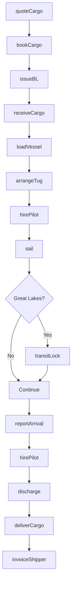
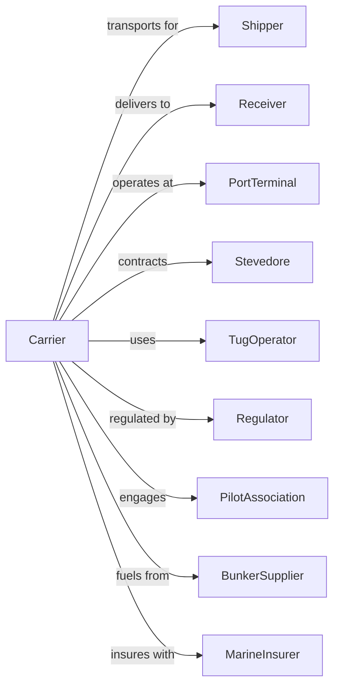

# Coastal and Great Lakes Freight Transportation

> Business-as-Code definition for domestic water freight operations. Models the complete Jones Act shipping lifecycle from booking through coastal and Great Lakes cargo movement.

## Overview

Coastal and Great Lakes freight transportation involves operating vessels between U.S. ports under Jones Act cabotage requirements, moving bulk commodities, containers, and project cargo. This definition exposes actions for managing domestic waterborne freight on coastal routes, the Great Lakes-St. Lawrence Seaway system, and intercoastal trade.

## Actors

| Actor | Description |
|-------|-------------|
| Shipper | Company sending domestic waterborne freight |
| Receiver | Company receiving cargo at destination port |
| PortTerminal | Loads and discharges vessels |
| Stevedore | Provides cargo handling labor |
| TugOperator | Assists vessel movements |
| Regulator | Coast Guard and Maritime Administration |
| PilotAssociation | Provides harbor pilots |
| BunkerSupplier | Provides marine fuel |
| MarineInsurer | Covers cargo and hull |

## Roles

| Role | Description |
|------|-------------|
| Captain | Commands vessel on domestic routes |
| ChiefMate | Manages cargo operations |
| ChiefEngineer | Maintains propulsion systems |
| PortCaptain | Coordinates vessel operations |
| TrafficManager | Schedules sailings and cargo |
| DocumentsClerk | Prepares domestic shipping documents |
| CustomerService | Handles shipper inquiries |
| SafetyOfficer | Ensures regulatory compliance |

## Entities

| Entity | Description |
|--------|-------------|
| Vessel | Jones Act qualified ship or barge |
| Cargo | Bulk, breakbulk, or containerized freight |
| Voyage | Scheduled sailing between domestic ports |
| BillOfLading | Domestic shipping contract |
| Port | U.S. coastal or Great Lakes terminal |
| Berth | Dock position for loading/discharge |
| Rate | Freight price per ton or container |
| Manifest | Cargo listing for voyage |
| Lock | Great Lakes-St. Lawrence passage |
| Tug | Vessel assist boat |

## Actions

| Action | Description |
|--------|-------------|
| quoteCargo | Provide rate for shipment |
| bookCargo | Reserve space on vessel |
| issueBL | Create domestic bill of lading |
| receiveCargo | Accept freight at origin terminal |
| loadVessel | Place cargo aboard ship |
| sail | Transit coastal waters or lakes |
| transitLock | Pass through St. Lawrence Seaway locks |
| discharge | Remove cargo at destination |
| deliverCargo | Release freight to receiver |
| trackShipment | Monitor cargo location |
| invoiceShipper | Bill for transportation services |
| arrangeTug | Schedule assist boats |
| hirePilot | Engage harbor pilot |
| reportArrival | Notify port of vessel ETA |

## Events

| Event | Description |
|-------|-------------|
| cargoQuoted | Rate provided to shipper |
| cargoBooked | Space reserved on voyage |
| blIssued | Bill of lading created |
| cargoReceived | Freight accepted at terminal |
| vesselLoaded | Cargo placed aboard |
| vesselSailed | Departed origin port |
| lockTransited | Passed through seaway lock |
| vesselArrived | Reached destination port |
| cargoDischarged | Unloaded from vessel |
| cargoDelivered | Released to receiver |
| shipmentTracked | Location update recorded |
| shipperInvoiced | Bill sent for services |
| tugArranged | Assist boats scheduled |
| pilotHired | Harbor pilot engaged |

## Searches

| Search | Description |
|--------|-------------|
| findSailings | List domestic voyages by route |
| trackCargo | Get shipment location and ETA |
| getBillOfLading | Retrieve shipping documents |
| getVesselSchedule | View sailing dates and ports |
| getRates | Get pricing for domestic lanes |
| getPortConditions | Check terminal status |
| getLockSchedule | View seaway lock availability |
| getWeather | Check marine conditions |

## Workflow



## Actor Relationships



## Usage

### Calling Actions

```typescript
import { shipCoastalGreat } from '@headlessly/ship-coastal-great'

const carrier = shipCoastalGreat()

// Get quote for coastal shipment
const quote = await carrier.quoteCargo({
  origin: 'USHOU', // Houston
  destination: 'USNYC', // New York
  commodity: 'steel-coils',
  weight: 5000,
  units: 'metric-tons'
})

// Book cargo space
const booking = await carrier.bookCargo({
  quoteId: quote.id,
  shipper: { name: 'Texas Steel', port: 'Houston' },
  receiver: { name: 'Northeast Metals', port: 'Newark' },
  readyDate: '2024-06-15'
})

// Track shipment
const status = await carrier.trackCargo({
  blNumber: booking.blNumber
})
```

### Event-Driven Automation

```typescript
// Auto-notify on vessel arrival
carrier.vesselArrived(async ({ voyageId, port }) => {
  const bookings = await carrier.findSailings({ voyageId })

  for (const booking of bookings.filter(b => b.destinationPort === port)) {
    await sendNotification({
      to: booking.receiver.email,
      subject: 'Cargo Arrival Notice',
      body: `Your shipment has arrived at ${port}. Ready for pickup.`
    })
  }
})

// Auto-arrange tugs for vessel movements
carrier.reportArrival(async ({ vesselId, port, eta }) => {
  const vessel = await carrier.getVesselSchedule({ vesselId })

  if (vessel.requiresTugAssist) {
    await carrier.arrangeTug({
      vesselId,
      port,
      serviceTime: eta,
      tugsRequired: vessel.draft > 35 ? 2 : 1
    })
  }
})
```
