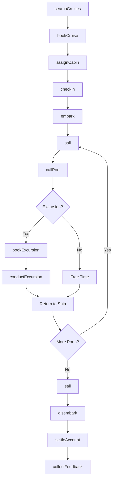
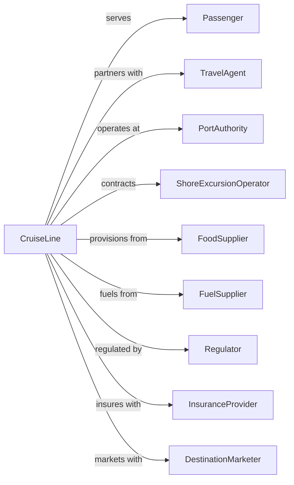

# Deep Sea Passenger Transportation

> Business-as-Code definition for ocean cruise and passenger ship operations. Models the complete voyage lifecycle from booking through embarkation, onboard service, and port calls.

## Overview

Deep sea passenger transportation involves operating cruise ships and ocean liners on international voyages, providing transportation and hospitality services. This definition exposes actions for managing cruise bookings, cabin assignments, embarkation, onboard services, shore excursions, and disembarkation.

## Actors

| Actor | Description |
|-------|-------------|
| Passenger | Guest booking cruise travel |
| TravelAgent | Books cruises on behalf of passengers |
| PortAuthority | Manages cruise terminal operations |
| ShoreExcursionOperator | Provides tours at port calls |
| FoodSupplier | Provisions vessel with consumables |
| FuelSupplier | Provides marine bunker fuel |
| Regulator | Coast Guard and flag state authority |
| InsuranceProvider | Covers passenger and vessel liability |
| DestinationMarketer | Promotes ports and itineraries |

## Roles

| Role | Description |
|------|-------------|
| Captain | Commands cruise vessel |
| HotelDirector | Manages guest services |
| CruiseDirector | Coordinates entertainment and activities |
| PurserOfficer | Handles guest accounts and documentation |
| CabinSteward | Provides stateroom service |
| ChefExecutive | Oversees food and beverage |
| MedicalOfficer | Provides onboard healthcare |
| ShoreExManager | Coordinates port excursions |
| CasinoManager | Oversees onboard gaming operations and revenue |

## Entities

| Entity | Description |
|--------|-------------|
| Cruise | Voyage itinerary with dates and ports |
| Vessel | Cruise ship with passenger capacity |
| Cabin | Stateroom with category and amenities |
| Booking | Passenger reservation with fare |
| Itinerary | Sequence of port calls |
| PortCall | Scheduled stop at destination |
| Excursion | Shore tour or activity |
| OnboardAccount | Guest charges and credits |
| Manifest | List of all passengers aboard |
| Embarkation | Boarding process at home port |

## Actions

| Action | Description |
|--------|-------------|
| searchCruises | Find available voyages by itinerary |
| bookCruise | Reserve cabin and create reservation |
| assignCabin | Allocate specific stateroom |
| checkIn | Process passenger online before sailing |
| embark | Board passengers at terminal |
| sail | Depart port and transit at sea |
| callPort | Arrive at destination port |
| bookExcursion | Reserve shore tour |
| conductExcursion | Execute shore activity |
| chargeAccount | Post expense to guest folio |
| provideService | Deliver onboard amenities |
| disembark | Process guest departure |
| settleAccount | Finalize guest charges |
| collectFeedback | Gather post-cruise survey |

## Events

| Event | Description |
|-------|-------------|
| cruiseSearched | Available voyages returned |
| cruiseBooked | Reservation confirmed |
| cabinAssigned | Stateroom allocated |
| passengerCheckedIn | Online check-in completed |
| passengerEmbarked | Guest boarded vessel |
| vesselSailed | Departed from port |
| portCalled | Arrived at destination |
| excursionBooked | Shore tour reserved |
| excursionCompleted | Shore activity finished |
| accountCharged | Expense posted to folio |
| serviceProvided | Amenity delivered |
| passengerDisembarked | Guest departed vessel |
| accountSettled | Final charges processed |
| feedbackCollected | Survey response received |

## Searches

| Search | Description |
|--------|-------------|
| findCruises | List voyages by destination and date |
| getCabinAvailability | Check stateroom inventory |
| getBooking | Retrieve reservation details |
| getItinerary | View voyage schedule and ports |
| findExcursions | List shore tours at port |
| getManifest | View passenger list |
| getAccountBalance | Check guest folio |
| getVesselPosition | Track ship location |

## Workflow



## Actor Relationships



## Usage

### Calling Actions

```typescript
import { shipOceanPassengers } from '@headlessly/ship-ocean-passengers'

const cruiseLine = shipOceanPassengers()

// List voyages by destination and date
const cruises = await cruiseLine.findCruises({ destination: 'caribbean', departureMonth: '2024-12' })

// Check stateroom inventory
const cabinAvailability = await cruiseLine.getCabinAvailability({ cruiseId: 'CRU-2024-1201', category: 'balcony' })

// Search for Caribbean cruises
const cruises = await cruiseLine.searchCruises({
  destination: 'caribbean',
  departurePort: 'USMIA',
  departureMonth: '2024-12',
  nights: 7,
  passengers: 2
})

// Book a cruise
const booking = await cruiseLine.bookCruise({
  cruiseId: cruises[0].id,
  passengers: [
    { firstName: 'John', lastName: 'Smith', dob: '1980-05-15' },
    { firstName: 'Jane', lastName: 'Smith', dob: '1982-08-22' }
  ],
  cabinCategory: 'balcony',
  fareType: 'all-inclusive'
})

// Book shore excursion
await cruiseLine.bookExcursion({
  bookingId: booking.id,
  portCall: 'COZUMEL',
  excursionId: 'snorkel-reef-tour',
  participants: 2
})
```

### Event-Driven Automation

```typescript
// Auto-send pre-cruise information
cruiseLine.cruiseBooked(async ({ bookingId, cruiseId, departureDate }) => {
  const daysUntilDeparture = daysBetween(new Date(), departureDate)

  if (daysUntilDeparture <= 30) {
    await sendEmail({
      to: booking.primaryGuest.email,
      subject: 'Your Cruise is Coming Up!',
      template: 'pre-cruise-info',
      data: { cruiseId, departureDate }
    })
  }
})

// Auto-prompt for feedback after disembarkation
cruiseLine.passengerDisembarked(async ({ bookingId, passengerEmail }) => {
  await scheduleEmail({
    to: passengerEmail,
    subject: 'How was your cruise?',
    template: 'post-cruise-survey',
    sendAt: addDays(new Date(), 1)
  })
})
```
