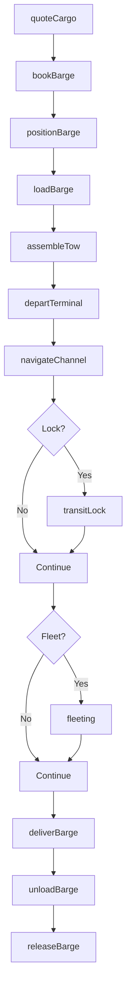
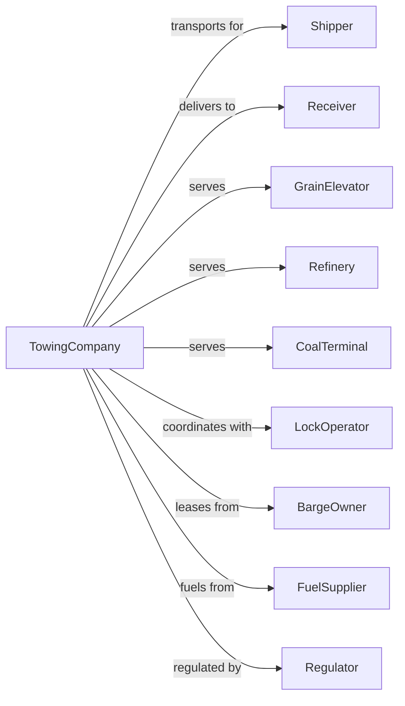

# Inland Water Freight Transportation

> Business-as-Code definition for river and inland waterway barge operations. Models the complete tow lifecycle from booking through lock passage and terminal delivery on the Mississippi, Ohio, and other inland waterways.

## Overview

Inland water freight transportation involves operating towboats and barges on rivers, canals, and intracoastal waterways to move bulk commodities including grain, coal, petroleum, and aggregates. This definition exposes actions for managing barge fleets, tow assembly, lock navigation, and terminal operations across the inland waterway system.

## Actors

| Actor | Description |
|-------|-------------|
| Shipper | Company shipping bulk commodities by barge |
| Receiver | Destination terminal receiving barge cargo |
| GrainElevator | Agricultural facility loading/unloading grain |
| Refinery | Petroleum facility for liquid cargo |
| CoalTerminal | Mining operation shipping coal |
| LockOperator | Army Corps managing lock passages |
| BargeOwner | Leases barges for freight |
| FuelSupplier | Provides marine diesel |
| Regulator | Coast Guard and Corps of Engineers |

## Roles

| Role | Description |
|------|-------------|
| TowboatCaptain | Commands towboat and navigates waterway |
| Pilot | Steers tow through difficult passages |
| Deckhand | Handles lines and assists barge operations |
| PortEngineer | Maintains towboat propulsion |
| FleetManager | Coordinates barge positioning |
| Dispatcher | Schedules tows and manages fleet |
| TerminalOperator | Loads and unloads barges |
| TrafficCoordinator | Manages waterway movements |
| Lockmaster | Coordinates vessel passage through river locks and dams |

## Entities

| Entity | Description |
|--------|-------------|
| Towboat | Vessel pushing or pulling barges |
| Barge | Flat-bottomed cargo vessel |
| Tow | Assembly of barges pushed by towboat |
| Cargo | Bulk commodity being transported |
| Lock | Navigation structure for elevation changes |
| Terminal | Loading or discharge facility |
| Waterway | Navigable river or canal |
| FleetingArea | Location for staging barges |
| BillOfLading | Shipping documentation |
| Rate | Price per ton for commodity movement |

## Actions

| Action | Description |
|--------|-------------|
| quoteCargo | Provide rate for barge shipment |
| bookBarge | Reserve barge capacity |
| positionBarge | Move empty barge to loading terminal |
| loadBarge | Fill barge with commodity |
| assembleTow | Build tow configuration |
| departTerminal | Leave loading facility |
| navigateChannel | Transit waterway maintaining channel |
| transitLock | Pass through navigation lock |
| fleeting | Stage barges at intermediate point |
| deliverBarge | Arrive at discharge terminal |
| unloadBarge | Remove cargo from barge |
| releaseBarge | Return empty to fleet |
| trackTow | Monitor tow location |
| reportPosition | Submit location to traffic system |

## Events

| Event | Description |
|-------|-------------|
| cargoQuoted | Rate provided to shipper |
| bargeBooked | Capacity reserved |
| bargePositioned | Empty arrived at terminal |
| bargeLoaded | Cargo aboard barge |
| towAssembled | Tow configuration complete |
| towDeparted | Left origin terminal |
| lockApproached | Arrived at navigation lock |
| lockTransited | Passed through lock |
| towFleeted | Barges staged at intermediate |
| bargeDelivered | Arrived at destination |
| bargeUnloaded | Cargo discharged |
| bargeReleased | Empty returned to fleet |
| towTracked | Position update recorded |
| positionReported | Location submitted |

## Searches

| Search | Description |
|--------|-------------|
| findBarges | List available barges by type |
| trackTow | Get tow location and ETA |
| getLockStatus | Check lock queue and delays |
| getWaterLevel | Monitor river stages |
| getTerminalStatus | Check loading/unloading capacity |
| findFleetingAreas | List staging locations |
| getRates | Get pricing for commodity route |
| getWeather | Check conditions for navigation |

## Workflow



## Actor Relationships



## Usage

### Calling Actions

```typescript
import { shipInlandWater } from '@headlessly/ship-inland-water'

const towingCompany = shipInlandWater()

// Get quote for grain shipment
const quote = await towingCompany.quoteCargo({
  origin: 'minneapolis-terminal',
  destination: 'new-orleans-export',
  commodity: 'corn',
  tons: 50000,
  bargeType: 'covered-hopper'
})

// Book barges
const booking = await towingCompany.bookBarge({
  quoteId: quote.id,
  bargeCount: 30,
  loadDate: '2024-06-20',
  shipper: 'midwest-grain-coop'
})

// Track tow in transit
const status = await towingCompany.trackTow({
  towId: 'MV-ENTERPRISE-2024-156'
})
```

### Event-Driven Automation

```typescript
// Auto-notify on lock approach
towingCompany.lockApproached(async ({ towId, lockName, eta }) => {
  await towingCompany.reportPosition({
    towId,
    location: lockName,
    eta,
    bargeCount: 15
  })

  const lockStatus = await towingCompany.getLockStatus({ lockName })

  if (lockStatus.queueLength > 5) {
    await sendNotification({
      to: 'dispatch@company.com',
      subject: `Lock Delay Alert: ${lockName}`,
      body: `Tow ${towId} facing ${lockStatus.estimatedDelay} hour delay`
    })
  }
})

// Auto-coordinate fleeting
towingCompany.towDeparted(async ({ towId, bargeCount }) => {
  if (bargeCount > 15) {
    // Large tows may need to split at intermediate points
    await towingCompany.fleeting({
      towId,
      fleetingArea: 'cairo-fleeting',
      action: 'split-tow'
    })
  }
})
```
