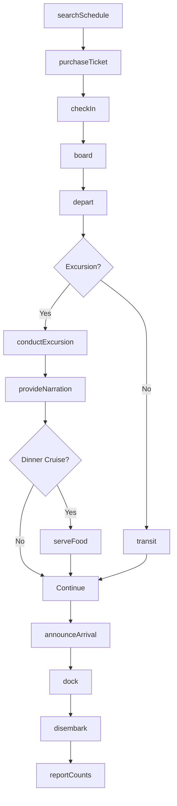
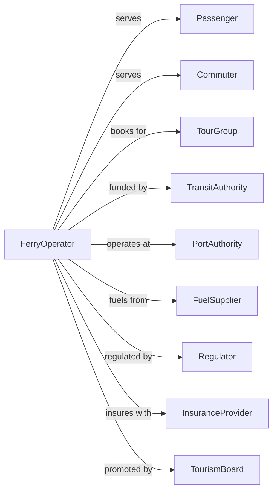

# Inland Water Passenger Transportation

> Business-as-Code definition for river ferry and excursion boat operations. Models the complete passenger service lifecycle from booking through boarding, transit, and arrival on rivers and inland waterways.

## Overview

Inland water passenger transportation involves operating ferries, riverboats, and excursion vessels on rivers, lakes, and intracoastal waterways for passenger service. This definition exposes actions for managing ferry schedules, ticket sales, passenger boarding, and river cruise operations.

## Actors

| Actor | Description |
|-------|-------------|
| Passenger | Traveler using ferry or excursion service |
| Commuter | Regular ferry rider for daily transport |
| TourGroup | Organized excursion booking |
| TransitAuthority | Public agency funding ferry service |
| PortAuthority | Manages ferry terminals |
| FuelSupplier | Provides marine diesel |
| Regulator | Coast Guard safety oversight |
| InsuranceProvider | Covers passenger liability |
| TourismBoard | Promotes excursion services |

## Roles

| Role | Description |
|------|-------------|
| Captain | Commands passenger vessel |
| Deckhand | Assists boarding and handles lines |
| TicketAgent | Sells tickets and processes fares |
| PurserOfficer | Manages onboard accounts |
| TourNarrator | Provides commentary on excursions |
| SafetyOfficer | Conducts safety briefings |
| Dispatcher | Schedules departures and crews |
| TerminalManager | Oversees passenger facilities |

## Entities

| Entity | Description |
|--------|-------------|
| Ferry | Vessel for passenger transport |
| ExcursionBoat | Vessel for sightseeing cruises |
| Route | Scheduled service between landings |
| Schedule | Departure times and frequency |
| Ticket | Fare document for passage |
| Landing | Passenger boarding location |
| Crossing | Single trip between terminals |
| Excursion | Sightseeing or dinner cruise |
| Manifest | Passenger count for voyage |
| Fare | Price for passage type |

## Actions

| Action | Description |
|--------|-------------|
| searchSchedule | Find available departures |
| purchaseTicket | Buy fare for passage |
| checkIn | Process passenger for boarding |
| board | Allow passengers onto vessel |
| depart | Leave terminal on schedule |
| transit | Cross waterway to destination |
| announceArrival | Notify of approaching landing |
| dock | Secure vessel at terminal |
| disembark | Allow passengers to exit |
| conductExcursion | Operate sightseeing cruise |
| provideNarration | Deliver tour commentary |
| serveFood | Provide dining on dinner cruise |
| trackVessel | Monitor vessel location |
| reportCounts | Submit passenger statistics |

## Events

| Event | Description |
|-------|-------------|
| scheduleSearched | Departures returned to customer |
| ticketPurchased | Fare paid and ticket issued |
| passengerCheckedIn | Boarding processed |
| passengersBoarded | Guests aboard vessel |
| vesselDeparted | Left terminal |
| crossingCompleted | Arrived at destination |
| arrivalAnnounced | Landing approach broadcast |
| vesselDocked | Secured at terminal |
| passengersDisembarked | Guests departed vessel |
| excursionCompleted | Sightseeing cruise finished |
| narrationProvided | Commentary delivered |
| foodServed | Dining service completed |
| vesselTracked | Position recorded |
| countsReported | Statistics submitted |
| weatherWarningIssued | Weather warning issued affecting operations |

## Searches

| Search | Description |
|--------|-------------|
| findDepartures | List scheduled crossings |
| checkAvailability | View capacity for departure |
| getTicket | Retrieve ticket details |
| getSchedule | View full route timetable |
| findExcursions | List available cruises |
| trackVessel | Get vessel location |
| getWeather | Check conditions for sailing |
| getFareRules | View pricing and policies |

## Workflow



## Actor Relationships



## Usage

### Calling Actions

```typescript
import { shipRiverPassengers } from '@headlessly/ship-river-passengers'

const ferryService = shipRiverPassengers()

// List scheduled crossings
const departures = await ferryService.findDepartures({ route: 'hudson-river', date: '2024-06-15' })

// View capacity for departure
const availability = await ferryService.checkAvailability({ departureId: 'DEP-1430', passengers: 4 })

// Search for ferry departures
const departures = await ferryService.searchSchedule({
  origin: 'downtown-landing',
  destination: 'airport-terminal',
  date: '2024-06-15',
  passengers: 2
})

// Purchase tickets
const ticket = await ferryService.purchaseTicket({
  departureId: departures[0].id,
  passengers: 2,
  fareType: 'adult',
  paymentMethod: 'creditCard'
})

// Book dinner cruise excursion
const excursion = await ferryService.conductExcursion({
  type: 'dinner-cruise',
  date: '2024-06-20',
  time: '19:00',
  guests: 4,
  menu: 'captain-table',
  specialRequests: ['window-seat', 'anniversary-cake']
})
```

### Event-Driven Automation

```typescript
// Auto-notify on vessel approach
ferryService.crossingCompleted(async ({ vesselId, landing }) => {
  // Announce to waiting passengers
  await ferryService.announceArrival({
    landing,
    vessel: vesselId,
    message: `The ferry is now arriving. Please prepare to board.`
  })
})

// Auto-report daily statistics
ferryService.passengersDisembarked(async ({ vesselId, passengerCount, routeId }) => {
  await ferryService.reportCounts({
    vesselId,
    routeId,
    date: new Date(),
    passengers: passengerCount,
    reportTo: 'transit-authority'
  })
})

// Auto-adjust schedule for weather
ferryService.weatherWarningIssued(async ({ severity, waterway }) => {
  if (severity === 'high') {
    await ferryService.cancelDepartures({
      waterway,
      reason: 'weather',
      notifyPassengers: true
    })
  }
})
```
