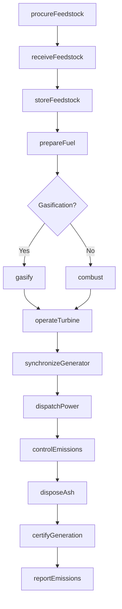
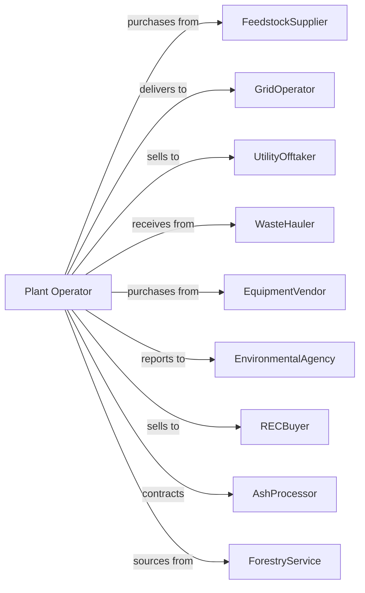

# Biomass Electric Power Generation

> Business-as-Code definition for biomass power generation operations. Models the complete feedstock-to-electricity lifecycle from fuel procurement through grid delivery.

## Overview

Biomass electric power generation converts organic materials such as wood waste, agricultural residues, and municipal solid waste into electricity through combustion or gasification. This definition exposes actions for feedstock management, combustion control, emissions compliance, and power dispatch, with events for automation and searches for operational data retrieval.

## Actors

| Actor | Description |
|-------|-------------|
| FeedstockSupplier | Provides wood chips, agricultural residue, or waste fuel |
| GridOperator | Receives generated power and manages interconnection |
| UtilityOfftaker | Purchases power under renewable energy contract |
| WasteHauler | Delivers municipal solid waste or industrial byproducts |
| EquipmentVendor | Supplies boilers, gasifiers, and emission controls |
| EnvironmentalAgency | Regulates air emissions and ash disposal |
| RECBuyer | Purchases renewable energy certificates |
| AshProcessor | Receives and processes combustion ash |
| ForestryService | Coordinates wood waste from forest management |

## Roles

| Role | Description |
|------|-------------|
| PlantManager | Oversees all facility operations and fuel contracts |
| FuelYardOperator | Manages feedstock receiving, storage, and handling |
| BoilerOperator | Controls combustion process and steam generation |
| TurbineOperator | Monitors and operates turbine-generator equipment |
| EnvironmentalEngineer | Manages emissions controls and permit compliance |
| MaintenanceTechnician | Maintains boiler, fuel handling, and auxiliary systems |
| FeedstockSampler | Tests incoming biomass loads for moisture, BTU content, and contaminant levels |

## Entities

| Entity | Description |
|--------|-------------|
| Feedstock | Organic material used as fuel for combustion |
| FuelYard | Storage area for biomass materials |
| Boiler | Combustion chamber that converts biomass to steam |
| Gasifier | Converts biomass to synthesis gas for combustion |
| Turbine | Steam-driven rotating machine for power generation |
| Generator | Converts mechanical rotation to electrical power |
| Scrubber | Removes particulates and pollutants from exhaust |
| Baghouse | Filters particulate matter from flue gas |
| Ash | Combustion residue requiring disposal or recycling |
| REC | Renewable energy certificate proving clean generation |
| FuelContract | Agreement for biomass supply and delivery |

## Actions

| Action | Description |
|--------|-------------|
| procureFeedstock | Contract for delivery of biomass fuel materials |
| receiveFeedstock | Accept delivery and assess fuel quality and moisture |
| storeFeedstock | Manage fuel yard inventory and pile rotation |
| prepareFuel | Process feedstock to appropriate size and moisture |
| combust | Burn biomass in boiler to generate steam |
| gasify | Convert biomass to synthesis gas for cleaner combustion |
| operateTurbine | Control steam flow for power generation |
| synchronizeGenerator | Match generator output to grid frequency |
| dispatchPower | Deliver electricity to transmission grid |
| controlEmissions | Operate scrubbers and baghouses for air quality |
| disposeAsh | Remove and transport combustion residue |
| certifyGeneration | Issue renewable energy certificates for output |
| reportEmissions | Submit air quality data to regulators |
| maintainBoiler | Perform cleaning and repairs on combustion system |

## Events

| Event | Description |
|-------|-------------|
| feedstockDelivered | Biomass fuel shipment received at plant |
| feedstockQualityTested | Moisture and energy content analyzed |
| combustionStarted | Boiler ignited and generating steam |
| gasificationStarted | Gasifier producing synthesis gas |
| turbineStarted | Turbine came online and began generating |
| generatorSynchronized | Generator connected to grid at matching frequency |
| powerDispatched | Electricity delivered to transmission system |
| emissionsExceeded | Pollutant level crossed permit threshold |
| ashRemoved | Combustion residue transported from facility |
| RECsIssued | Renewable energy certificates generated |
| maintenanceCompleted | Scheduled maintenance work finished |
| fuelInventoryDepleted | Fuel inventory fell below threshold |
| boilerTripped | Combustion system shut down due to fault |

## Searches

| Search | Description |
|--------|-------------|
| getFuelInventory | Retrieve current feedstock stockpile levels |
| getFuelQuality | Check moisture and heating value of stored fuel |
| getBoilerStatus | Get operational status of combustion systems |
| getGenerationHistory | Retrieve power output records by time period |
| getEmissionsData | Retrieve air quality monitoring readings |
| getAshInventory | Track ash production and disposal |
| getRECBalance | Check renewable energy certificate inventory |
| getSupplierPerformance | Review feedstock delivery reliability |

## Workflow



## Actor Relationships



## Usage

### Calling Actions

```typescript
import { generateBiomassElectric } from '@headlessly/generate-biomass-electric'

const plant = generateBiomassElectric()

// Retrieve current feedstock stockpile levels
const getFuelInventoryResult = await plant.getFuelInventory({ status: 'active' })

// Check moisture and heating value of stored fuel
const getFuelQualityResult = await plant.getFuelQuality({ status: 'active' })

// Procure feedstock for operations
const contract = await plant.procureFeedstock({
  supplierIds: ['forestry-coop', 'sawmill-waste'],
  fuelType: 'woodChips',
  quantity: 5000, // tons
  deliveryPeriod: 'monthly',
  maxMoisture: 0.35
})

// Receive and test incoming fuel
await plant.receiveFeedstock({
  deliveryId: 'DEL-2024-1542',
  actualWeight: 48.5, // tons
  moistureContent: 0.32,
  heatingValue: 8500 // Btu/lb
})

// Dispatch renewable power
await plant.dispatchPower({
  gridOperatorId: 'ercot',
  amount: 50, // MW
  duration: 24, // hours
  scheduledStart: '2024-12-01T00:00:00Z'
})
```

### Event-Driven Automation

```typescript
// Auto-respond to fuel inventory levels
plant.fuelInventoryDepleted(async ({ currentTons, minimumTons }) => {
  const needed = minimumTons * 1.5 - currentTons

  await plant.procureFeedstock({
    quantity: needed,
    priority: 'expedited',
    deliveryWindow: '48-hours'
  })
})

// Handle emissions exceedances
plant.emissionsExceeded(async ({ pollutant, level, limit }) => {
  await plant.controlEmissions({
    mode: 'enhanced',
    targetReduction: (level - limit) / level + 0.1
  })

  await plant.reportEmissions({
    eventType: 'exceedance',
    pollutant,
    level,
    correctiveAction: 'enhanced-controls'
  })
})

// Certify renewable generation
plant.powerDispatched(async ({ mwh, timestamp }) => {
  await plant.certifyGeneration({
    quantity: mwh,
    vintage: timestamp,
    fuelType: 'biomass',
    registry: 'wregis'
  })
})
```
