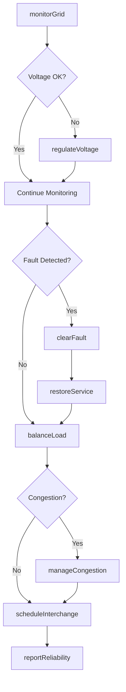
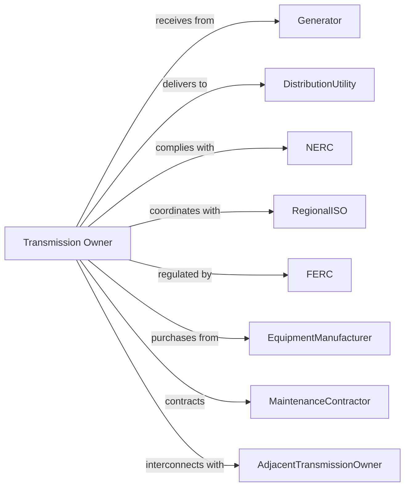

# Electric Bulk Power Transmission and Control

> Business-as-Code definition for bulk power transmission operations. Models the complete flow of electricity from generators through high-voltage networks to distribution systems.

## Overview

Electric bulk power transmission operates high-voltage networks that move electricity from generating plants to distribution centers across regions. This definition exposes actions for voltage regulation, power flow management, grid reliability, and market coordination, with events for automation and searches for system status retrieval.

## Actors

| Actor | Description |
|-------|-------------|
| Generator | Power plants delivering electricity to transmission system |
| DistributionUtility | Local utility receiving power for end-customer delivery |
| NERC | North American Electric Reliability Corporation sets standards |
| RegionalISO | Independent system operator managing market and dispatch |
| FERC | Federal Energy Regulatory Commission regulates rates and access |
| EquipmentManufacturer | Supplies transformers, breakers, and control systems |
| MaintenanceContractor | Provides line and substation maintenance services |
| AdjacentTransmissionOwner | Neighboring utility for interchange coordination |
| Landowner | Property owner hosting transmission line easements |

## Roles

| Role | Description |
|------|-------------|
| SystemOperator | Monitors and controls real-time grid operations |
| TransmissionPlanner | Designs network expansions and upgrades |
| ProtectionEngineer | Configures relay settings and fault protection |
| SubstationTechnician | Maintains transformers and switching equipment |
| DispatchCoordinator | Schedules power flows with generators and utilities |
| ComplianceManager | Ensures adherence to NERC reliability standards |
| RelayTester | Calibrates and tests protective relays at substations to ensure correct fault clearing |

## Entities

| Entity | Description |
|--------|-------------|
| TransmissionLine | High-voltage conductor carrying bulk power |
| Substation | Facility for voltage transformation and switching |
| Transformer | Changes voltage level for transmission efficiency |
| CircuitBreaker | Protective device that interrupts fault currents |
| Capacitor | Provides reactive power for voltage support |
| Reactor | Absorbs reactive power to lower voltage |
| SCADA | Supervisory control and data acquisition system |
| EnergyManagementSystem | Software managing real-time grid operations |
| Interchange | Power flow between control areas |
| Congestion | Transmission constraint limiting power flow |
| Easement | Legal right to use land for transmission lines |

## Actions

| Action | Description |
|--------|-------------|
| monitorGrid | Track voltage, frequency, and power flows in real time |
| regulateVoltage | Adjust transformer taps and reactive devices |
| balanceLoad | Match generation with demand across control area |
| switchCircuit | Open or close breakers to reconfigure network |
| clearFault | Isolate faulted equipment and restore service |
| scheduleInterchange | Coordinate power flows with adjacent systems |
| manageCongestion | Redispatch generation to relieve constraints |
| curtailLoad | Reduce demand during emergency conditions |
| restoreService | Re-energize circuits after outage |
| maintainSubstation | Perform equipment testing and repairs |
| inspectLine | Patrol transmission corridors for issues |
| planExpansion | Design network upgrades to meet future demand |
| reportReliability | Submit performance metrics to NERC |
| coordinateOutage | Schedule maintenance with affected parties |

## Events

| Event | Description |
|-------|-------------|
| voltageDeviated | Voltage crossed normal operating band |
| frequencyDeviated | System frequency departed from 60 Hz |
| faultOccurred | Short circuit detected on transmission element |
| breakerOperated | Circuit breaker opened or closed |
| lineEnergized | Transmission line brought into service |
| lineDeenergized | Transmission line taken out of service |
| interchangeScheduled | Power transfer with neighbor confirmed |
| congestionDetected | Transmission constraint became binding |
| loadShed | Emergency load reduction executed |
| serviceRestored | Outaged customers returned to service |
| maintenanceCompleted | Scheduled equipment work finished |
| reliabilityEventReported | Disturbance report submitted to NERC |
| expansionApproved | New transmission project authorized |

## Searches

| Search | Description |
|--------|-------------|
| getGridStatus | Retrieve real-time voltage and flow data |
| getLineStatus | Check energization state of transmission lines |
| getSubstationStatus | Get equipment status at substations |
| getInterchangeSchedule | Retrieve scheduled power transfers |
| getCongestionMap | Identify constrained transmission paths |
| getOutageSchedule | List planned equipment outages |
| getReliabilityMetrics | Retrieve NERC compliance statistics |
| getFaultHistory | Review past disturbance events |

## Workflow



## Actor Relationships



## Usage

### Calling Actions

```typescript
import { transmitBulkElectricPower } from '@headlessly/transmit-bulk-electric-power'

const transmission = transmitBulkElectricPower()

// Monitor grid conditions
const status = await transmission.monitorGrid({
  controlArea: 'midwest-region',
  metrics: ['voltage', 'frequency', 'lineFlow', 'reserve']
})

// Regulate voltage at substation
await transmission.regulateVoltage({
  substationId: 'central-345kv',
  targetVoltage: 345, // kV
  method: 'tapChanger',
  direction: 'raise'
})

// Schedule interchange with neighbor
await transmission.scheduleInterchange({
  partnerId: 'eastern-interconnect',
  direction: 'export',
  amount: 500, // MW
  startTime: '2025-02-01T14:00:00Z',
  duration: 4 // hours
})
```

### Event-Driven Automation

```typescript
// Auto-respond to voltage deviation
transmission.voltageDeviated(async ({ substationId, voltage, band }) => {
  const deviation = voltage - band.target

  await transmission.regulateVoltage({
    substationId,
    targetVoltage: band.target,
    method: deviation > 0 ? 'reactor' : 'capacitor'
  })
})

// Clear faults automatically
transmission.faultOccurred(async ({ lineId, faultType, location }) => {
  // Isolate faulted section
  await transmission.switchCircuit({
    lineId,
    action: 'open',
    reason: 'faultClearing'
  })

  // Attempt restoration after clearing
  setTimeout(async () => {
    await transmission.restoreService({
      lineId,
      method: 'autoReclose'
    })
  }, 5000)
})

// Manage congestion in real time
transmission.congestionDetected(async ({ path, constraint, price }) => {
  if (price > 100) { // $/MWh
    await transmission.manageCongestion({
      path,
      method: 'redispatch',
      urgency: 'immediate'
    })
  }
})
```
