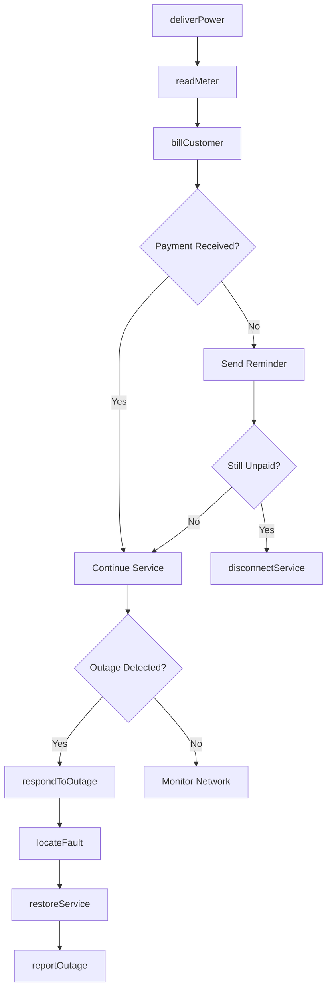
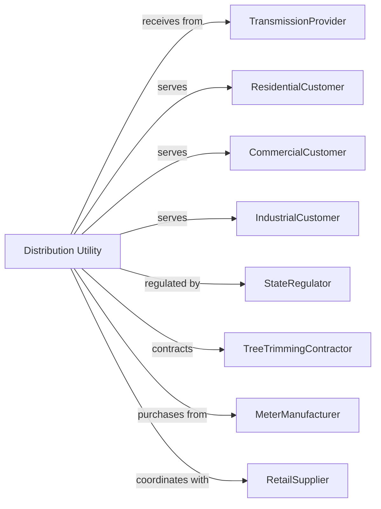

# Electric Power Distribution

> Business-as-Code definition for electric power distribution operations. Models the delivery of electricity from substations to end-use customers through local networks.

## Overview

Electric power distribution delivers electricity from transmission substations to residential, commercial, and industrial customers through local distribution networks. This definition exposes actions for service management, outage response, metering, and demand management, with events for automation and searches for customer and system data retrieval.

## Actors

| Actor | Description |
|-------|-------------|
| TransmissionProvider | Delivers bulk power to distribution substations |
| ResidentialCustomer | Household consuming electricity for home use |
| CommercialCustomer | Business consuming electricity for commercial operations |
| IndustrialCustomer | Manufacturing facility with large power requirements |
| StateRegulator | Public utility commission setting rates and standards |
| TreeTrimmingContractor | Maintains vegetation clearance around power lines |
| MeterManufacturer | Supplies electric meters and smart grid equipment |
| RetailSupplier | Competitive provider selling electricity in deregulated markets |
| SolarCustomer | Customer with distributed generation selling excess power |

## Roles

| Role | Description |
|------|-------------|
| DistributionOperator | Monitors and controls local grid operations |
| FieldLineworker | Repairs and maintains distribution lines and equipment |
| MeterTechnician | Installs and services customer meters |
| CustomerServiceRep | Handles customer inquiries and service requests |
| OutageCoordinator | Manages restoration during service interruptions |
| DemandPlanner | Forecasts load and plans capacity additions |
| HotLineworker | Performs energized bare-hand or hot-stick repairs on live distribution lines |

## Entities

| Entity | Description |
|--------|-------------|
| Substation | Facility stepping down voltage for distribution |
| Feeder | Primary distribution circuit serving an area |
| Transformer | Steps down voltage for customer service |
| Meter | Device measuring customer electricity consumption |
| ServiceDrop | Connection from utility pole to customer premises |
| Pole | Structure supporting overhead distribution lines |
| Underground | Buried cable infrastructure in urban areas |
| Recloser | Automatic device restoring service after momentary faults |
| CustomerAccount | Record of customer service and billing |
| Outage | Service interruption affecting customers |
| DemandResponse | Program reducing load during peak periods |

## Actions

| Action | Description |
|--------|-------------|
| deliverPower | Distribute electricity to customers through network |
| connectService | Establish new electric service for customer |
| disconnectService | Terminate service for move-out or non-payment |
| readMeter | Collect consumption data from customer meters |
| billCustomer | Generate invoice based on metered usage |
| respondToOutage | Dispatch crews to restore service interruptions |
| locateFault | Identify location of equipment failure on network |
| restoreService | Re-energize circuits and return customers to service |
| trimTrees | Clear vegetation from power line corridors |
| replaceTransformer | Install new transformer to replace failed unit |
| manageDemand | Activate load reduction programs during peaks |
| processInterconnection | Connect customer solar or storage to grid |
| upgradeInfrastructure | Install new equipment to increase capacity |
| reportOutage | Submit reliability metrics to regulator |

## Events

| Event | Description |
|-------|-------------|
| serviceConnected | New customer service established |
| serviceDisconnected | Customer service terminated |
| meterRead | Consumption data collected from customer |
| billGenerated | Customer invoice created |
| paymentReceived | Customer payment processed |
| outageDetected | Service interruption identified |
| crewDispatched | Line crew sent to repair location |
| faultLocated | Equipment failure pinpointed on network |
| serviceRestored | Customers returned to service after outage |
| transformerReplaced | Failed transformer swapped with new unit |
| demandResponseActivated | Load reduction program triggered |
| solarConnected | Customer distributed generation interconnected |
| peakDemandReached | System load hit maximum for period |

## Searches

| Search | Description |
|--------|-------------|
| getCustomerAccount | Retrieve customer service and billing information |
| getMeterReading | Get consumption data for specific meter |
| getOutageStatus | Check current outages by location or feeder |
| getFeederLoad | Retrieve demand on distribution circuits |
| getTransformerStatus | Check loading and health of transformers |
| getServiceHistory | Review customer service requests and work orders |
| getDemandForecast | Get predicted load for planning period |
| getInterconnectionQueue | List pending distributed generation applications |

## Workflow



## Actor Relationships



## Usage

### Calling Actions

```typescript
import { generateElectricPower } from '@headlessly/generate-electric-power'

const utility = generateElectricPower()

// Connect new customer service
await utility.connectService({
  customerId: 'CUST-2025-78432',
  serviceAddress: '1234 Oak Street',
  serviceType: 'residential',
  meterNumber: 'MTR-456789',
  effectiveDate: '2025-02-15'
})

// Read customer meters
const readings = await utility.readMeter({
  route: 'route-northwest-12',
  meterIds: ['MTR-456789', 'MTR-456790', 'MTR-456791'],
  readDate: '2025-02-01'
})

// Respond to outage
await utility.respondToOutage({
  outageId: 'OUT-2025-1542',
  affectedCustomers: 1250,
  feederId: 'feeder-north-05',
  priority: 'high'
})
```

### Event-Driven Automation

```typescript
// Auto-dispatch for outages
utility.outageDetected(async ({ feederId, affectedCount, cause }) => {
  await utility.locateFault({
    feederId,
    method: 'sectionalize',
    automatedSwitching: true
  })

  await utility.respondToOutage({
    feederId,
    estimatedRestoration: estimateTime(cause, affectedCount),
    notifyCustomers: true
  })
})

// Manage peak demand automatically
utility.peakDemandReached(async ({ systemLoad, capacity, forecast }) => {
  if (systemLoad / capacity > 0.9) {
    await utility.manageDemand({
      program: 'criticalPeakPricing',
      targetReduction: (systemLoad - capacity * 0.85),
      duration: 2 // hours
    })
  }
})

// Process solar interconnections
utility.solarConnected(async ({ customerId, capacity, meterId }) => {
  await utility.processInterconnection({
    customerId,
    type: 'netMetering',
    systemCapacity: capacity,
    bidirectionalMeter: meterId
  })
})
```
