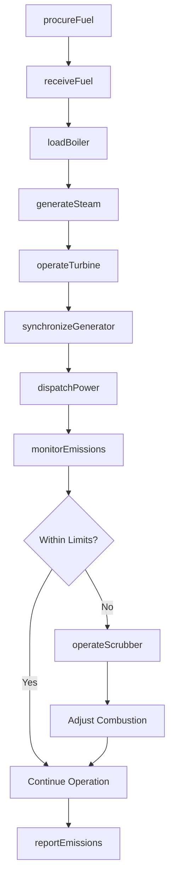
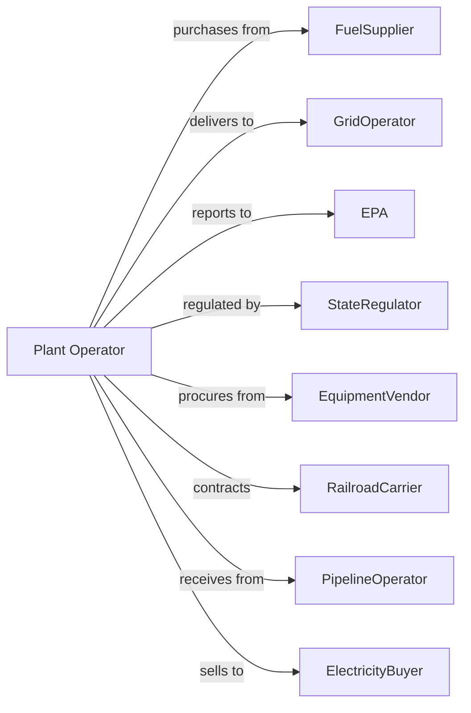

# Fossil Fuel Electric Power Generation

> Business-as-Code definition for fossil fuel power generation operations. Models the complete fuel-to-electricity lifecycle from procurement through grid delivery and emissions compliance.

## Overview

Fossil fuel electric power generation converts coal, natural gas, or oil into electricity through combustion processes. This definition exposes actions for fuel management, boiler operations, turbine control, and emissions monitoring, with events for operational automation and searches for performance data retrieval.

## Actors

| Actor | Description |
|-------|-------------|
| FuelSupplier | Provides coal, natural gas, or fuel oil for combustion |
| GridOperator | Receives generated power and coordinates dispatch scheduling |
| EPA | Environmental Protection Agency regulates emissions and permits |
| StateRegulator | State public utility commission oversees rates and operations |
| EquipmentVendor | Supplies boilers, turbines, and control systems |
| EmissionsMonitor | Third-party verification of emissions data |
| ElectricityBuyer | Purchases power through wholesale markets or contracts |
| RailroadCarrier | Transports coal from mines to power plant |
| PipelineOperator | Delivers natural gas through transmission pipelines |

## Roles

| Role | Description |
|------|-------------|
| PlantManager | Oversees all facility operations and strategic decisions |
| ShiftSupervisor | Manages operations during assigned shift |
| BoilerOperator | Controls combustion process and steam generation |
| TurbineOperator | Monitors and operates turbine-generator units |
| EnvironmentalEngineer | Manages emissions controls and regulatory compliance |
| FuelHandler | Coordinates fuel receiving, storage, and delivery to boilers |
| AshHandler | Operates fly ash and bottom ash removal systems and loads trucks for disposal |

## Entities

| Entity | Description |
|--------|-------------|
| Boiler | Combustion chamber that converts fuel to steam |
| Turbine | Steam-driven rotating machine for power generation |
| Generator | Converts mechanical rotation to electrical power |
| Condenser | Converts exhaust steam back to water for reuse |
| CoolingTower | Dissipates waste heat to atmosphere |
| FuelStorage | Coal yard, oil tanks, or gas receiving station |
| Scrubber | Air pollution control equipment for sulfur removal |
| Stack | Chimney for exhaust gas discharge |
| CEMS | Continuous Emissions Monitoring System |
| HeatRate | Efficiency measure of fuel-to-electricity conversion |
| CapacityFactor | Ratio of actual output to maximum possible output |

## Actions

| Action | Description |
|--------|-------------|
| procureFuel | Purchase and schedule delivery of coal, gas, or oil |
| receiveFuel | Accept delivery and verify fuel quality and quantity |
| loadBoiler | Feed fuel into combustion chamber |
| generateSteam | Produce high-pressure steam through combustion |
| operateTurbine | Control steam flow through turbine for power generation |
| synchronizeGenerator | Match generator output to grid frequency and voltage |
| dispatchPower | Deliver electricity to grid per scheduled amounts |
| monitorEmissions | Track pollutant levels via CEMS equipment |
| operateScrubber | Control pollution abatement equipment |
| maintainEquipment | Perform scheduled maintenance on plant systems |
| reportEmissions | Submit emissions data to regulatory agencies |
| optimizeHeatRate | Adjust operations to maximize fuel efficiency |
| startUnit | Bring generating unit online from cold or warm state |
| shutdownUnit | Take generating unit offline safely |
| tradeCarbonCredits | Buy or sell emissions allowances in cap-and-trade markets |

## Events

| Event | Description |
|-------|-------------|
| fuelDelivered | Coal, gas, or oil shipment received at plant |
| boilerIgnited | Combustion process started in boiler unit |
| steamGenerated | Steam production reached operational parameters |
| turbineStarted | Turbine unit came online and began rotating |
| generatorSynchronized | Generator connected to grid at matching frequency |
| powerDispatched | Electricity delivered to transmission system |
| emissionsThresholdExceeded | Pollutant level exceeded permit limits |
| scrubberMalfunctioned | Pollution control equipment experienced failure |
| unitTripped | Generating unit shut down due to fault condition |
| maintenanceCompleted | Scheduled maintenance work finished |
| heatRateImproved | Fuel efficiency optimization achieved |
| emissionsReportFiled | Regulatory emissions report submitted |
| carbonCreditsTraded | Emissions allowance transaction completed |
| fuelPriceChanged | Current fuel market pricing data retrieved |

## Searches

| Search | Description |
|--------|-------------|
| getFuelInventory | Retrieve current fuel stockpile levels |
| getUnitStatus | Get operational status of all generating units |
| getEmissionsData | Retrieve CEMS readings by pollutant and time period |
| getGenerationHistory | Retrieve power output records |
| getHeatRateHistory | Track fuel efficiency over time |
| getMaintenanceSchedule | List upcoming maintenance activities |
| getFuelPrice | Get current market prices for fuel commodities |
| getCapacityAvailable | Calculate available generation capacity |

## Workflow



## Actor Relationships



## Usage

### Calling Actions

```typescript
import { generateFossilFuel } from '@headlessly/generate-fossil-fuel'

const plant = generateFossilFuel()

// Retrieve current fuel stockpile levels
const getFuelInventoryResult = await plant.getFuelInventory({ status: 'active' })

// Get operational status of all generating units
const getUnitStatusResult = await plant.getUnitStatus({ status: 'active' })

// Procure fuel for upcoming operations
const fuelOrder = await plant.procureFuel({
  fuelType: 'naturalGas',
  quantity: 50000, // MMBtu
  deliveryDate: '2024-07-01',
  pipelineId: 'transco-zone-6'
})

// Start generating unit
await plant.startUnit({
  unitId: 'unit-2',
  startType: 'warm',
  targetLoad: 400, // MW
  rampRate: 8 // MW per minute
})

// Dispatch power to grid
await plant.dispatchPower({
  gridOperatorId: 'pjm-interconnection',
  amount: 650, // MW
  duration: 6, // hours
  scheduledStart: '2024-07-15T08:00:00Z'
})
```

### Event-Driven Automation

```typescript
// Auto-respond to emissions exceedance
plant.emissionsThresholdExceeded(async ({ unitId, pollutant, level }) => {
  if (pollutant === 'SO2') {
    await plant.operateScrubber({
      unitId,
      mode: 'enhanced',
      targetReduction: 0.95
    })
  }
})

// Optimize operations based on fuel prices
plant.fuelPriceChanged(async ({ naturalGas, coal }) => {
  const gasPrice = naturalGas.perMMBtu
  const coalPrice = coal.perTon

  if (gasPrice < 3.00) {
    await plant.optimizeHeatRate({
      preferredFuel: 'naturalGas',
      targetHeatRate: 7200 // Btu/kWh
    })
  }
})
```
