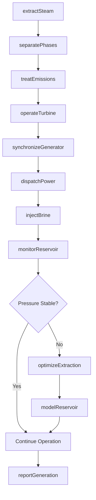
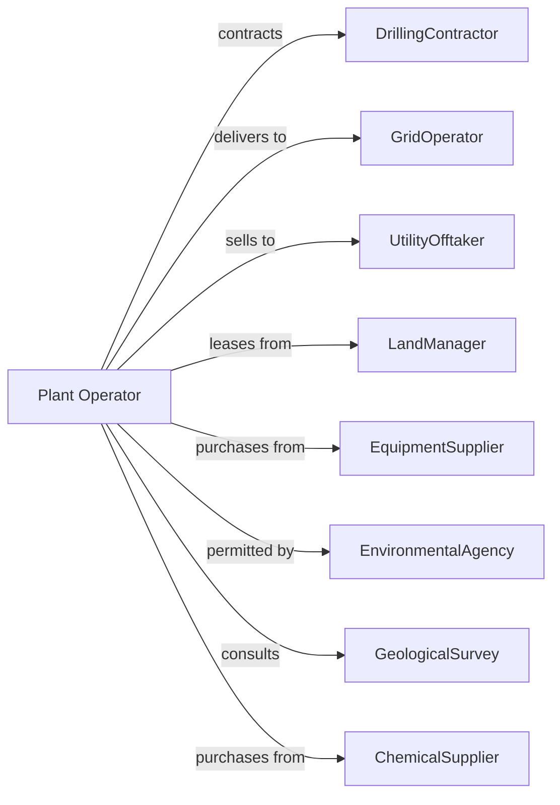

# Geothermal Electric Power Generation

> Business-as-Code definition for geothermal power generation operations. Models the complete heat-to-electricity lifecycle from reservoir management through grid delivery.

## Overview

Geothermal electric power generation extracts heat from underground reservoirs to produce steam that drives turbines for electricity generation. This definition exposes actions for well operations, steam management, turbine control, and reservoir sustainability, with events for automation and searches for operational data retrieval.

## Actors

| Actor | Description |
|-------|-------------|
| DrillingContractor | Drills and completes production and injection wells |
| GridOperator | Receives generated power and manages interconnection |
| UtilityOfftaker | Purchases power under power purchase agreement |
| LandManager | BLM or private owner of geothermal resource rights |
| EquipmentSupplier | Provides turbines, separators, and control systems |
| EnvironmentalAgency | Regulates emissions, water use, and land disturbance |
| GeologicalSurvey | Provides reservoir characterization and monitoring |
| MaintenanceContractor | Services wells and surface equipment |
| ChemicalSupplier | Provides scale inhibitors and treatment chemicals |

## Roles

| Role | Description |
|------|-------------|
| PlantManager | Oversees all facility operations and performance |
| ReservoirEngineer | Monitors subsurface conditions and well performance |
| PowerPlantOperator | Controls turbine and generation equipment |
| WellOperator | Manages production and injection well operations |
| EnvironmentalSpecialist | Monitors emissions and ensures permit compliance |
| MaintenanceTechnician | Maintains surface equipment and piping systems |
| BrineChemist | Monitors dissolved minerals and pH in geothermal fluid to prevent scaling and corrosion |

## Entities

| Entity | Description |
|--------|-------------|
| Reservoir | Underground formation containing geothermal fluid |
| ProductionWell | Extracts hot water or steam from reservoir |
| InjectionWell | Returns cooled fluid to reservoir |
| Separator | Separates steam from liquid brine |
| Turbine | Steam-driven rotating machine for power generation |
| Generator | Converts mechanical rotation to electrical power |
| Condenser | Converts exhaust steam to liquid for reinjection |
| CoolingTower | Dissipates waste heat to atmosphere |
| Scrubber | Removes hydrogen sulfide from steam |
| SCADA | Supervisory control and data acquisition system |
| ReservoirModel | Simulation of subsurface conditions and sustainability |

## Actions

| Action | Description |
|--------|-------------|
| extractSteam | Produce geothermal fluid from production wells |
| separatePhases | Separate steam from brine in flash or binary process |
| operateTurbine | Control steam flow for power generation |
| synchronizeGenerator | Match generator output to grid frequency |
| dispatchPower | Deliver electricity to transmission grid |
| injectBrine | Return spent fluid to reservoir through injection wells |
| treatEmissions | Remove hydrogen sulfide and other gases |
| monitorReservoir | Track pressure, temperature, and fluid chemistry |
| maintainWells | Perform workover and cleaning operations |
| modelReservoir | Update simulation based on production data |
| optimizeExtraction | Balance production rates for reservoir longevity |
| scaleInhibition | Apply chemical treatment to prevent mineral buildup |
| drillMakeupWell | Add new well to maintain production capacity |
| reportGeneration | Submit production data to regulators and offtaker |

## Events

| Event | Description |
|-------|-------------|
| steamExtracted | Geothermal fluid produced from well |
| phasesSeparated | Steam separated from liquid brine |
| turbineStarted | Turbine came online and began generating |
| generatorSynchronized | Generator connected to grid at matching frequency |
| powerDispatched | Electricity delivered to transmission system |
| brineInjected | Spent fluid returned to reservoir |
| emissionsTreated | Hydrogen sulfide removed from exhaust |
| reservoirPressureChanged | Subsurface pressure crossed monitoring threshold |
| wellMaintenanceCompleted | Workover or cleaning operation finished |
| scaleDetected | Mineral buildup identified in well or piping |
| makeupWellDrilled | New production or injection well completed |
| modelUpdated | Reservoir simulation refreshed with new data |
| sustainabilityAlertTriggered | Extraction rate may exceed reservoir recharge |

## Searches

| Search | Description |
|--------|-------------|
| getWellStatus | Retrieve production and injection well conditions |
| getReservoirData | Get pressure, temperature, and chemistry readings |
| getGenerationHistory | Retrieve power output records by time period |
| getSteamQuality | Check enthalpy and moisture content of steam |
| getEmissionsData | Retrieve hydrogen sulfide and CO2 levels |
| getModelPredictions | Get reservoir simulation forecasts |
| getMaintenanceLog | List completed and scheduled well work |
| getCapacityTrend | Track generation capacity over time |

## Workflow



## Actor Relationships



## Usage

### Calling Actions

```typescript
import { generateGeothermalElectric } from '@headlessly/generate-geothermal-electric'

const plant = generateGeothermalElectric()

// Monitor reservoir conditions
const reservoir = await plant.monitorReservoir({
  fieldId: 'the-geysers',
  wells: ['PW-12', 'PW-15', 'PW-18'],
  metrics: ['pressure', 'temperature', 'enthalpy']
})

// Extract steam from production wells
await plant.extractSteam({
  wellIds: ['PW-12', 'PW-15'],
  flowRate: 150000, // lbs/hr
  separatorPressure: 100 // psi
})

// Dispatch baseload power
await plant.dispatchPower({
  gridOperatorId: 'caiso',
  amount: 85, // MW
  duration: 24, // hours
  scheduledStart: '2024-11-01T00:00:00Z'
})
```

### Event-Driven Automation

```typescript
// Auto-respond to reservoir pressure decline
plant.reservoirPressureChanged(async ({ fieldId, currentPressure, baseline }) => {
  const decline = (baseline - currentPressure) / baseline

  if (decline > 0.1) {
    await plant.optimizeExtraction({
      fieldId,
      strategy: 'sustainableYield',
      targetPressure: baseline * 0.95
    })

    await plant.modelReservoir({
      fieldId,
      updateFrequency: 'daily'
    })
  }
})

// Treat scale buildup automatically
plant.scaleDetected(async ({ wellId, severity, mineralType }) => {
  if (severity === 'moderate' || severity === 'severe') {
    await plant.scaleInhibition({
      wellId,
      chemical: selectInhibitor(mineralType),
      injectionRate: calculateRate(severity)
    })
  }
})
```
