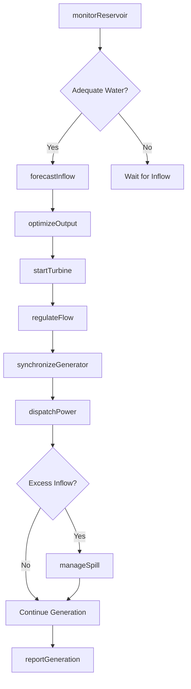
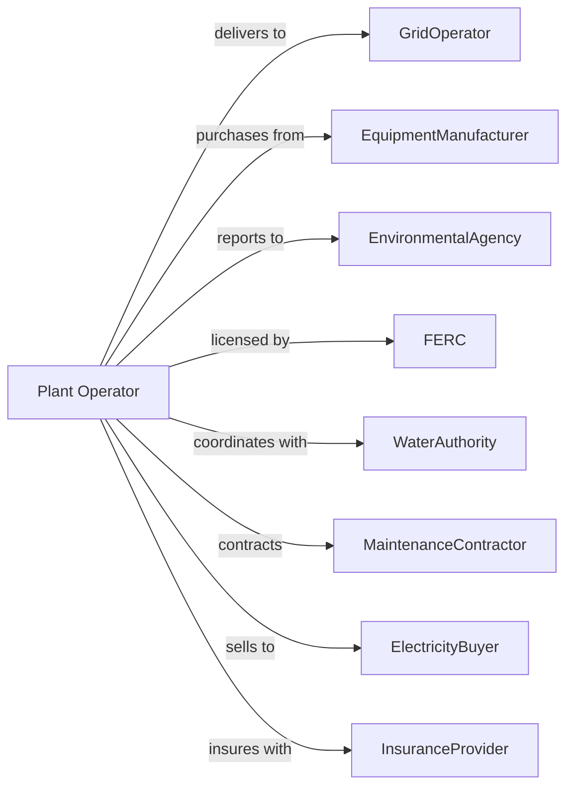

# Hydroelectric Power Generation

> Business-as-Code definition for hydroelectric power generation operations. Models the complete water-to-electricity lifecycle from reservoir management through grid delivery.

## Overview

Hydroelectric power generation harnesses flowing or falling water to drive turbines that produce electricity. This definition exposes actions for dam operations, water flow management, turbine control, and power output optimization, with events for automation and searches for operational data retrieval.

## Actors

| Actor | Description |
|-------|-------------|
| GridOperator | Receives generated power and manages transmission scheduling |
| EquipmentManufacturer | Supplies turbines, generators, and control systems |
| EnvironmentalAgency | Regulates water usage, fish passage, and ecological impact |
| FERC | Federal Energy Regulatory Commission oversees dam licensing |
| WaterAuthority | Manages water rights and allocation agreements |
| MaintenanceContractor | Provides specialized dam and turbine maintenance services |
| ElectricityBuyer | Purchases power through contracts or spot markets |
| InsuranceProvider | Provides coverage for dam infrastructure and liability |
| CommunityStakeholder | Local communities affected by water levels and operations |

## Roles

| Role | Description |
|------|-------------|
| PlantManager | Oversees all facility operations and personnel |
| DamOperator | Controls spillways, gates, and water release |
| TurbineEngineer | Monitors and maintains turbine and generator equipment |
| HydrologistTechnician | Tracks water flow, reservoir levels, and precipitation |
| ComplianceOfficer | Ensures regulatory compliance and permit adherence |
| ControlRoomOperator | Monitors SCADA systems and manages real-time output |
| GateOperator | Opens and closes sluice gates and penstocks to regulate water flow through the dam |

## Entities

| Entity | Description |
|--------|-------------|
| Dam | Structure that impounds water and creates hydraulic head |
| Reservoir | Water storage area behind the dam |
| Penstock | Large pipe conveying water from reservoir to turbines |
| Turbine | Rotating machine converting water flow to mechanical energy |
| Generator | Converts mechanical rotation to electrical power |
| Spillway | Overflow structure for excess water release |
| Transformer | Steps up voltage for transmission |
| FishLadder | Structure allowing fish to bypass the dam |
| WaterRight | Legal entitlement to use water for power generation |
| GenerationSchedule | Planned power output over time periods |

## Actions

| Action | Description |
|--------|-------------|
| monitorReservoir | Track water levels, inflow rates, and storage capacity |
| adjustGates | Open or close spillway gates to control water release |
| startTurbine | Bring turbine unit online for power generation |
| stopTurbine | Take turbine unit offline for maintenance or low demand |
| regulateFlow | Control water flow through penstocks to match demand |
| synchronizeGenerator | Match generator output to grid frequency and voltage |
| dispatchPower | Deliver electricity to grid at scheduled times and amounts |
| inspectDam | Conduct safety inspections of dam structure and equipment |
| maintainTurbine | Perform scheduled maintenance on turbine components |
| reportGeneration | Submit generation data to grid operator and regulators |
| forecastInflow | Predict water availability based on weather and snowpack |
| optimizeOutput | Balance water usage against power prices and demand |
| manageSpill | Release excess water during high inflow events |
| monitorFishPassage | Track fish migration through ladders and bypass systems |

## Events

| Event | Description |
|-------|-------------|
| reservoirLevelChanged | Water level crossed a monitoring threshold |
| turbineStarted | Turbine unit came online and began generating |
| turbineStopped | Turbine unit taken offline |
| generatorSynchronized | Generator output matched grid specifications |
| powerDispatched | Electricity delivered to transmission system |
| spillwayOpened | Spillway gates opened for water release |
| spillwayClosed | Spillway gates closed |
| maintenanceCompleted | Scheduled maintenance work finished |
| inflowForecastUpdated | New water inflow projections available |
| complianceReportFiled | Regulatory report submitted to authorities |
| fishPassageMonitored | Fish migration data recorded |
| safetyInspectionPassed | Dam safety inspection completed successfully |
| emergencyShutdownTriggered | Automatic or manual emergency stop initiated |

## Searches

| Search | Description |
|--------|-------------|
| getReservoirLevels | Retrieve current and historical water levels |
| getTurbineStatus | Get operational status of all turbine units |
| getGenerationHistory | Retrieve power output records by time period |
| getInflowForecast | Get predicted water inflow for planning |
| getMaintenanceSchedule | List upcoming maintenance activities |
| getComplianceStatus | Check permit and regulatory compliance status |
| getSpotPrice | Get current electricity market prices |

## Workflow



## Actor Relationships



## Usage

### Calling Actions

```typescript
import { generateHydroelectricPower } from '@headlessly/generate-hydroelectric-power'

const plant = generateHydroelectricPower()

// Monitor reservoir status
const reservoir = await plant.monitorReservoir({
  damId: 'grand-coulee',
  metrics: ['level', 'inflow', 'outflow', 'storage']
})

// Start turbine for generation
await plant.startTurbine({
  unitId: 'turbine-3',
  targetOutput: 250, // MW
  rampRate: 10 // MW per minute
})

// Dispatch power to grid
await plant.dispatchPower({
  gridOperatorId: 'bonneville-power',
  amount: 750, // MW
  duration: 4, // hours
  scheduledStart: '2024-06-15T14:00:00Z'
})
```

### Event-Driven Automation

```typescript
// Auto-adjust generation based on reservoir levels
plant.reservoirLevelChanged(async ({ damId, level, threshold }) => {
  if (level > threshold.high) {
    await plant.manageSpill({
      damId,
      spillRate: calculateSafeSpillRate(level)
    })
  }
})

// Optimize output based on market prices
plant.getSpotPrice(async ({ price }) => {
  const forecast = await plant.getInflowForecast()

  if (price >= 50.00 && forecast.waterAvailable) {
    await plant.optimizeOutput({
      strategy: 'maximize',
      priceThreshold: price
    })
  }
})
```
