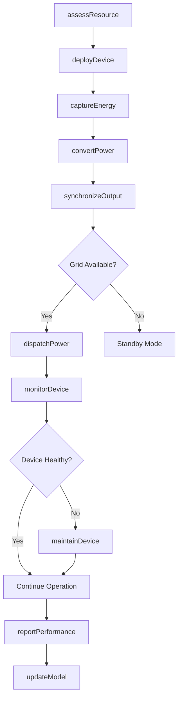
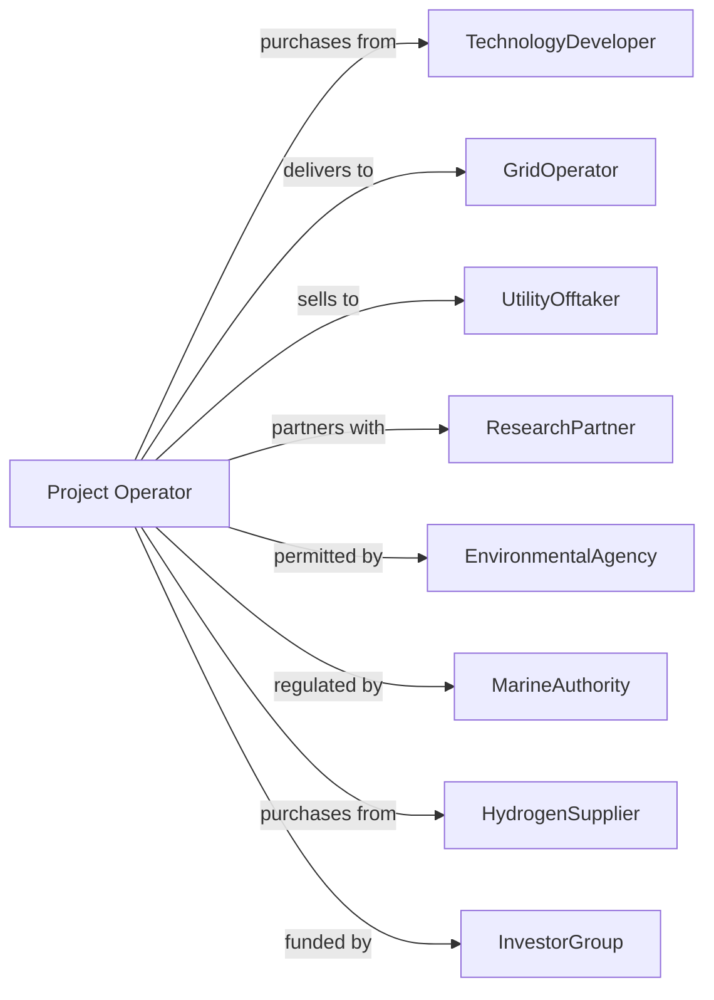

# Other Electric Power Generation

> Business-as-Code definition for alternative power generation operations. Models electricity production from tidal, wave, fuel cell, and other emerging technologies.

## Overview

Other electric power generation converts alternative energy sources such as tidal currents, ocean waves, hydrogen fuel cells, and emerging technologies into electricity. This definition exposes actions for resource capture, energy conversion, and grid integration, with events for automation and searches for performance data retrieval.

## Actors

| Actor | Description |
|-------|-------------|
| TechnologyDeveloper | Provides innovative generation equipment and systems |
| GridOperator | Receives generated power and manages interconnection |
| UtilityOfftaker | Purchases power under pilot or commercial agreement |
| ResearchPartner | Collaborates on technology development and testing |
| EnvironmentalAgency | Permits ocean deployment and monitors ecosystem impact |
| MarineAuthority | Regulates offshore installations and navigation |
| HydrogenSupplier | Provides hydrogen fuel for fuel cell systems |
| InvestorGroup | Provides funding for emerging technology deployment |
| InsuranceProvider | Covers novel technology and operational risks |

## Roles

| Role | Description |
|------|-------------|
| ProjectManager | Oversees deployment and operation of generation systems |
| SystemEngineer | Manages technology performance and optimization |
| MarineOperator | Handles offshore deployment and maintenance |
| ControlRoomOperator | Monitors SCADA systems and manages output |
| ResearchEngineer | Collects data and advances technology capabilities |
| SafetyCoordinator | Manages operational safety and emergency procedures |
| SubseaDiver | Inspects and maintains underwater tidal turbines and mooring systems |

## Entities

| Entity | Description |
|--------|-------------|
| TidalTurbine | Underwater device capturing tidal current energy |
| WaveConverter | Device capturing ocean wave energy |
| FuelCell | Electrochemical device converting hydrogen to electricity |
| Electrolyzer | Produces hydrogen from water using electricity |
| Converter | Transforms variable output to grid-compatible power |
| SubseaCable | Transmits power from offshore to onshore grid |
| Mooring | Anchoring system for floating devices |
| ControlSystem | Manages device operation and grid synchronization |
| ResourceAssessment | Study of energy potential at deployment site |
| PerformanceModel | Prediction of energy capture and output |
| CapacityFactor | Ratio of actual to theoretical maximum output |

## Actions

| Action | Description |
|--------|-------------|
| assessResource | Evaluate energy potential of site or fuel source |
| deployDevice | Install generation equipment at operating location |
| captureEnergy | Harness tidal, wave, or chemical energy |
| convertPower | Transform captured energy to electrical power |
| synchronizeOutput | Match AC output to grid frequency and voltage |
| dispatchPower | Deliver electricity to transmission grid |
| monitorDevice | Track device health and performance remotely |
| maintainDevice | Perform scheduled and corrective maintenance |
| retrieveDevice | Remove equipment from water for service |
| supplyHydrogen | Deliver and store hydrogen for fuel cells |
| stackFuelCell | Assemble and configure fuel cell modules |
| reportPerformance | Submit generation and reliability data |
| updateModel | Refine predictions based on operational data |
| scaleDeployment | Add devices to increase generation capacity |

## Events

| Event | Description |
|-------|-------------|
| deviceDeployed | Generation equipment installed and commissioned |
| energyCaptured | Tidal, wave, or chemical energy converted |
| powerGenerated | Electricity produced from alternative source |
| generatorSynchronized | Output matched grid specifications |
| powerDispatched | Electricity delivered to transmission system |
| deviceFaulted | Equipment experienced error or malfunction |
| maintenanceCompleted | Scheduled or corrective work finished |
| deviceRetrieved | Equipment removed from service location |
| hydrogenDelivered | Fuel supply received for fuel cell operation |
| performanceThresholdMet | Generation exceeded target metrics |
| stormModeActivated | Device entered protective configuration |
| resourceDataUpdated | New site assessment information available |
| scalingApproved | Capacity expansion authorized |

## Searches

| Search | Description |
|--------|-------------|
| getDeviceStatus | Retrieve operational status of all generation units |
| getResourceData | Get measured energy resource at deployment site |
| getGenerationHistory | Retrieve power output records by time period |
| getAvailability | Calculate device uptime percentage |
| getFaultLog | List recent device faults and root causes |
| getHydrogenInventory | Check fuel supply levels for fuel cells |
| getPerformanceMetrics | Compare actual vs modeled output |
| getMaintenanceSchedule | List upcoming maintenance activities |

## Workflow



## Actor Relationships



## Usage

### Calling Actions

```typescript
import { generateElectricPower } from '@headlessly/generate-electric-power'

const project = generateElectricPower()

// Retrieve operational status of all generation units
const getDeviceStatusResult = await project.getDeviceStatus({ status: 'active' })

// Get measured energy resource at deployment site
const getResourceDataResult = await project.getResourceData({ status: 'active' })

// Assess tidal resource potential
const resource = await project.assessResource({
  siteId: 'puget-sound-narrows',
  resourceType: 'tidal',
  measurementPeriod: 30, // days
  metrics: ['velocity', 'direction', 'turbulence']
})

// Deploy tidal turbine array
await project.deployDevice({
  deviceType: 'tidalTurbine',
  location: { lat: 47.2698, lon: -122.5447 },
  capacity: 2, // MW per device
  quantity: 5
})

// Dispatch power from fuel cell system
await project.dispatchPower({
  systemId: 'fuel-cell-array-1',
  gridOperatorId: 'nyiso',
  amount: 10, // MW
  duration: 8, // hours
  scheduledStart: '2025-01-15T06:00:00Z'
})
```

### Event-Driven Automation

```typescript
// Auto-respond to storm conditions
project.stormModeActivated(async ({ deviceIds, stormCategory }) => {
  for (const deviceId of deviceIds) {
    await project.monitorDevice({
      deviceId,
      mode: 'intensive',
      alertThreshold: 'low'
    })
  }

  await project.reportPerformance({
    event: 'stormMode',
    devices: deviceIds,
    expectedDowntime: estimateDowntime(stormCategory)
  })
})

// Manage hydrogen supply for fuel cells
project.hydrogenDelivered(async ({ systemId, quantity, purity }) => {
  if (purity >= 0.9999) {
    await project.stackFuelCell({
      systemId,
      mode: 'fullCapacity'
    })
  }
})

// Scale deployment based on performance
project.performanceThresholdMet(async ({ siteId, capacityFactor }) => {
  if (capacityFactor > 0.35) {
    await project.scaleDeployment({
      siteId,
      additionalCapacity: 10, // MW
      submitForApproval: true
    })
  }
})
```
