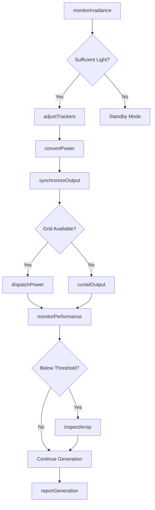
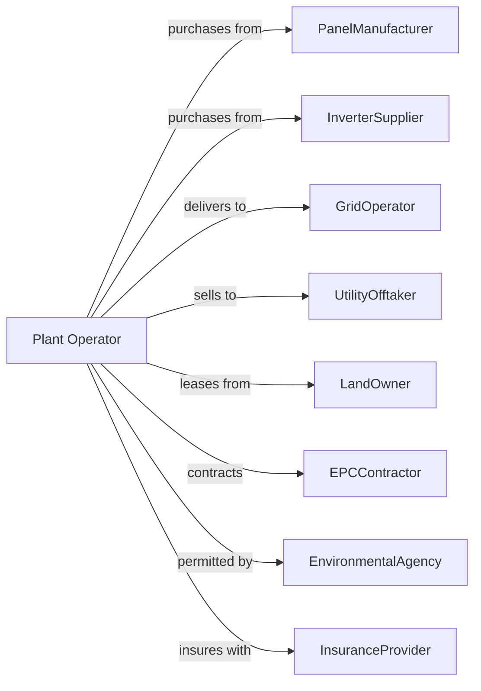

# Solar Electric Power Generation

> Business-as-Code definition for utility-scale solar power generation operations. Models the complete solar-to-electricity lifecycle from irradiance capture through grid delivery.

## Overview

Solar electric power generation converts sunlight into electricity through photovoltaic panels or concentrated solar thermal systems. This definition exposes actions for array management, inverter operations, power optimization, and grid integration, with events for automation and searches for performance data retrieval.

## Actors

| Actor | Description |
|-------|-------------|
| PanelManufacturer | Supplies photovoltaic modules and mounting systems |
| InverterSupplier | Provides DC-to-AC conversion equipment |
| GridOperator | Receives generated power and manages interconnection |
| UtilityOfftaker | Purchases power under long-term power purchase agreement |
| LandOwner | Leases property for solar installation |
| EPCContractor | Engineering, procurement, and construction services |
| EnvironmentalAgency | Permits and monitors land use and wildlife impact |
| InsuranceProvider | Provides coverage for equipment and business interruption |
| WeatherService | Supplies irradiance forecasts and meteorological data |

## Roles

| Role | Description |
|------|-------------|
| PlantManager | Oversees all facility operations and performance |
| SCADAOperator | Monitors control systems and manages real-time output |
| MaintenanceTechnician | Performs panel cleaning and equipment repairs |
| ElectricalEngineer | Manages inverters, transformers, and grid connection |
| PerformanceAnalyst | Tracks generation metrics and identifies optimization opportunities |
| LandscapeManager | Maintains vegetation control around arrays |
| PanelWasher | Operates robotic or manual cleaning systems to remove soiling from PV modules |

## Entities

| Entity | Description |
|--------|-------------|
| PVPanel | Photovoltaic module converting sunlight to DC electricity |
| Array | Group of panels wired together on mounting structure |
| Inverter | Converts DC power from panels to grid-compatible AC |
| Tracker | Motorized mounting system following sun position |
| Transformer | Steps up voltage for transmission |
| Substation | Connects solar facility to transmission grid |
| Pyranometer | Sensor measuring solar irradiance |
| SCADA | Supervisory control and data acquisition system |
| PPA | Power purchase agreement defining sale terms |
| CapacityFactor | Ratio of actual to theoretical maximum output |
| Irradiance | Solar energy received per unit area |

## Actions

| Action | Description |
|--------|-------------|
| monitorIrradiance | Track incoming solar radiation levels |
| adjustTrackers | Orient panels to optimize sun angle capture |
| convertPower | Transform DC electricity to AC via inverters |
| synchronizeOutput | Match AC output to grid frequency and voltage |
| dispatchPower | Deliver electricity to grid per interconnection agreement |
| cleanPanels | Remove dust and debris to maintain efficiency |
| inspectArray | Conduct visual and thermal inspection for defects |
| replaceInverter | Swap failed inverter unit with replacement |
| monitorPerformance | Track actual vs expected generation output |
| curtailOutput | Reduce generation when grid cannot accept full output |
| forecastGeneration | Predict power output based on weather data |
| reportGeneration | Submit production data to offtaker and grid operator |
| manageVegetation | Control plant growth that may shade panels |
| calibrateSensors | Verify accuracy of irradiance and power meters |

## Events

| Event | Description |
|-------|-------------|
| sunriseDetected | Sufficient light for generation to begin |
| sunsetDetected | Light level dropped below generation threshold |
| trackersAdjusted | Panel orientation changed to follow sun |
| inverterOnline | Inverter began converting DC to AC power |
| inverterFaulted | Inverter experienced error and stopped |
| powerDispatched | Electricity delivered to transmission system |
| curtailmentOrdered | Grid operator requested output reduction |
| panelsCleaned | Cleaning operation completed |
| hotspotDetected | Thermal imaging identified panel defect |
| cloudCoverChanged | Irradiance level shifted due to weather |
| performanceAlertTriggered | Output fell below expected threshold |
| forecastUpdated | New generation prediction available |
| monthlyReportFiled | Production report submitted to stakeholders |

## Searches

| Search | Description |
|--------|-------------|
| getIrradianceData | Retrieve current and historical solar radiation |
| getArrayStatus | Get operational status of panel arrays |
| getInverterStatus | Check health and output of inverter units |
| getGenerationHistory | Retrieve power output records by time period |
| getPerformanceRatio | Calculate actual vs theoretical output ratio |
| getWeatherForecast | Get solar irradiance predictions |
| getCurtailmentHistory | Review past output reduction events |
| getMaintenanceLog | List completed and scheduled maintenance |

## Workflow



## Actor Relationships



## Usage

### Calling Actions

```typescript
import { generateSolarElectric } from '@headlessly/generate-solar-electric'

const plant = generateSolarElectric()

// Monitor current conditions
const irradiance = await plant.monitorIrradiance({
  siteId: 'desert-sunlight',
  sensors: ['pyranometer-1', 'pyranometer-2']
})

// Adjust tracking systems
await plant.adjustTrackers({
  arrayIds: ['array-north', 'array-south'],
  mode: 'astronomical',
  backtracking: true
})

// Dispatch power per PPA
await plant.dispatchPower({
  offtakerId: 'southern-california-edison',
  amount: 250, // MW
  scheduledStart: '2024-09-15T07:00:00Z',
  scheduledEnd: '2024-09-15T18:00:00Z'
})
```

### Event-Driven Automation

```typescript
// Auto-respond to inverter faults
plant.inverterFaulted(async ({ inverterId, errorCode, arrayId }) => {
  await plant.replaceInverter({
    inverterId,
    priority: 'high',
    dispatchTechnician: true
  })

  // Reroute power through backup
  await plant.convertPower({
    arrayId,
    inverter: 'backup-inverter'
  })
})

// Optimize based on cloud cover
plant.cloudCoverChanged(async ({ siteId, coverage, duration }) => {
  const forecast = await plant.getWeatherForecast({ siteId })

  if (coverage > 0.7 && duration > 30) {
    await plant.forecastGeneration({
      siteId,
      horizonMinutes: 60,
      notify: ['gridOperator', 'offtaker']
    })
  }
})
```
