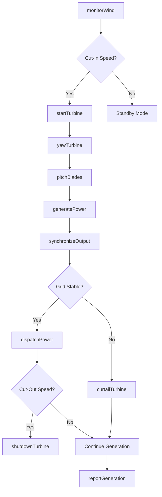
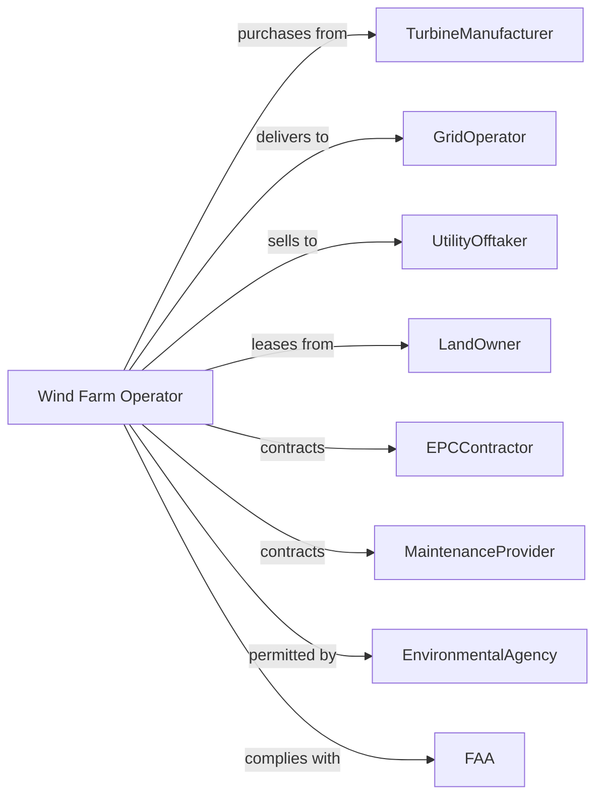

# Wind Electric Power Generation

> Business-as-Code definition for wind power generation operations. Models the complete wind-to-electricity lifecycle from turbine operations through grid delivery.

## Overview

Wind electric power generation converts kinetic energy from wind into electricity through turbine-driven generators. This definition exposes actions for turbine control, wind monitoring, power optimization, and grid integration, with events for automation and searches for operational and meteorological data retrieval.

## Actors

| Actor | Description |
|-------|-------------|
| TurbineManufacturer | Supplies wind turbines and nacelle components |
| GridOperator | Receives generated power and manages interconnection |
| UtilityOfftaker | Purchases power under power purchase agreement |
| LandOwner | Leases property for turbine installation and access |
| EPCContractor | Engineering, procurement, and construction services |
| MaintenanceProvider | Specialized turbine service and repair contractor |
| EnvironmentalAgency | Regulates noise, wildlife impact, and visual concerns |
| FAA | Federal Aviation Administration for aviation lighting compliance |
| WeatherService | Provides wind forecasts and meteorological data |

## Roles

| Role | Description |
|------|-------------|
| SiteManager | Oversees all wind farm operations and performance |
| ControlCenterOperator | Monitors SCADA systems and manages turbine fleet |
| WindTechnician | Performs turbine inspections, maintenance, and repairs |
| ElectricalEngineer | Manages collection system and grid interconnection |
| PerformanceEngineer | Analyzes generation data and optimizes output |
| SafetyCoordinator | Manages climb safety and rescue procedures |
| BladeInspector | Performs rope-access or drone inspections of blade surfaces for cracks and erosion |

## Entities

| Entity | Description |
|--------|-------------|
| Turbine | Wind energy converter with rotor, nacelle, and tower |
| Nacelle | Housing containing gearbox, generator, and controls |
| Rotor | Hub and blades capturing wind energy |
| Blade | Aerodynamic component converting wind to rotation |
| Gearbox | Increases rotational speed from rotor to generator |
| Tower | Structure supporting nacelle at optimal height |
| Transformer | Steps up voltage at turbine base |
| CollectionSystem | Underground cables connecting turbines to substation |
| Anemometer | Sensor measuring wind speed and direction |
| SCADA | Supervisory control and data acquisition system |
| PPA | Power purchase agreement defining sale terms |

## Actions

| Action | Description |
|--------|-------------|
| monitorWind | Track wind speed, direction, and turbulence |
| startTurbine | Bring turbine online when wind reaches cut-in speed |
| yawTurbine | Rotate nacelle to face incoming wind direction |
| pitchBlades | Adjust blade angle to optimize power capture |
| generatePower | Convert rotational energy to electricity |
| synchronizeOutput | Match AC output to grid frequency |
| dispatchPower | Deliver electricity to grid per interconnection agreement |
| curtailTurbine | Reduce output for grid stability or wildlife protection |
| shutdownTurbine | Stop turbine for high wind, maintenance, or fault |
| inspectTurbine | Conduct visual and functional inspection |
| maintainGearbox | Perform oil changes and component checks |
| replaceBlade | Install new blade to replace damaged one |
| forecastGeneration | Predict power output based on wind forecasts |
| reportGeneration | Submit production data to offtaker and grid operator |

## Events

| Event | Description |
|-------|-------------|
| cutInReached | Wind speed sufficient to start generation |
| cutOutReached | Wind speed too high for safe operation |
| turbineStarted | Turbine came online and began generating |
| turbineStopped | Turbine taken offline |
| yawCompleted | Nacelle orientation adjusted to wind direction |
| pitchAdjusted | Blade angle changed for power optimization |
| powerDispatched | Electricity delivered to transmission system |
| curtailmentOrdered | Output reduction requested by grid operator |
| faultDetected | Turbine experienced error condition |
| maintenanceCompleted | Scheduled maintenance work finished |
| bladeIceDetected | Ice accumulation identified on blades |
| birdActivityDetected | Wildlife activity triggered curtailment protocol |
| forecastUpdated | New wind prediction available |

## Searches

| Search | Description |
|--------|-------------|
| getWindData | Retrieve current and historical wind measurements |
| getTurbineStatus | Get operational status of all turbines |
| getGenerationHistory | Retrieve power output records by time period |
| getAvailabilityRate | Calculate turbine uptime percentage |
| getFaultLog | List recent turbine faults and causes |
| getWindForecast | Get predicted wind conditions |
| getCurtailmentHistory | Review past output reduction events |
| getMaintenanceSchedule | List upcoming maintenance activities |

## Workflow



## Actor Relationships



## Usage

### Calling Actions

```typescript
import { generateWindElectric } from '@headlessly/generate-wind-electric'

const farm = generateWindElectric()

// Retrieve current and historical wind measurements
const getWindDataResult = await farm.getWindData({ status: 'active' })

// Get operational status of all turbines
const getTurbineStatusResult = await farm.getTurbineStatus({ status: 'active' })

// Monitor wind conditions
const wind = await farm.monitorWind({
  siteId: 'alta-wind',
  turbineIds: ['T-001', 'T-002', 'T-003'],
  metrics: ['speed', 'direction', 'turbulence']
})

// Start turbine when conditions are favorable
await farm.startTurbine({
  turbineId: 'T-015',
  windSpeed: 4.5, // m/s
  startMode: 'soft'
})

// Dispatch power to grid
await farm.dispatchPower({
  gridOperatorId: 'caiso',
  amount: 150, // MW
  scheduledStart: '2024-10-01T00:00:00Z',
  duration: 24 // hours
})
```

### Event-Driven Automation

```typescript
// Auto-respond to high wind conditions
farm.cutOutReached(async ({ turbineId, windSpeed }) => {
  await farm.shutdownTurbine({
    turbineId,
    reason: 'highWind',
    restartWhenSafe: true
  })
})

// Protect wildlife during migration
farm.birdActivityDetected(async ({ turbineIds, species, activityLevel }) => {
  if (activityLevel === 'high') {
    for (const turbineId of turbineIds) {
      await farm.curtailTurbine({
        turbineId,
        reason: 'wildlifeProtection',
        duration: 30 // minutes
      })
    }
  }
})

// Optimize based on forecasts
farm.forecastUpdated(async ({ siteId, forecast }) => {
  const upcoming = forecast.next24Hours

  if (upcoming.averageSpeed > 12) {
    await farm.forecastGeneration({
      siteId,
      notify: ['gridOperator', 'tradingDesk']
    })
  }
})
```
