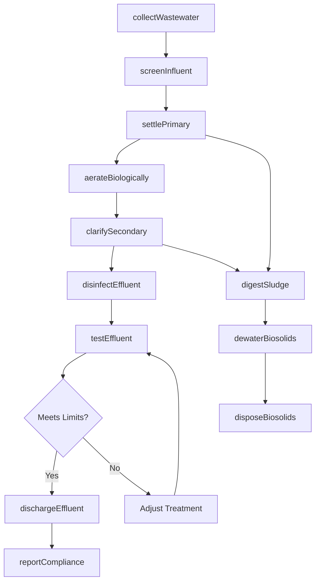
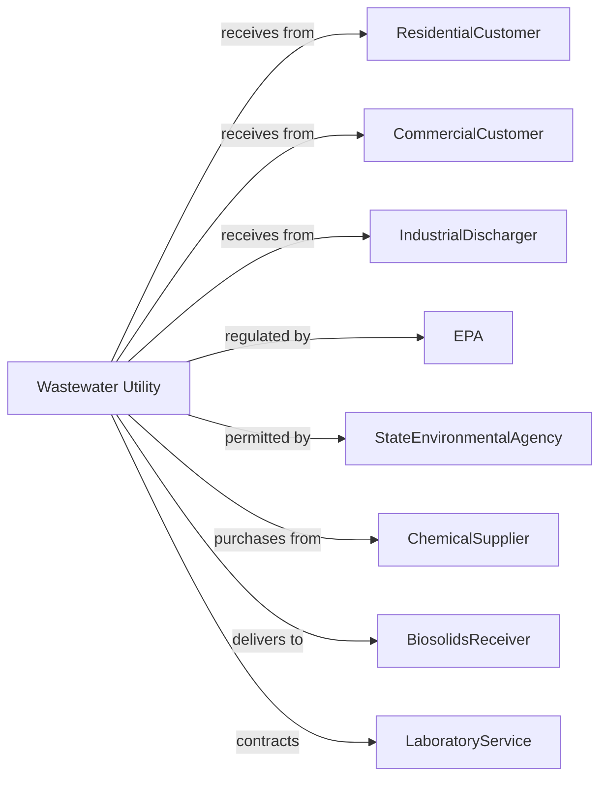

# Sewage Treatment Facilities

> Business-as-Code definition for sewage treatment operations. Models the complete wastewater lifecycle from collection through treatment and discharge or reuse.

## Overview

Sewage treatment facilities collect, treat, and discharge or reclaim wastewater from residential, commercial, and industrial sources. This definition exposes actions for collection system management, treatment processes, biosolids handling, and effluent compliance, with events for automation and searches for system data retrieval.

## Actors

| Actor | Description |
|-------|-------------|
| ResidentialCustomer | Household generating domestic wastewater |
| CommercialCustomer | Business generating wastewater from commercial operations |
| IndustrialDischarger | Manufacturer with pretreated industrial wastewater |
| EPA | Environmental Protection Agency sets discharge standards |
| StateEnvironmentalAgency | Issues NPDES permits and monitors compliance |
| ChemicalSupplier | Provides treatment chemicals and polymers |
| BiosolidsReceiver | Farm or landfill accepting treated sludge |
| LaboratoryService | Performs effluent and biosolids testing |
| EquipmentVendor | Supplies pumps, blowers, and treatment equipment |

## Roles

| Role | Description |
|------|-------------|
| PlantSuperintendent | Oversees all treatment facility operations |
| ProcessOperator | Operates treatment equipment and monitors processes |
| CollectionSystemOperator | Maintains sewer lines and pump stations |
| LaboratoryTechnician | Performs in-house water quality testing |
| MaintenanceTechnician | Repairs and maintains plant equipment |
| PretreatmentCoordinator | Manages industrial discharge permits and monitoring |
| DigestOperator | Monitors anaerobic digester temperature, gas production, and volatile solids destruction |

## Entities

| Entity | Description |
|--------|-------------|
| SewerMain | Pipeline collecting wastewater from customers |
| LiftStation | Pumping facility moving wastewater uphill |
| Headworks | Initial screening and grit removal facility |
| PrimaryTank | Settling basin for solids removal |
| AerationBasin | Biological treatment using microorganisms |
| SecondaryTank | Clarifier separating biomass from treated water |
| Digester | Tank stabilizing sludge through anaerobic digestion |
| Disinfection | UV or chlorine treatment before discharge |
| Effluent | Treated wastewater discharged to receiving water |
| Biosolids | Treated sludge suitable for land application |
| NPDESPermit | National Pollutant Discharge Elimination System license |
| IndustrialPermit | Authorization for industrial discharge to sewer |

## Actions

| Action | Description |
|--------|-------------|
| collectWastewater | Receive sewage through collection system |
| screenInfluent | Remove large debris and grit at headworks |
| settlePrimary | Allow solids to settle in primary tanks |
| aerateBiologically | Treat wastewater with microorganisms in aeration |
| clarifySecondary | Separate biomass from treated water |
| disinfectEffluent | Kill pathogens before discharge |
| dischargeEffluent | Release treated water to receiving body |
| digestSludge | Stabilize solids in anaerobic digesters |
| dewaterBiosolids | Remove water from sludge for disposal |
| disposeBiosolids | Transport biosolids to permitted destination |
| testEffluent | Sample and analyze discharge for permit compliance |
| maintainCollection | Clean and repair sewer lines and manholes |
| respondToOverflow | Address sanitary sewer overflow events |
| reportCompliance | Submit discharge monitoring reports to regulators |

## Events

| Event | Description |
|-------|-------------|
| wastewaterReceived | Influent arrived at treatment plant |
| influentScreened | Debris and grit removed at headworks |
| primarySettled | Solids removed in primary clarifier |
| aerationComplete | Biological treatment finished |
| secondaryClarified | Biomass separated from treated water |
| effluentDisinfected | Pathogen treatment completed |
| effluentDischarged | Treated water released to receiving body |
| sludgeDigested | Anaerobic stabilization completed |
| biosolidsDewatered | Sludge water content reduced |
| biosolidsDisposed | Treated sludge transported to destination |
| permitLimitExceeded | Effluent parameter above permit threshold |
| sewerOverflowDetected | Untreated sewage released from collection system |
| equipmentFailed | Treatment equipment experienced malfunction |
| industrialViolation | Pretreatment permit exceedance detected |

## Searches

| Search | Description |
|--------|-------------|
| getInfluentQuality | Retrieve incoming wastewater characteristics |
| getEffluentQuality | Get latest effluent test results |
| getProcessStatus | Check status of treatment unit processes |
| getBiosolidsInventory | Track sludge production and disposal |
| getCollectionStatus | Check sewer line and lift station conditions |
| getPermitCompliance | Review permit limit adherence |
| getIndustrialDischargers | List permitted industrial users |
| getOverflowHistory | Review past sanitary sewer overflow events |

## Workflow



## Actor Relationships



## Usage

### Calling Actions

```typescript
import { treatWastewater } from '@headlessly/treat-wastewater'

const utility = treatWastewater()

// Retrieve incoming wastewater characteristics
const getInfluentQualityResult = await utility.getInfluentQuality({ status: 'active' })

// Get latest effluent test results
const getEffluentQualityResult = await utility.getEffluentQuality({ status: 'active' })

// Process incoming wastewater
const influent = await utility.collectWastewater({
  plantId: 'central-wwtp',
  flow: 25000000, // gallons per day
  metrics: ['BOD', 'TSS', 'ammonia', 'pH']
})

// Operate biological treatment
await utility.aerateBiologically({
  basinId: 'aeration-basin-1',
  dissolvedOxygen: 2.0, // mg/L target
  mixedLiquor: 3000, // mg/L MLSS
  sludgeAge: 10 // days
})

// Discharge treated effluent
await utility.dischargeEffluent({
  outfallId: 'outfall-001',
  receivingWater: 'green-river',
  flow: 24500000, // gallons
  qualityVerified: true
})
```

### Event-Driven Automation

```typescript
// Auto-respond to permit exceedance
utility.permitLimitExceeded(async ({ parameter, value, limit, outfallId }) => {
  // Adjust treatment process
  if (parameter === 'ammonia') {
    await utility.aerateBiologically({
      action: 'increaseAeration',
      targetReduction: (value - limit) / value
    })
  }

  await utility.reportCompliance({
    eventType: 'exceedance',
    parameter,
    value,
    limit,
    correctiveAction: 'treatmentAdjustment'
  })
})

// Manage sewer overflow response
utility.sewerOverflowDetected(async ({ location, estimatedVolume, cause }) => {
  await utility.respondToOverflow({
    location,
    actions: ['isolate', 'pump', 'disinfect'],
    notifyAgency: true,
    publicNotice: estimatedVolume > 10000
  })

  await utility.maintainCollection({
    location,
    action: cause === 'blockage' ? 'jetClean' : 'repair',
    priority: 'emergency'
  })
})

// Optimize biosolids handling
utility.biosolidsDewatered(async ({ quantity, dryness, digesterId }) => {
  if (dryness >= 0.20) { // 20% solids
    await utility.disposeBiosolids({
      quantity,
      destination: 'land-application',
      permitId: 'BIOSOLIDS-2025-001'
    })
  } else {
    await utility.dewaterBiosolids({
      digesterId,
      additionalPolymer: true,
      targetDryness: 0.22
    })
  }
})
```
