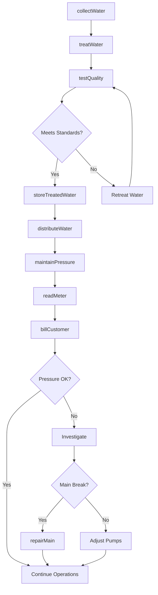
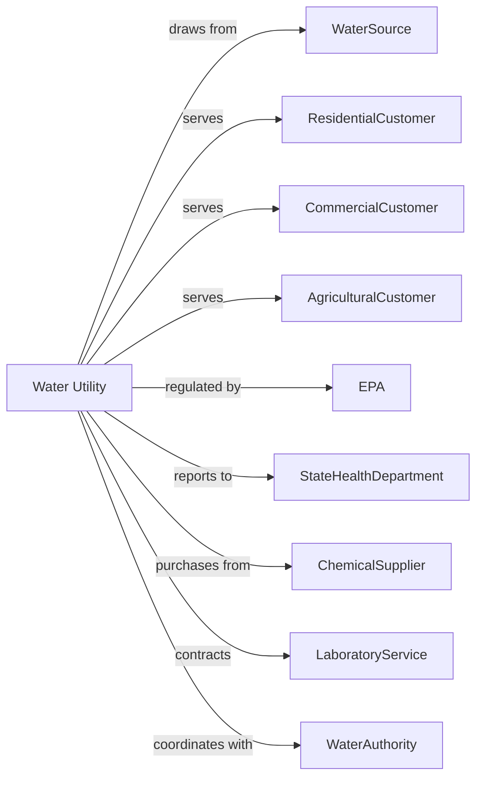

# Water Supply and Irrigation Systems

> Business-as-Code definition for water supply and irrigation operations. Models the complete source-to-tap lifecycle from water collection through treatment and distribution.

## Overview

Water supply and irrigation systems collect, treat, and distribute potable and non-potable water to residential, commercial, industrial, and agricultural customers. This definition exposes actions for source management, treatment processes, distribution operations, and water quality compliance, with events for automation and searches for system data retrieval.

## Actors

| Actor | Description |
|-------|-------------|
| WaterSource | Surface water body or groundwater aquifer providing raw water |
| ResidentialCustomer | Household consuming water for domestic use |
| CommercialCustomer | Business using water for commercial operations |
| AgriculturalCustomer | Farm using water for irrigation and livestock |
| EPA | Environmental Protection Agency sets drinking water standards |
| StateHealthDepartment | Regulates water quality and system operations |
| ChemicalSupplier | Provides treatment chemicals and disinfectants |
| LaboratoryService | Performs water quality testing and analysis |
| WaterAuthority | Regional body managing water rights and allocation |

## Roles

| Role | Description |
|------|-------------|
| WaterPlantOperator | Operates treatment plant equipment and processes |
| DistributionOperator | Monitors and controls water delivery systems |
| WaterQualityTechnician | Collects samples and monitors water quality |
| FieldTechnician | Performs meter reading and service connections |
| CustomerServiceRep | Handles customer inquiries and service requests |
| SourceWaterManager | Manages reservoirs, wells, and water rights |
| ChlorinationOperator | Adjusts chlorine dosing and monitors residuals to ensure disinfection throughout the distribution system |

## Entities

| Entity | Description |
|--------|-------------|
| Reservoir | Surface water storage facility |
| Well | Groundwater extraction point |
| IntakePump | Equipment drawing water from source |
| TreatmentPlant | Facility processing raw water to potable standards |
| ClearWell | Treated water storage before distribution |
| DistributionMain | Pipeline carrying water through service area |
| Hydrant | Fire protection water access point |
| Meter | Device measuring customer water consumption |
| PumpStation | Facility maintaining pressure in distribution system |
| Tank | Elevated or ground storage for distribution |
| WaterRight | Legal entitlement to withdraw water from source |
| WaterQualityReport | Annual consumer confidence report on water quality |

## Actions

| Action | Description |
|--------|-------------|
| collectWater | Withdraw raw water from source via intake or well |
| treatWater | Process raw water through filtration and disinfection |
| testQuality | Sample and analyze water for contaminants |
| storeTreatedWater | Hold finished water in clear wells and tanks |
| distributeWater | Deliver potable water through distribution mains |
| maintainPressure | Operate pumps to keep system pressure adequate |
| connectService | Install meter and establish new water service |
| disconnectService | Terminate service for move-out or non-payment |
| readMeter | Collect consumption data from customer meters |
| billCustomer | Generate invoice based on metered usage |
| flushMain | Clear sediment and maintain water quality in pipes |
| repairMain | Fix broken or leaking water main |
| manageSource | Monitor reservoir levels and well yields |
| reportCompliance | Submit water quality data to regulators |

## Events

| Event | Description |
|-------|-------------|
| waterCollected | Raw water withdrawn from source |
| waterTreated | Treatment process completed |
| qualityTestPassed | Water met all regulatory standards |
| qualityTestFailed | Contaminant detected above limits |
| waterDistributed | Treated water delivered to customers |
| pressureLow | System pressure dropped below minimum |
| serviceConnected | New customer water service established |
| serviceDisconnected | Customer water service terminated |
| meterRead | Consumption data collected from customer |
| billGenerated | Customer invoice created |
| mainBreakDetected | Water main rupture identified |
| mainRepaired | Broken main fixed and service restored |
| boilWaterIssued | Advisory issued for contamination risk |
| droughtDeclared | Water shortage requiring conservation |

## Searches

| Search | Description |
|--------|-------------|
| getSourceLevels | Retrieve reservoir and well status |
| getWaterQuality | Get latest test results for treated water |
| getSystemPressure | Check pressure at points in distribution |
| getCustomerAccount | Retrieve customer service and billing information |
| getMeterReading | Get consumption data for specific meter |
| getMainBreakHistory | Review past main break locations |
| getProductionVolume | Retrieve water treatment output data |
| getComplianceStatus | Check regulatory compliance standing |

## Workflow



## Actor Relationships



## Usage

### Calling Actions

```typescript
import { supplyWaterSupply } from '@headlessly/supply-water-supply'

const utility = supplyWaterSupply()

// Retrieve reservoir and well status
const getSourceLevelsResult = await utility.getSourceLevels({ status: 'active' })

// Get latest test results for treated water
const getWaterQualityResult = await utility.getWaterQuality({ station: 'intake-1', parameters: ['turbidity', 'pH'] })

// Collect water from source
const intake = await utility.collectWater({
  sourceId: 'lake-pleasant',
  volume: 5000000, // gallons
  intakePumpId: 'pump-station-1'
})

// Treat raw water
await utility.treatWater({
  plantId: 'central-treatment',
  processes: ['coagulation', 'sedimentation', 'filtration', 'disinfection'],
  targetTurbidity: 0.1, // NTU
  chlorineResidual: 1.5 // mg/L
})

// Connect new customer
await utility.connectService({
  customerId: 'CUST-2025-12345',
  serviceAddress: '123 Water Street',
  serviceType: 'residential',
  meterSize: '0.75-inch',
  effectiveDate: '2025-04-01'
})
```

### Event-Driven Automation

```typescript
// Auto-respond to quality test failure
utility.qualityTestFailed(async ({ contaminant, level, limit, location }) => {
  if (contaminant === 'bacteria') {
    await utility.boilWaterIssued({
      affectedArea: location,
      reason: 'bacteriaDetected',
      instructions: 'Boil water for one minute before drinking'
    })
  }

  await utility.treatWater({
    plantId: 'central-treatment',
    additionalTreatment: determineRemedy(contaminant),
    targetLevel: limit * 0.5
  })
})

// Manage main breaks automatically
utility.mainBreakDetected(async ({ location, severity, estimatedFlow }) => {
  // Isolate affected section
  await utility.repairMain({
    location,
    isolateValves: true,
    dispatchCrew: true,
    priority: severity === 'major' ? 'emergency' : 'urgent'
  })

  // Notify affected customers
  const affected = await utility.getCustomerAccount({
    inServiceArea: location
  })
})

// Respond to drought conditions
utility.droughtDeclared(async ({ stage, restrictions }) => {
  await utility.manageSource({
    action: 'conservation',
    targetReduction: stage === 'severe' ? 0.3 : 0.15,
    enforceRestrictions: restrictions
  })
})
```
