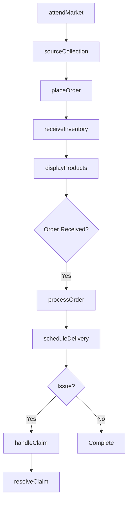
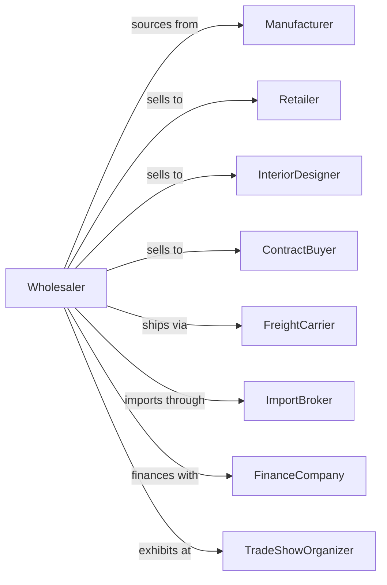

# Furniture Merchant Wholesalers

> Business-as-Code definition for furniture wholesale distribution operations. Models showroom management, order fulfillment, and dealer network coordination.

## Overview

Furniture merchant wholesalers distribute residential, office, and commercial furniture to retailers, designers, and contract buyers. This definition exposes actions for product sourcing, showroom operations, order management, and delivery coordination with events for seasonal buying and inventory optimization.

## Actors

| Actor | Description |
|-------|-------------|
| Manufacturer | Produces furniture lines and collections |
| Retailer | Furniture store purchasing for resale |
| InteriorDesigner | Specifies furniture for client projects |
| ContractBuyer | Purchases for hotels, offices, institutions |
| FreightCarrier | Provides furniture delivery services |
| ImportBroker | Handles customs for imported furniture |
| FinanceCompany | Provides dealer floor plan financing |
| TradeShowOrganizer | Hosts furniture market events |

## Roles

| Role | Description |
|------|-------------|
| ShowroomManager | Oversees product displays and buyer visits |
| SalesRepresentative | Manages dealer accounts and territories |
| PurchasingAgent | Sources products and manages vendors |
| LogisticsManager | Coordinates warehousing and delivery |
| DesignConsultant | Assists buyers with product selection |

## Entities

| Entity | Description |
|--------|-------------|
| Product | Furniture item with specs and pricing |
| Collection | Coordinated furniture line or series |
| Inventory | Stock levels across warehouse locations |
| PurchaseOrder | Order placed with manufacturer |
| SalesOrder | Customer order for furniture |
| Showroom | Display space for product presentation |
| Catalog | Product catalog with images and specs |
| DealerAccount | Retailer profile with terms and pricing |
| Delivery | Scheduled furniture shipment |
| Claim | Damage or quality issue report |
| Market | Trade show or buying event |

## Actions

| Action | Description |
|--------|-------------|
| sourceCollection | Identify and onboard new product lines |
| placeOrder | Submit purchase order to manufacturer |
| receiveInventory | Check in incoming furniture shipment |
| displayProducts | Set up showroom presentations |
| processOrder | Fulfill dealer or customer order |
| scheduleDelivery | Arrange furniture delivery |
| handleClaim | Process damage or quality complaint |
| attendMarket | Participate in furniture trade show |
| updateCatalog | Maintain product data and pricing |
| manageDealerTerms | Set pricing and payment terms |
| forecastDemand | Project furniture requirements |
| transferStock | Move inventory between locations |
| discontinueProduct | Phase out product from offering |
| runPromotion | Execute special pricing programs |

## Events

| Event | Description |
|-------|-------------|
| orderReceived | Customer placed furniture order |
| inventoryReceived | Manufacturer shipment arrived |
| orderShipped | Furniture dispatched for delivery |
| orderDelivered | Customer received furniture |
| claimFiled | Damage or issue reported |
| claimResolved | Claim settlement completed |
| newCollectionLaunched | New product line available |
| productDiscontinued | Item removed from catalog |
| marketScheduled | Trade show dates announced |
| dealerActivated | New dealer account opened |
| priceChanged | Manufacturer adjusted pricing |
| stockDepleted | Inventory fell below reorder level |

## Searches

| Search | Description |
|--------|-------------|
| findProducts | Search by style, category, or dimensions |
| getInventory | Check stock levels and availability |
| getOrders | Retrieve orders by status or dealer |
| getDealers | Search dealer accounts |
| getDeliveries | Track scheduled shipments |
| getClaims | List open damage claims |
| getCollections | Browse product lines and series |

## Workflow



## Actor Relationships



## Usage

### Calling Actions

```typescript
import { wholesaleFurniture } from '@headlessly/wholesale-furniture'

const wholesaler = wholesaleFurniture()

// Search product catalog
const products = await wholesaler.findProducts({
  category: 'dining-tables',
  style: 'mid-century',
  priceRange: { min: 500, max: 2000 }
})

// Process dealer order
const order = await wholesaler.processOrder({
  dealerId: 'furniture-store-456',
  items: [
    { sku: 'DT-MCM-60-WAL', quantity: 4 },
    { sku: 'DC-MCM-WAL', quantity: 16 }
  ],
  deliveryPreference: 'consolidated'
})

// Schedule delivery
await wholesaler.scheduleDelivery({
  orderId: order.id,
  date: '2024-03-15',
  timeWindow: 'morning',
  liftgateRequired: true
})
```

### Event-Driven Automation

```typescript
// Notify dealers of new collections
wholesaler.newCollectionLaunched(async ({ collectionId, name }) => {
  const dealers = await wholesaler.getDealers({
    status: 'active',
    categories: ['residential']
  })

  for (const dealer of dealers) {
    await sendCollectionAnnouncement({
      dealerId: dealer.id,
      collection: collectionId
    })
  }
})

// Auto-reorder popular items
wholesaler.stockDepleted(async ({ sku, currentQty }) => {
  const forecast = await wholesaler.forecastDemand({ sku })

  if (forecast.velocity > 5) {
    await wholesaler.placeOrder({
      sku,
      quantity: forecast.recommendedQty,
      priority: 'standard'
    })
  }
})
```
