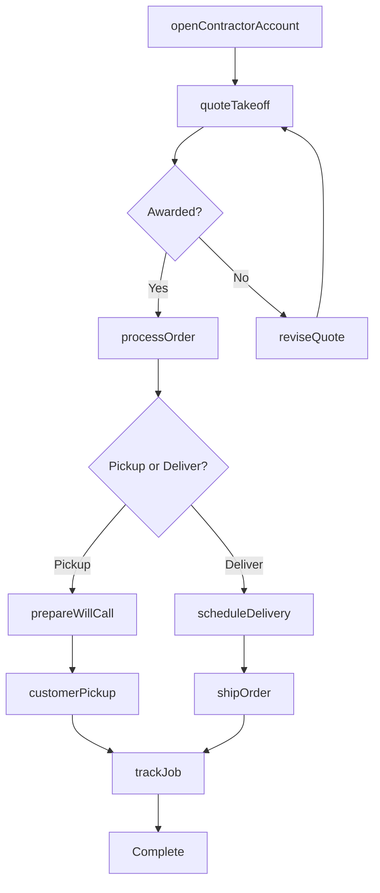
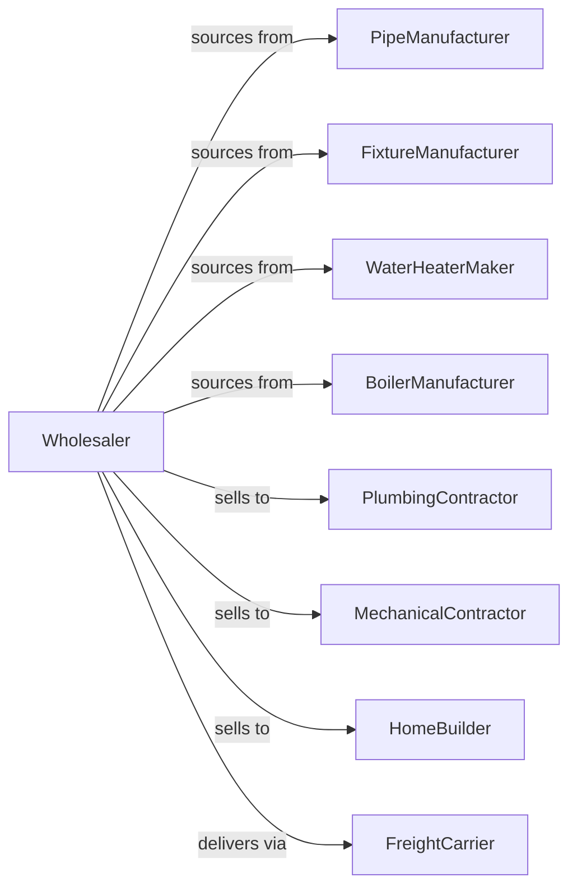

# Plumbing and Heating Equipment and Supplies (Hydronics) Merchant Wholesalers

> Business-as-Code definition for plumbing and hydronic heating wholesale distribution. Models procurement, contractor fulfillment, and jobsite delivery for pipes, fixtures, and water heaters.

## Overview

Plumbing wholesalers distribute pipes, fittings, fixtures, water heaters, hydronic heating equipment, and plumbing supplies to plumbing contractors, mechanical contractors, and builders. This definition exposes actions for product sourcing, counter operations, and project quotation with events for commodity pricing and inventory optimization.

## Actors

| Actor | Description |
|-------|-------------|
| PipeManufacturer | Produces copper, PEX, and PVC pipe |
| FixtureManufacturer | Makes faucets, sinks, and toilets |
| WaterHeaterMaker | Produces water heating equipment |
| BoilerManufacturer | Makes hydronic heating systems |
| PlumbingContractor | Installs plumbing systems |
| MechanicalContractor | Installs heating and piping |
| HomeBuilder | Purchases plumbing for new construction |
| FreightCarrier | Provides delivery services |

## Roles

| Role | Description |
|------|-------------|
| BranchManager | Oversees counter and warehouse operations |
| OutsideSalesRep | Serves contractor accounts |
| CounterSalesRep | Handles walk-in and call-in orders |
| ProjectSpecialist | Prices large plumbing projects |
| InventoryManager | Manages stock and commodity position |

## Entities

| Entity | Description |
|--------|-------------|
| Product | Plumbing product with specs |
| Inventory | Stock levels by branch |
| PurchaseOrder | Order placed with manufacturer |
| SalesOrder | Customer order for products |
| ProjectQuote | Multi-item project quotation |
| WillCall | Customer pickup order |
| Delivery | Jobsite delivery shipment |
| ContractorAccount | Customer profile with pricing |
| CopperPrice | Commodity copper pricing |
| Takeoff | Material list from blueprints |
| Return | Customer return authorization |

## Actions

| Action | Description |
|--------|-------------|
| sourceProduct | Identify and onboard product lines |
| placeOrder | Submit purchase order to manufacturer |
| receiveInventory | Check in incoming products |
| stockBranch | Store products at branch |
| openContractorAccount | Set up new customer |
| quoteTakeoff | Price materials from blueprints |
| processOrder | Fulfill contractor order |
| prepareWillCall | Stage order for pickup |
| scheduleDelivery | Arrange jobsite delivery |
| shipOrder | Dispatch order to customer |
| processReturn | Handle customer returns |
| updateCopperPricing | Adjust prices for commodity |
| trackJob | Monitor project material delivery |
| designSystem | Help spec hydronic system |

## Events

| Event | Description |
|-------|-------------|
| orderReceived | Customer placed order |
| inventoryReceived | Manufacturer shipment arrived |
| willCallStaged | Pickup order staged |
| orderDelivered | Customer received products |
| takeoffQuoted | Project pricing submitted |
| projectAwarded | Won project bid |
| copperPriceChanged | Copper commodity shifted |
| accountOpened | New contractor authorized |
| returnProcessed | Return completed |
| stockDepleted | Inventory fell below reorder level |
| deliveryScheduled | Jobsite delivery confirmed |
| jobCompleted | Project fully supplied |

## Searches

| Search | Description |
|--------|-------------|
| findProducts | Search by category, brand, size |
| getInventory | Check stock by branch |
| getOrders | Retrieve orders by status |
| getContractors | Search customer accounts |
| getTakeoffs | Track project quotes |
| getWillCalls | List pending pickups |
| getDeliveries | View scheduled deliveries |

## Workflow



## Actor Relationships



## Usage

### Calling Actions

```typescript
import { wholesalePlumbingHeating } from '@headlessly/wholesale-plumbing-heating'

const wholesaler = wholesalePlumbingHeating()

// Search plumbing fixtures
const faucets = await wholesaler.findProducts({
  category: 'faucet',
  type: 'kitchen',
  brand: 'delta',
  finish: 'stainless'
})

// Quote project takeoff
const quote = await wholesaler.quoteTakeoff({
  contractorId: 'plumber-123',
  projectName: 'Riverside Apartments',
  items: [
    { productId: 'COPPER-3/4-L', quantity: 500, unit: 'ft' },
    { productId: 'WH-50GAL-NG', quantity: 24 },
    { productId: 'TOILET-ADA-EL', quantity: 48 }
  ],
  laborDate: '2024-05-01'
})

// Schedule jobsite delivery
await wholesaler.scheduleDelivery({
  orderId: quote.orderId,
  jobsiteAddress: '1234 Construction Blvd',
  date: '2024-04-28',
  liftgate: false,
  contactPhone: '555-123-4567'
})
```

### Event-Driven Automation

```typescript
// Update copper-based pricing
wholesaler.copperPriceChanged(async ({ changePercent }) => {
  if (Math.abs(changePercent) > 3) {
    await wholesaler.updateCopperPricing({
      categories: ['copper-pipe', 'copper-fittings'],
      adjustment: changePercent,
      effectiveDate: new Date()
    })
  }
})

// Notify on will call ready
wholesaler.willCallStaged(async ({ orderId, contractorId }) => {
  await notifyContractor({
    contractorId,
    message: `Order ${orderId} ready for pickup`
  })
})
```
