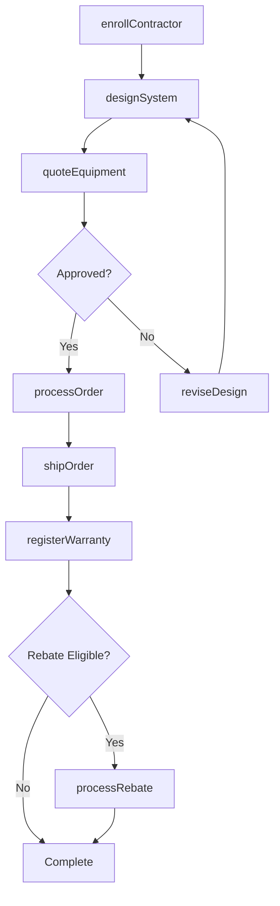
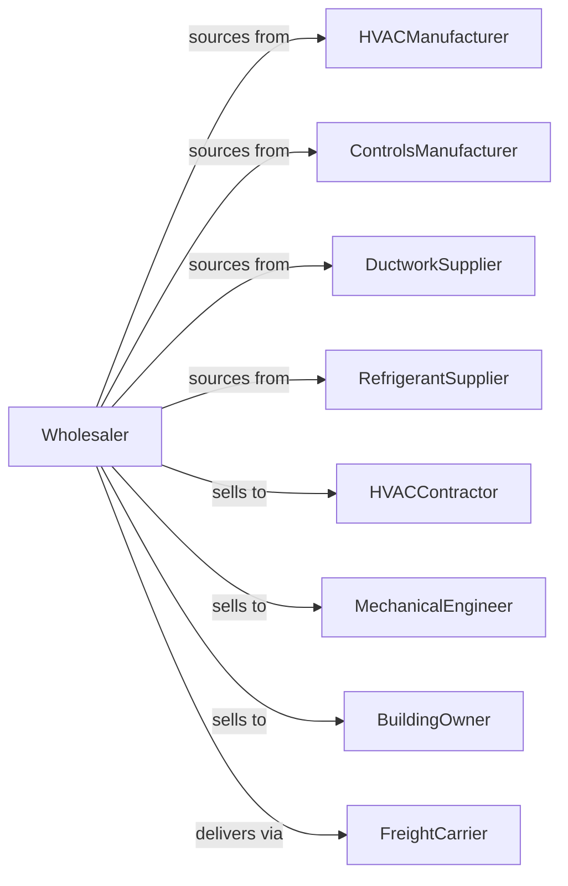

# Warm Air Heating and Air-Conditioning Equipment and Supplies Merchant Wholesalers

> Business-as-Code definition for HVAC equipment wholesale distribution. Models procurement, contractor programs, and technical support for heating, cooling, and ventilation systems.

## Overview

HVAC wholesalers distribute furnaces, air conditioners, heat pumps, ductwork, controls, and refrigerants to HVAC contractors, mechanical engineers, and building owners. This definition exposes actions for equipment sourcing, contractor program management, and technical design support with events for seasonal demand and inventory optimization.

## Actors

| Actor | Description |
|-------|-------------|
| HVACManufacturer | Produces heating and cooling equipment |
| ControlsManufacturer | Makes thermostats and building controls |
| DuctworkSupplier | Produces ductwork and fittings |
| RefrigerantSupplier | Provides refrigerant chemicals |
| HVACContractor | Installs heating and cooling systems |
| MechanicalEngineer | Designs HVAC systems |
| BuildingOwner | End user of HVAC equipment |
| FreightCarrier | Provides equipment delivery |

## Roles

| Role | Description |
|------|-------------|
| TerritoryManager | Oversees branch and territory sales |
| TechnicalSalesRep | Provides equipment selection support |
| ApplicationEngineer | Assists with system design |
| ContractorProgramMgr | Manages dealer programs |
| WarehouseManager | Oversees inventory and logistics |

## Entities

| Entity | Description |
|--------|-------------|
| Equipment | HVAC unit with model and specs |
| Inventory | Stock levels by location |
| PurchaseOrder | Order placed with manufacturer |
| SalesOrder | Customer order for equipment |
| ContractorProgram | Dealer incentive agreement |
| SystemDesign | Equipment selection for project |
| Warranty | Equipment warranty registration |
| Refrigerant | Controlled refrigerant product |
| EPACertification | Refrigerant handling certification |
| Quote | Price quotation for equipment |
| Rebate | Manufacturer incentive |

## Actions

| Action | Description |
|--------|-------------|
| sourceEquipment | Identify and onboard product lines |
| placeOrder | Submit purchase order to manufacturer |
| receiveInventory | Check in incoming equipment |
| stockWarehouse | Store equipment in locations |
| enrollContractor | Add contractor to dealer program |
| designSystem | Assist with equipment selection |
| quoteEquipment | Price equipment for project |
| processOrder | Fulfill contractor equipment order |
| shipOrder | Dispatch equipment to customer |
| sellRefrigerant | Process controlled refrigerant sale |
| registerWarranty | Activate equipment warranty |
| processRebate | Submit manufacturer rebate |
| provideTraining | Conduct contractor education |
| forecastSeasonal | Project seasonal equipment demand |

## Events

| Event | Description |
|-------|-------------|
| orderReceived | Customer placed order |
| inventoryReceived | Manufacturer shipment arrived |
| orderShipped | Equipment dispatched |
| orderDelivered | Customer received equipment |
| contractorEnrolled | New dealer authorized |
| systemDesigned | Equipment selection completed |
| warrantyRegistered | Equipment warranty activated |
| rebateEarned | Contractor qualified for rebate |
| refrigerantSold | Controlled sale completed |
| seasonStarting | Peak season approaching |
| stockLow | Inventory below threshold |
| trainingScheduled | Education event confirmed |

## Searches

| Search | Description |
|--------|-------------|
| findEquipment | Search by type, capacity, efficiency |
| getInventory | Check stock levels |
| getOrders | Retrieve orders by status |
| getContractors | Search dealer program members |
| getDesigns | Access system specifications |
| getWarranties | Track equipment warranties |
| getRebates | View rebate status |

## Workflow



## Actor Relationships



## Usage

### Calling Actions

```typescript
import { wholesaleHVACEquipment } from '@headlessly/wholesale-hvac-equipment'

const wholesaler = wholesaleHVACEquipment()

// Search HVAC equipment
const heatPumps = await wholesaler.findEquipment({
  type: 'heat-pump',
  capacity: '3-ton',
  seer: { min: 16 },
  brand: 'carrier'
})

// Design system for project
const design = await wholesaler.designSystem({
  contractorId: 'hvac-pro-456',
  projectName: 'Office Building HVAC',
  loadCalculation: {
    cooling: 120000,
    heating: 100000,
    unit: 'btu'
  }
})

// Process equipment order
await wholesaler.processOrder({
  contractorId: 'hvac-pro-456',
  items: design.recommendedEquipment,
  deliveryDate: '2024-04-15',
  programId: 'carrier-dealer'
})
```

### Event-Driven Automation

```typescript
// Prepare for peak season
wholesaler.seasonStarting(async ({ season }) => {
  const forecast = await wholesaler.forecastSeasonal({ season })

  await wholesaler.placeOrder({
    items: forecast.recommendedStock,
    priority: 'pre-season'
  })
})

// Auto-process rebates
wholesaler.rebateEarned(async ({ contractorId, programId, amount }) => {
  await wholesaler.processRebate({
    contractorId,
    programId,
    amount,
    period: getCurrentQuarter()
  })
})
```
