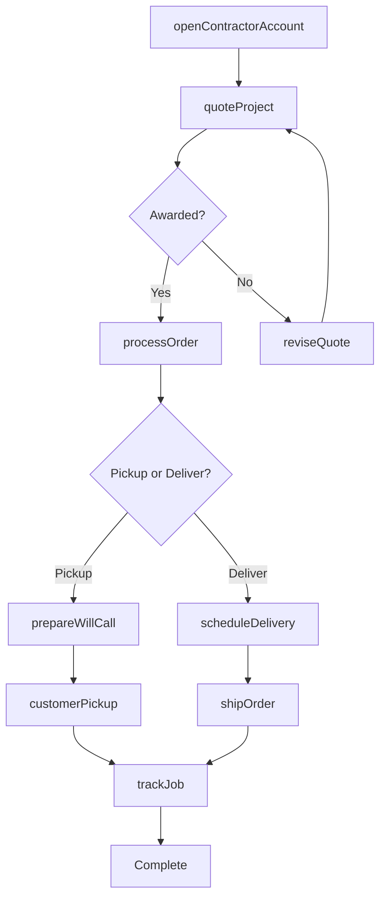
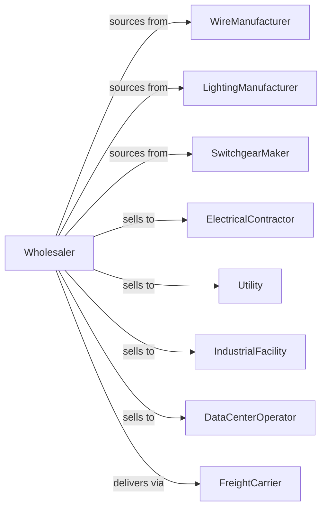

# Electrical Apparatus and Equipment, Wiring Supplies, and Related Equipment Merchant Wholesalers

> Business-as-Code definition for electrical distribution operations. Models procurement, contractor fulfillment, and jobsite delivery for wire, lighting, and power equipment.

## Overview

Electrical wholesalers distribute wire, cable, conduit, lighting fixtures, switchgear, transformers, and wiring devices to electrical contractors, utilities, and industrial facilities. This definition exposes actions for product sourcing, contractor counter operations, and project quotation with events for commodity pricing and inventory optimization.

## Actors

| Actor | Description |
|-------|-------------|
| WireManufacturer | Produces electrical wire and cable |
| LightingManufacturer | Makes lighting fixtures and controls |
| SwitchgearMaker | Produces panels and distribution equipment |
| ElectricalContractor | Installs electrical systems |
| Utility | Power company purchasing equipment |
| IndustrialFacility | Factory or plant buying supplies |
| DataCenterOperator | Purchases power distribution equipment |
| FreightCarrier | Provides delivery services |

## Roles

| Role | Description |
|------|-------------|
| BranchManager | Oversees counter and warehouse operations |
| OutsideSalesRep | Serves contractor and project accounts |
| CounterSalesRep | Handles walk-in and call-in orders |
| ProjectQuoter | Prices large project bids |
| InventoryManager | Manages stock and commodity position |
| WireCutter | Measures and cuts wire and cable to custom lengths at the counter |

## Entities

| Entity | Description |
|--------|-------------|
| Product | Electrical product with specs |
| Inventory | Stock levels by branch location |
| PurchaseOrder | Order placed with manufacturer |
| SalesOrder | Customer order for products |
| ProjectQuote | Multi-item project quotation |
| WillCall | Customer pickup order |
| Delivery | Jobsite delivery shipment |
| ContractorAccount | Customer profile with pricing |
| CommodityPrice | Wire and metal pricing |
| Job | Construction project being supplied |
| Return | Customer return authorization |

## Actions

| Action | Description |
|--------|-------------|
| sourceProduct | Identify and onboard product lines |
| placeOrder | Submit purchase order to manufacturer |
| receiveInventory | Check in incoming products |
| stockBranch | Store products at branch |
| openContractorAccount | Set up new customer |
| quoteProject | Price materials for job bid |
| processOrder | Fulfill customer order |
| prepareWillCall | Stage order for pickup |
| scheduleDelivery | Arrange jobsite delivery |
| shipOrder | Dispatch order to customer |
| processReturn | Handle customer returns |
| updatePricing | Adjust prices for commodity changes |
| trackJob | Monitor project material delivery |
| cutWire | Cut wire to specified length |

## Events

| Event | Description |
|-------|-------------|
| orderReceived | Customer placed order |
| inventoryReceived | Manufacturer shipment arrived |
| willCallStaged | Pickup order staged |
| orderDelivered | Customer received products |
| projectQuoted | Bid pricing submitted |
| projectAwarded | Won project bid |
| commodityPriceChanged | Wire metal pricing shifted |
| accountOpened | New contractor authorized |
| returnProcessed | Return completed |
| stockDepleted | Inventory fell below reorder level |
| deliveryScheduled | Jobsite delivery confirmed |
| jobCompleted | Project fully supplied |

## Searches

| Search | Description |
|--------|-------------|
| findProducts | Search by category, brand, specs |
| getInventory | Check stock by branch |
| getOrders | Retrieve orders by status |
| getContractors | Search customer accounts |
| getProjects | Track quoted and active jobs |
| getWillCalls | List pending pickups |
| getDeliveries | View scheduled deliveries |

## Workflow



## Actor Relationships



## Usage

### Calling Actions

```typescript
import { wholesaleElectricalApparatus } from '@headlessly/wholesale-electrical-apparatus'

const wholesaler = wholesaleElectricalApparatus()

// Search wire inventory
const wire = await wholesaler.findProducts({
  category: 'building-wire',
  type: 'THHN',
  gauge: '10',
  color: 'green'
})

// Quote project materials
const quote = await wholesaler.quoteProject({
  contractorId: 'sparky-electric-123',
  jobName: 'Office Building TI',
  items: [
    { productId: 'THHN-10-GRN', quantity: 2000, unit: 'ft' },
    { productId: 'LED-TROFFER-2x4', quantity: 50 },
    { productId: 'PANEL-200A-MLO', quantity: 2 }
  ],
  validDays: 30
})

// Schedule jobsite delivery
await wholesaler.scheduleDelivery({
  orderId: quote.orderId,
  jobsiteAddress: '1234 Construction Blvd',
  date: '2024-03-20',
  liftgate: true,
  contactPhone: '555-123-4567'
})
```

### Event-Driven Automation

```typescript
// Update pricing on commodity changes
wholesaler.commodityPriceChanged(async ({ commodity, changePercent }) => {
  if (Math.abs(changePercent) > 2) {
    await wholesaler.updatePricing({
      category: 'wire',
      adjustment: changePercent,
      effectiveDate: new Date()
    })
  }
})

// Notify on will call ready
wholesaler.willCallStaged(async ({ orderId, contractorId }) => {
  await notifyContractor({
    contractorId,
    message: `Order ${orderId} ready for pickup`
  })
})
```
