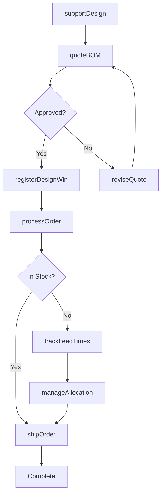
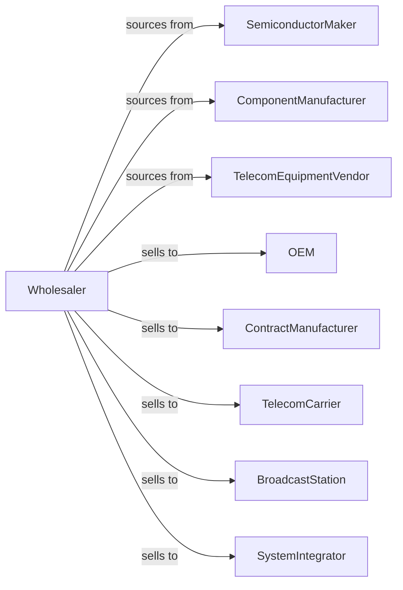

# Other Electronic Parts and Equipment Merchant Wholesalers

> Business-as-Code definition for electronic components wholesale distribution. Models procurement, technical sales, and fulfillment for semiconductors, components, and telecommunications equipment.

## Overview

Electronic parts wholesalers distribute semiconductors, passive components, connectors, telecommunications equipment, and broadcasting equipment to manufacturers, OEMs, and service providers. This definition exposes actions for product sourcing, technical design support, and supply chain management with events for product lifecycle and inventory optimization.

## Actors

| Actor | Description |
|-------|-------------|
| SemiconductorMaker | Produces chips and integrated circuits |
| ComponentManufacturer | Makes passive components and connectors |
| TelecomEquipmentVendor | Produces network and communications gear |
| OEM | Original equipment manufacturer |
| ContractManufacturer | Builds products for other brands |
| TelecomCarrier | Wireless or wireline service provider |
| BroadcastStation | Radio or television broadcaster |
| SystemIntegrator | Builds custom electronic systems |

## Roles

| Role | Description |
|------|-------------|
| ProductLineManager | Manages semiconductor and component lines |
| FieldApplicationEngineer | Provides technical design support |
| AccountManager | Serves OEM and manufacturer accounts |
| SupplyChainSpecialist | Manages inventory and demand planning |
| TechnicalSalesRep | Sells complex technical products |

## Entities

| Entity | Description |
|--------|-------------|
| Component | Electronic part with specifications |
| Inventory | Stock levels with date codes |
| PurchaseOrder | Order placed with manufacturer |
| SalesOrder | Customer order for components |
| BOM | Bill of materials for design |
| DateCode | Manufacturing date for components |
| Franchise | Authorized distributor agreement |
| Quote | Price quotation for components |
| DesignWin | Customer design using components |
| LeadTime | Delivery time from manufacturer |
| Allocation | Supply constraint quantity |

## Actions

| Action | Description |
|--------|-------------|
| sourceComponent | Identify and authorize product lines |
| placeOrder | Submit purchase order to manufacturer |
| receiveInventory | Check in with date code tracking |
| stockWarehouse | Store components in ESD-safe location |
| quoteBOM | Price customer bill of materials |
| processOrder | Fulfill customer component order |
| shipOrder | Dispatch components to customer |
| supportDesign | Provide technical application support |
| trackLeadTimes | Monitor manufacturer delivery times |
| manageAllocation | Handle supply constraint distribution |
| processReturn | Handle customer returns |
| trackDateCodes | Monitor component age and rotation |
| registerDesignWin | Log customer design using parts |
| forecastDemand | Project component requirements |

## Events

| Event | Description |
|-------|-------------|
| orderReceived | Customer placed order |
| inventoryReceived | Manufacturer shipment arrived |
| orderShipped | Components dispatched |
| orderDelivered | Customer received components |
| designWinRegistered | Customer design logged |
| leadTimeChanged | Manufacturer delivery shifted |
| allocationIssued | Supply constraint announced |
| dateCodeAged | Components approached age limit |
| productReachedEOL | Component end-of-life announced |
| newProductIntroduced | New component available |
| stockDepleted | Inventory fell below reorder level |
| franchiseRenewed | Distribution agreement renewed |

## Searches

| Search | Description |
|--------|-------------|
| findComponents | Search by part number, specs, cross-ref |
| getInventory | Check stock with date codes |
| getOrders | Retrieve orders by status |
| getLeadTimes | View current delivery times |
| getAllocations | Track supply constraints |
| getDesignWins | List registered designs |
| getBOMs | Access customer bills of materials |

## Workflow



## Actor Relationships



## Usage

### Calling Actions

```typescript
import { wholesaleElectronicParts } from '@headlessly/wholesale-electronic-parts'

const wholesaler = wholesaleElectronicParts()

// Search components
const capacitors = await wholesaler.findComponents({
  category: 'capacitor',
  type: 'ceramic',
  value: '100nF',
  package: '0603'
})

// Quote customer BOM
const quote = await wholesaler.quoteBOM({
  customerId: 'oem-456',
  projectName: 'IoT Sensor v2',
  items: [
    { partNumber: 'CAP-100NF-0603', quantity: 10000 },
    { partNumber: 'MCU-ARM-M4-64', quantity: 1000 },
    { partNumber: 'CONN-USB-C', quantity: 1000 }
  ],
  targetPrice: true
})

// Register design win
await wholesaler.registerDesignWin({
  customerId: 'oem-456',
  projectName: 'IoT Sensor v2',
  annualVolume: 50000,
  productionStart: '2024-Q3'
})
```

### Event-Driven Automation

```typescript
// Alert on allocation constraints
wholesaler.allocationIssued(async ({ partNumber, availableQty }) => {
  const affectedCustomers = await getCustomersWithBackorders(partNumber)

  for (const customer of affectedCustomers) {
    await notifyCustomer({
      customerId: customer.id,
      message: `Allocation on ${partNumber}: ${availableQty} units available`
    })
  }
})

// Rotate aging inventory
wholesaler.dateCodeAged(async ({ partNumber, dateCode, ageMonths }) => {
  if (ageMonths > 24) {
    await wholesaler.createPromotion({
      partNumber,
      dateCode,
      discount: 15,
      reason: 'date-code-rotation'
    })
  }
})
```
