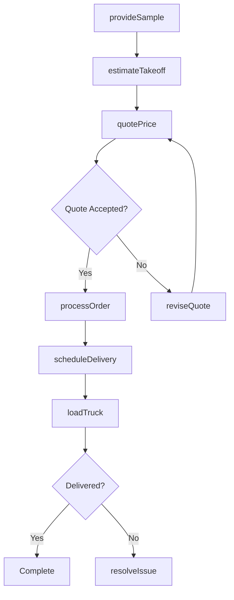
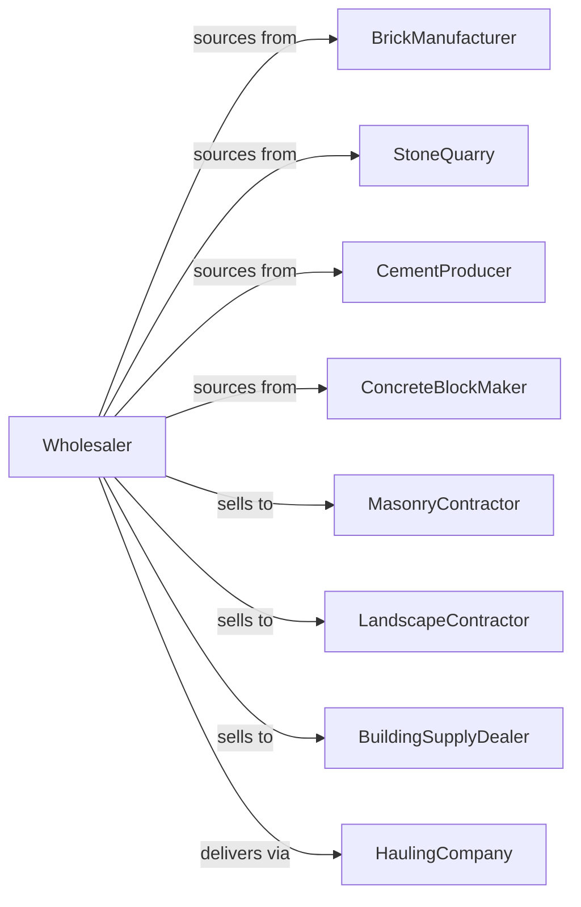

# Brick, Stone, and Related Construction Material Merchant Wholesalers

> Business-as-Code definition for masonry materials wholesale distribution. Models procurement, yard operations, and contractor fulfillment for brick, stone, and concrete products.

## Overview

Brick and stone wholesalers distribute masonry products including brick, natural stone, cement, concrete blocks, pavers, and aggregates to contractors, masonry suppliers, and building material dealers. This definition exposes actions for product sourcing, inventory management, and heavy material delivery with events for project scheduling and stock optimization.

## Actors

| Actor | Description |
|-------|-------------|
| BrickManufacturer | Produces clay brick and pavers |
| StoneQuarry | Supplies natural and cut stone |
| CementProducer | Manufactures portland cement |
| ConcreteBlockMaker | Produces CMU and concrete products |
| MasonryContractor | Installs brick, stone, and block |
| LandscapeContractor | Uses pavers and decorative stone |
| BuildingSupplyDealer | Resells masonry materials |
| HaulingCompany | Provides flatbed and dump delivery |

## Roles

| Role | Description |
|------|-------------|
| ProductManager | Sources products and manages vendors |
| YardManager | Oversees material handling and storage |
| SalesRepresentative | Serves contractor accounts |
| EstimatorSupport | Assists with material takeoffs |
| DispatchCoordinator | Schedules deliveries and trucks |

## Entities

| Entity | Description |
|--------|-------------|
| Product | Masonry item with specs and unit pricing |
| Inventory | Stock levels by product and yard location |
| PurchaseOrder | Order placed with manufacturer |
| SalesOrder | Customer order for materials |
| Delivery | Scheduled material shipment |
| Yard | Storage facility for heavy materials |
| Pallet | Unit of packaged brick or block |
| Takeoff | Material quantity estimate for project |
| Sample | Product sample for customer evaluation |
| Quote | Price quotation for materials |
| LoadTicket | Delivery documentation |

## Actions

| Action | Description |
|--------|-------------|
| sourceProduct | Identify and qualify suppliers |
| placeOrder | Submit purchase order to manufacturer |
| receiveMaterial | Check in incoming product shipment |
| stockYard | Store materials in yard locations |
| provideSample | Send product samples to customer |
| estimateTakeoff | Calculate materials for project |
| quotePrice | Generate customer price quotation |
| processOrder | Fulfill customer material order |
| scheduleDelivery | Arrange heavy material delivery |
| loadTruck | Prepare materials for shipment |
| processReturn | Handle customer returns |
| cycleCount | Verify physical inventory |
| manageBin | Organize yard storage locations |
| forecastDemand | Project material requirements |

## Events

| Event | Description |
|-------|-------------|
| orderReceived | Customer placed material order |
| materialReceived | Manufacturer shipment arrived |
| orderLoaded | Materials placed on delivery vehicle |
| orderDelivered | Customer received materials |
| sampleRequested | Customer requested product sample |
| takeoffCompleted | Project estimate finished |
| quoteAccepted | Customer approved quotation |
| stockDepleted | Inventory fell below reorder level |
| deliveryScheduled | Shipment date confirmed |
| returnProcessed | Customer return completed |
| priceChanged | Manufacturer adjusted pricing |

## Searches

| Search | Description |
|--------|-------------|
| findProducts | Search by type, color, size |
| getInventory | Check stock levels and locations |
| getOrders | Retrieve orders by status |
| getDeliveries | Track scheduled shipments |
| getQuotes | List active quotations |
| getTakeoffs | Access project estimates |
| getSamples | Track sample requests |

## Workflow



## Actor Relationships



## Usage

### Calling Actions

```typescript
import { wholesaleBrick } from '@headlessly/wholesale-brick'

const wholesaler = wholesaleBrick()

// Search masonry products
const products = await wholesaler.findProducts({
  type: 'brick',
  color: 'red-blend',
  finish: 'tumbled'
})

// Estimate takeoff for project
const takeoff = await wholesaler.estimateTakeoff({
  projectId: 'project-123',
  area: 2500,
  product: 'standard-modular',
  wasteFactor: 0.05
})

// Process order with delivery
await wholesaler.processOrder({
  customerId: 'mason-456',
  items: takeoff.materials,
  deliveryDate: '2024-04-01',
  jobsiteAddress: '1234 Building Lane',
  forkliftUnload: true
})
```

### Event-Driven Automation

```typescript
// Follow up on sample requests
wholesaler.sampleRequested(async ({ customerId, productId }) => {
  await wholesaler.provideSample({
    customerId,
    productId,
    followUpDays: 7
  })

  await scheduleFollowUp({
    customerId,
    type: 'sample-review',
    daysOut: 5
  })
})

// Auto-reorder on low stock
wholesaler.stockDepleted(async ({ productId, currentQty }) => {
  const demand = await wholesaler.forecastDemand({ productId })

  await wholesaler.placeOrder({
    productId,
    quantity: demand.recommended,
    priority: 'standard'
  })
})
```
