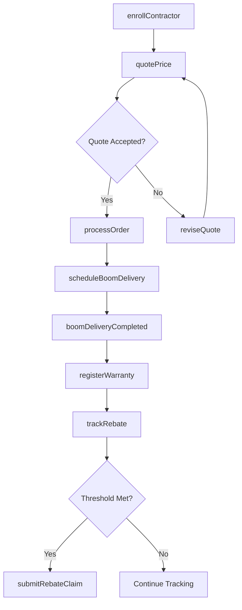
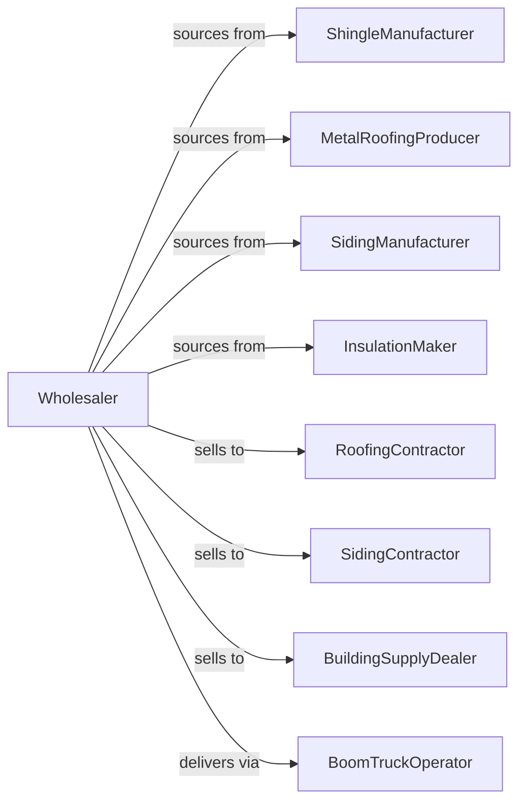

# Roofing, Siding, and Insulation Material Merchant Wholesalers

> Business-as-Code definition for roofing and exterior materials wholesale distribution. Models procurement, contractor programs, and jobsite delivery operations.

## Overview

Roofing and siding wholesalers distribute shingles, metal roofing, vinyl and fiber cement siding, insulation, and related accessories to roofing contractors, siding installers, and building material dealers. This definition exposes actions for product sourcing, contractor program management, and rooftop delivery with events for storm demand and inventory optimization.

## Actors

| Actor | Description |
|-------|-------------|
| ShingleManufacturer | Produces asphalt and composite shingles |
| MetalRoofingProducer | Manufactures standing seam and panels |
| SidingManufacturer | Produces vinyl and fiber cement siding |
| InsulationMaker | Manufactures fiberglass and foam insulation |
| RoofingContractor | Installs roofing systems |
| SidingContractor | Installs exterior cladding |
| BuildingSupplyDealer | Resells roofing materials |
| BoomTruckOperator | Provides rooftop delivery services |

## Roles

| Role | Description |
|------|-------------|
| BrandManager | Manages manufacturer relationships |
| WarehouseManager | Oversees inventory and operations |
| ContractorSalesRep | Serves roofing and siding contractors |
| ProgramCoordinator | Administers rebate and loyalty programs |
| DeliveryDispatcher | Schedules boom truck deliveries |

## Entities

| Entity | Description |
|--------|-------------|
| Product | Roofing or siding item with specs |
| Inventory | Stock levels by product and location |
| PurchaseOrder | Order placed with manufacturer |
| SalesOrder | Customer order for materials |
| ContractorProgram | Rebate and incentive program |
| Delivery | Scheduled jobsite shipment |
| BoomDelivery | Rooftop crane delivery |
| Warehouse | Distribution and storage facility |
| RebateClaim | Contractor rebate submission |
| Warranty | Manufacturer product warranty |
| Quote | Price quotation for materials |

## Actions

| Action | Description |
|--------|-------------|
| sourceProduct | Identify and contract suppliers |
| placeOrder | Submit purchase order to manufacturer |
| receiveMaterial | Check in incoming shipment |
| stockInventory | Store materials in warehouse |
| enrollContractor | Add contractor to loyalty program |
| quotePrice | Generate customer price quotation |
| processOrder | Fulfill contractor material order |
| scheduleBoomDelivery | Arrange rooftop placement |
| trackRebate | Monitor contractor rebate earnings |
| submitRebateClaim | File rebate with manufacturer |
| registerWarranty | Activate product warranty |
| handleClaim | Process warranty or damage claim |
| forecastStormDemand | Project demand after weather events |
| transferInventory | Move stock between locations |

## Events

| Event | Description |
|-------|-------------|
| orderReceived | Contractor placed material order |
| materialReceived | Manufacturer shipment arrived |
| orderShipped | Materials dispatched for delivery |
| orderDelivered | Contractor received materials |
| boomDeliveryCompleted | Rooftop placement finished |
| rebateEarned | Contractor qualified for rebate |
| rebatePaid | Rebate payment processed |
| warrantyRegistered | Product warranty activated |
| claimFiled | Warranty claim submitted |
| stormDetected | Major storm event in territory |
| stockDepleted | Inventory fell below reorder level |
| priceChanged | Manufacturer adjusted pricing |

## Searches

| Search | Description |
|--------|-------------|
| findProducts | Search by type, brand, color |
| getInventory | Check stock levels and locations |
| getOrders | Retrieve orders by status |
| getDeliveries | Track scheduled shipments |
| getContractorPrograms | View program enrollment |
| getRebates | Track rebate earnings and claims |
| getWarranties | Access warranty registrations |

## Workflow



## Actor Relationships



## Usage

### Calling Actions

```typescript
import { wholesaleRoofing } from '@headlessly/wholesale-roofing'

const wholesaler = wholesaleRoofing()

// Search roofing products
const shingles = await wholesaler.findProducts({
  type: 'architectural-shingles',
  brand: 'gaf',
  color: 'charcoal'
})

// Process contractor order with boom delivery
const order = await wholesaler.processOrder({
  contractorId: 'roofer-123',
  items: [
    { sku: 'GAF-TIMB-CHAR', quantity: 45, unit: 'squares' },
    { sku: 'ICE-WATER-36', quantity: 10, unit: 'rolls' }
  ],
  programId: 'pro-rewards'
})

// Schedule rooftop delivery
await wholesaler.scheduleBoomDelivery({
  orderId: order.id,
  address: '5678 Home Street',
  date: '2024-03-25',
  accessNotes: 'Driveway access, 40ft reach needed'
})
```

### Event-Driven Automation

```typescript
// Prepare for storm demand surge
wholesaler.stormDetected(async ({ region, severity }) => {
  if (severity >= 'moderate') {
    const forecast = await wholesaler.forecastStormDemand({
      region,
      severity
    })

    await wholesaler.placeOrder({
      items: forecast.recommendedStock,
      priority: 'emergency'
    })
  }
})

// Auto-submit contractor rebates
wholesaler.rebateEarned(async ({ contractorId, programId, amount }) => {
  await wholesaler.submitRebateClaim({
    contractorId,
    programId,
    amount,
    period: getCurrentQuarter()
  })
})
```
