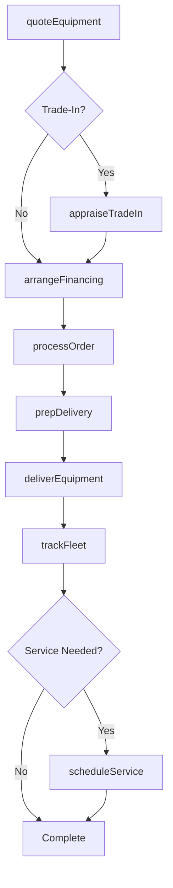
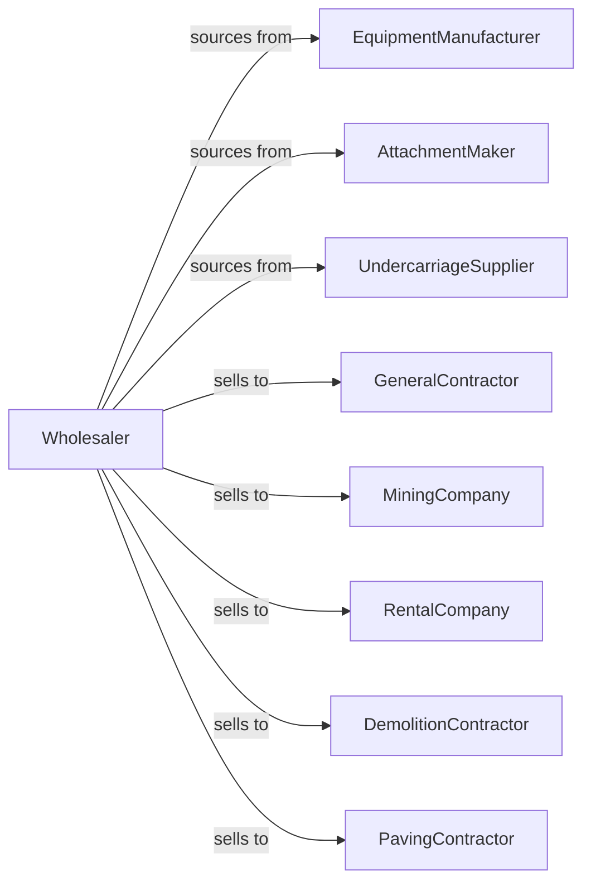

# Construction and Mining (except Oil Well) Machinery and Equipment Merchant Wholesalers

> Business-as-Code definition for heavy equipment wholesale distribution. Models procurement, dealer networks, and equipment lifecycle management for construction and mining machinery.

## Overview

Construction and mining equipment wholesalers distribute excavators, loaders, bulldozers, cranes, crushing equipment, and related attachments to contractors, mining operations, and rental companies. This definition exposes actions for equipment sourcing, dealer program management, and parts support with events for fleet lifecycle and service coordination.

## Actors

| Actor | Description |
|-------|-------------|
| EquipmentManufacturer | Produces construction and mining machinery |
| AttachmentMaker | Manufactures buckets, blades, and specialized attachments |
| UndercarriageSupplier | Provides tracks, rollers, and undercarriage components |
| GeneralContractor | Builds commercial and infrastructure projects |
| MiningCompany | Operates surface or underground mining operations |
| RentalCompany | Rents equipment to contractors and operators |
| DemolitionContractor | Demolishes structures and processes debris |
| PavingContractor | Constructs roads and parking surfaces |

## Roles

| Role | Description |
|------|-------------|
| TerritoryManager | Oversees sales territory and dealer relationships |
| ProductSpecialist | Provides technical equipment expertise |
| PartsManager | Manages parts inventory and ordering |
| ServiceCoordinator | Schedules equipment service and repairs |
| FinanceSpecialist | Structures equipment financing and leases |
| FieldServiceTech | Performs on-site heavy equipment repairs at job sites |

## Entities

| Entity | Description |
|--------|-------------|
| Equipment | Heavy machinery with serial number and specs |
| Inventory | Available new and used equipment |
| PurchaseOrder | Order placed with manufacturer |
| SalesOrder | Customer order for equipment |
| Attachment | Accessory or tool for equipment |
| ServiceRecord | Maintenance and repair history |
| Warranty | Equipment warranty coverage |
| Financing | Loan or lease arrangement |
| TradeIn | Equipment accepted in exchange |
| Part | Replacement component for equipment |
| Rental | Temporary equipment use agreement |

## Actions

| Action | Description |
|--------|-------------|
| sourceEquipment | Identify and order from manufacturers |
| receiveEquipment | Inspect and check in new machinery |
| prepDelivery | Configure and test equipment for customer |
| quoteEquipment | Price equipment with options and financing |
| processOrder | Fulfill customer equipment order |
| deliverEquipment | Transport to customer site |
| appraiseTradeIn | Value customer trade-in equipment |
| arrangeFinancing | Structure loan or lease terms |
| orderParts | Procure replacement components |
| scheduleService | Book equipment maintenance |
| performService | Execute repairs and maintenance |
| processWarranty | Handle manufacturer warranty claims |
| trackFleet | Monitor customer equipment status |
| reconUsed | Refurbish used equipment for resale |

## Events

| Event | Description |
|-------|-------------|
| equipmentReceived | New machinery arrived from manufacturer |
| quoteRequested | Customer requested equipment pricing |
| orderPlaced | Customer purchased equipment |
| equipmentDelivered | Machinery delivered to customer |
| tradeInReceived | Customer equipment accepted |
| financingApproved | Loan or lease approved |
| serviceScheduled | Maintenance appointment confirmed |
| serviceCompleted | Repairs or maintenance finished |
| warrantyClaimFiled | Warranty repair submitted |
| partShipped | Replacement component dispatched |
| equipmentReturned | Rental equipment came back |
| fleetIssueDetected | Fleet equipment issue detected via monitoring |

## Searches

| Search | Description |
|--------|-------------|
| findEquipment | Search by type, capacity, age |
| getInventory | Check available equipment |
| getOrders | Retrieve orders by status |
| getServiceHistory | View equipment maintenance records |
| getParts | Search parts availability |
| getCustomerFleet | List customer equipment |
| getWarrantyClaims | Track warranty status |

## Workflow



## Actor Relationships



## Usage

### Calling Actions

```typescript
import { wholesaleHeavyEquipment } from '@headlessly/wholesale-heavy-equipment'

const wholesaler = wholesaleHeavyEquipment()

// Search excavator inventory
const excavators = await wholesaler.findEquipment({
  type: 'excavator',
  operatingWeight: { min: 20000, max: 40000 },
  condition: 'new',
  brand: 'caterpillar'
})

// Quote with trade-in
const quote = await wholesaler.quoteEquipment({
  customerId: 'contractor-789',
  equipmentId: excavators[0].id,
  attachments: ['quick-coupler', 'thumb'],
  tradeIn: {
    serialNumber: 'CAT-EX-12345',
    hours: 8500
  }
})

// Arrange financing
await wholesaler.arrangeFinancing({
  quoteId: quote.id,
  term: 60,
  downPayment: 50000,
  type: 'lease'
})
```

### Event-Driven Automation

```typescript
// Schedule service on fleet alerts
wholesaler.fleetIssueDetected(async ({ customerId, serialNumber, alertType }) => {
  if (alertType === 'maintenance-due') {
    await wholesaler.scheduleService({
      customerId,
      serialNumber,
      serviceType: 'preventive',
      priority: 'normal'
    })
  }
})

// Process warranty on service completion
wholesaler.serviceCompleted(async ({ workOrderId, serialNumber, warrantyEligible }) => {
  if (warrantyEligible) {
    await wholesaler.processWarranty({
      serialNumber,
      workOrderId,
      laborHours: getLabor(workOrderId),
      parts: getParts(workOrderId)
    })
  }
})
```
