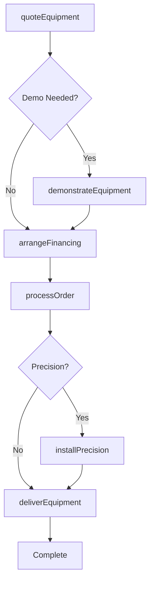
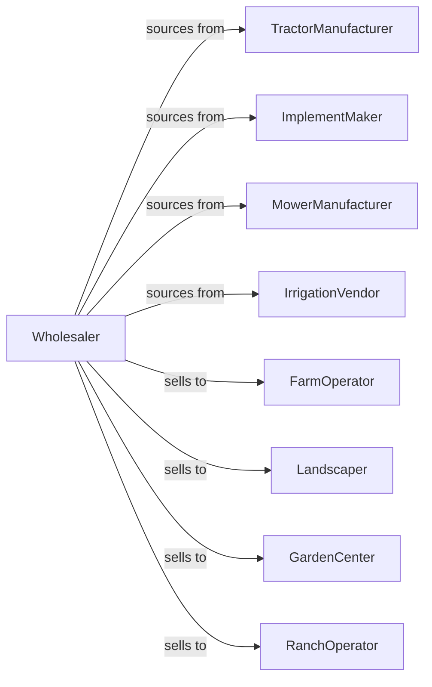

# Farm and Garden Machinery and Equipment Merchant Wholesalers

> Business-as-Code definition for agricultural equipment wholesale distribution. Models dealer networks, seasonal inventory management, and precision agriculture support for farm and garden machinery.

## Overview

Farm and garden equipment wholesalers distribute tractors, combines, tillage equipment, planters, lawn mowers, and related implements to farmers, landscapers, and garden centers. This definition exposes actions for equipment sourcing, dealer program management, and precision ag integration with events for seasonal demand and parts fulfillment.

## Actors

| Actor | Description |
|-------|-------------|
| TractorManufacturer | Produces farm tractors and utility vehicles |
| ImplementMaker | Manufactures tillage, planting, and harvesting equipment |
| MowerManufacturer | Produces lawn and commercial mowing equipment |
| IrrigationVendor | Supplies irrigation systems and components |
| FarmOperator | Produces crops or livestock |
| Landscaper | Provides commercial grounds maintenance |
| GardenCenter | Retails lawn and garden equipment |
| RanchOperator | Manages livestock and range operations |

## Roles

| Role | Description |
|------|-------------|
| DealerDevelopmentMgr | Recruits and supports dealer network |
| ProductLineSpecialist | Provides technical equipment expertise |
| PartsCounterRep | Handles parts sales and orders |
| ServiceManager | Oversees equipment repair operations |
| PrecisionAgSpecialist | Supports GPS and technology integration |

## Entities

| Entity | Description |
|--------|-------------|
| Equipment | Farm or garden machinery with specs |
| Inventory | Available new and used equipment |
| PurchaseOrder | Order placed with manufacturer |
| SalesOrder | Customer order for equipment |
| Implement | Attachment or pulled equipment |
| Part | Replacement component |
| ServiceRecord | Equipment maintenance history |
| Warranty | Manufacturer warranty coverage |
| Financing | Loan or lease arrangement |
| PrecisionSystem | GPS guidance and technology package |
| SeasonalProgram | Manufacturer seasonal incentives |

## Actions

| Action | Description |
|--------|-------------|
| sourceEquipment | Order equipment from manufacturers |
| receiveInventory | Check in incoming equipment |
| stockYard | Store equipment in dealer yard |
| quoteEquipment | Price equipment and implements |
| demonstrateEquipment | Conduct field demonstration |
| processOrder | Fulfill customer equipment order |
| deliverEquipment | Transport to customer farm |
| arrangeFinancing | Structure loan or lease |
| orderParts | Procure replacement components |
| shipParts | Dispatch parts to customer |
| scheduleService | Book equipment repair |
| performService | Execute maintenance or repair |
| installPrecision | Set up GPS and precision systems |
| runSeasonalProgram | Execute manufacturer promotions |

## Events

| Event | Description |
|-------|-------------|
| equipmentReceived | Machinery arrived from manufacturer |
| demoScheduled | Field demonstration confirmed |
| orderPlaced | Customer purchased equipment |
| equipmentDelivered | Machinery delivered to customer |
| financingApproved | Loan or lease approved |
| partOrdered | Component request received |
| partShipped | Replacement part dispatched |
| serviceScheduled | Repair appointment confirmed |
| serviceCompleted | Maintenance or repair finished |
| precisionInstalled | Technology system activated |
| seasonStarted | Planting or harvest season approaching |
| programLaunched | Seasonal promotion began |

## Searches

| Search | Description |
|--------|-------------|
| findEquipment | Search by type, horsepower, features |
| getInventory | Check available equipment |
| getOrders | Retrieve orders by status |
| getParts | Search parts availability |
| getServiceSchedule | View service appointments |
| getDealers | List authorized dealers |
| getPrograms | View active incentive programs |

## Workflow



## Actor Relationships



## Usage

### Calling Actions

```typescript
import { wholesaleFarmEquipment } from '@headlessly/wholesale-farm-equipment'

const wholesaler = wholesaleFarmEquipment()

// Search tractor inventory
const tractors = await wholesaler.findEquipment({
  type: 'tractor',
  horsepower: { min: 100, max: 150 },
  features: ['cab', 'loader-ready'],
  brand: 'john-deere'
})

// Schedule demonstration
const demo = await wholesaler.demonstrateEquipment({
  customerId: 'farm-456',
  equipmentId: tractors[0].id,
  location: 'customer-farm',
  date: '2024-03-15',
  implements: ['loader', 'rotary-cutter']
})

// Process order with precision package
await wholesaler.processOrder({
  customerId: 'farm-456',
  equipmentId: tractors[0].id,
  precisionPackage: {
    guidance: 'autosteer',
    display: '4640-universal',
    subscription: 'activation-3yr'
  }
})
```

### Event-Driven Automation

```typescript
// Prepare for seasonal demand
wholesaler.seasonStarted(async ({ season, region }) => {
  const forecast = await getForecast(season, region)

  await wholesaler.sourceEquipment({
    items: forecast.recommendedStock,
    priority: 'pre-season',
    deliveryBy: forecast.seasonStart
  })
})

// Notify on parts shipment
wholesaler.partShipped(async ({ customerId, partNumber, trackingNumber }) => {
  await notifyCustomer({
    customerId,
    message: `Part ${partNumber} shipped. Tracking: ${trackingNumber}`
  })
})
```
