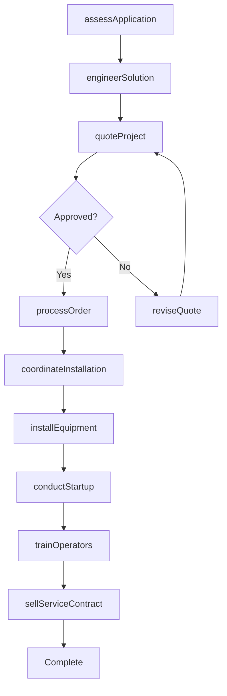
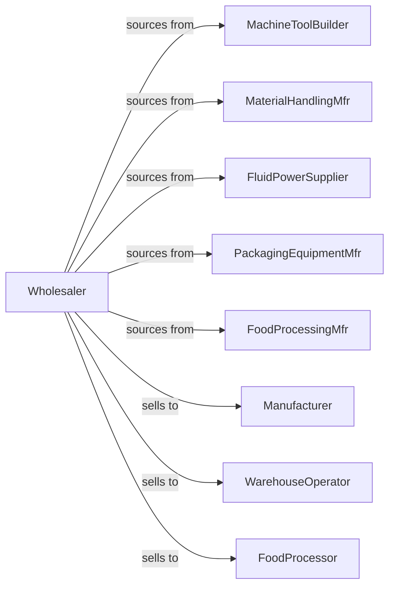

# Industrial Machinery and Equipment Merchant Wholesalers

> Business-as-Code definition for industrial machinery wholesale distribution. Models technical sales, application engineering, and equipment integration for manufacturing and processing operations.

## Overview

Industrial machinery wholesalers distribute metalworking machines, material handling equipment, fluid power systems, food processing machinery, and packaging equipment to manufacturers, processors, and warehouses. This definition exposes actions for equipment sourcing, application engineering, and installation coordination with events for project management and aftermarket support.

## Actors

| Actor | Description |
|-------|-------------|
| MachineToolBuilder | Manufactures CNC and metalworking machinery |
| MaterialHandlingMfr | Produces conveyors, lifts, and storage systems |
| FluidPowerSupplier | Manufactures hydraulic and pneumatic components |
| PackagingEquipmentMfr | Produces packaging and filling machinery |
| FoodProcessingMfr | Makes food and beverage processing equipment |
| Manufacturer | Produces goods using industrial machinery |
| WarehouseOperator | Operates distribution and fulfillment centers |
| FoodProcessor | Processes food and beverage products |

## Roles

| Role | Description |
|------|-------------|
| ApplicationEngineer | Designs equipment solutions for customer needs |
| TechnicalSalesRep | Sells complex machinery and systems |
| ProductManager | Manages specific machinery product lines |
| ServiceEngineer | Provides installation and repair support |
| ProjectCoordinator | Manages equipment installation projects |

## Entities

| Entity | Description |
|--------|-------------|
| Equipment | Industrial machinery with specifications |
| Inventory | Available new and rebuilt equipment |
| PurchaseOrder | Order placed with manufacturer |
| SalesOrder | Customer order for equipment |
| Project | Equipment installation engagement |
| Application | Customer process requirements |
| ServiceContract | Ongoing maintenance agreement |
| Part | Replacement component |
| Quote | Detailed equipment proposal |
| Installation | Equipment setup and commissioning |
| Training | Operator and maintenance instruction |

## Actions

| Action | Description |
|--------|-------------|
| sourceEquipment | Identify and order from manufacturers |
| assessApplication | Analyze customer process requirements |
| engineerSolution | Design equipment configuration |
| quoteProject | Price equipment and installation |
| processOrder | Fulfill customer equipment order |
| coordinateInstallation | Manage equipment setup project |
| installEquipment | Set up and commission machinery |
| trainOperators | Conduct equipment operation training |
| orderParts | Procure replacement components |
| performService | Execute maintenance and repairs |
| sellServiceContract | Establish ongoing support agreement |
| rebuildEquipment | Refurbish used machinery |
| integrateAutomation | Connect equipment to plant systems |
| conductStartup | Commission and validate equipment |

## Events

| Event | Description |
|-------|-------------|
| applicationAssessed | Customer requirements analyzed |
| solutionEngineered | Equipment configuration designed |
| quoteSubmitted | Proposal sent to customer |
| orderReceived | Customer placed order |
| equipmentShipped | Machinery dispatched |
| installationStarted | Setup work began |
| installationCompleted | Equipment commissioned |
| trainingCompleted | Operators certified |
| serviceScheduled | Maintenance appointment confirmed |
| serviceCompleted | Repair or maintenance finished |
| contractSigned | Service agreement executed |
| partOrdered | Component request received |

## Searches

| Search | Description |
|--------|-------------|
| findEquipment | Search by type, capacity, application |
| getInventory | Check available equipment |
| getProjects | Track installation projects |
| getQuotes | Retrieve proposals by status |
| getParts | Search parts availability |
| getServiceContracts | View active agreements |
| getApplications | Access customer requirements |

## Workflow



## Actor Relationships



## Usage

### Calling Actions

```typescript
import { wholesaleIndustrialMachinery } from '@headlessly/wholesale-industrial-machinery'

const wholesaler = wholesaleIndustrialMachinery()

// Search by type, capacity, application
const findEquipmentResult = await wholesaler.findEquipment({ status: 'active' })

// Check available equipment
const getInventoryResult = await wholesaler.getInventory({ status: 'available', category: 'main' })

// Assess customer application
const application = await wholesaler.assessApplication({
  customerId: 'mfr-789',
  process: 'cnc-machining',
  requirements: {
    partSize: { x: 24, y: 18, z: 12 },
    materials: ['aluminum', 'steel'],
    tolerances: 0.001,
    volume: 500
  }
})

// Engineer equipment solution
const solution = await wholesaler.engineerSolution({
  applicationId: application.id,
  constraints: {
    floorSpace: { width: 15, depth: 20 },
    power: '480V-3Ph',
    budget: 250000
  }
})

// Quote complete project
const quote = await wholesaler.quoteProject({
  solutionId: solution.id,
  includes: ['equipment', 'installation', 'training', 'startup'],
  serviceContract: { term: 36, coverage: 'full' }
})
```

### Event-Driven Automation

```typescript
// Track installation progress
wholesaler.installationStarted(async ({ projectId, customerId }) => {
  await notifyCustomer({
    customerId,
    message: `Installation for project ${projectId} has begun`
  })
})

// Schedule follow-up after startup
wholesaler.installationCompleted(async ({ projectId, equipmentIds }) => {
  await scheduleFollowUp({
    projectId,
    type: '30-day-checkup',
    date: addDays(new Date(), 30)
  })

  await wholesaler.trainOperators({
    projectId,
    equipmentIds,
    trainingType: 'comprehensive'
  })
})
```
