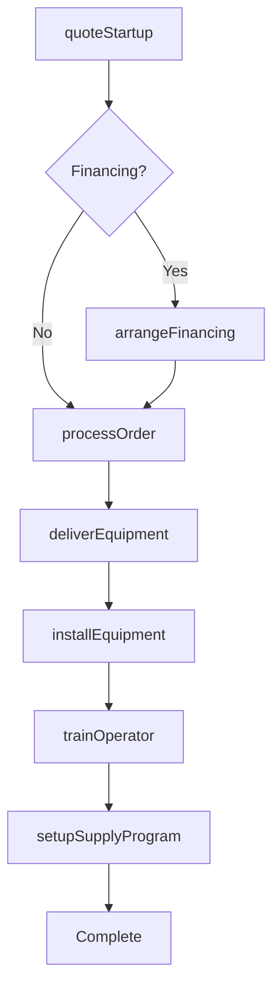
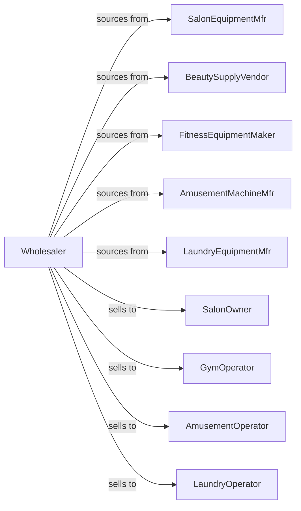

# Service Establishment Equipment and Supplies Merchant Wholesalers

> Business-as-Code definition for service industry equipment wholesale distribution. Models procurement, installation support, and supply programs for beauty, fitness, and amusement equipment.

## Overview

Service establishment equipment wholesalers distribute beauty salon equipment, barber supplies, fitness equipment, amusement machines, and laundry equipment to service businesses. This definition exposes actions for equipment sourcing, business startup support, and consumable supply programs with events for equipment lifecycle and service coordination.

## Actors

| Actor | Description |
|-------|-------------|
| SalonEquipmentMfr | Produces salon chairs and styling stations |
| BeautySupplyVendor | Manufactures hair care and cosmetic supplies |
| FitnessEquipmentMaker | Produces gym and exercise equipment |
| AmusementMachineMfr | Makes arcade games and amusement devices |
| LaundryEquipmentMfr | Produces commercial washers and dryers |
| SalonOwner | Operates hair or beauty salon |
| GymOperator | Runs fitness center or health club |
| AmusementOperator | Manages arcade or entertainment venue |
| LaundryOperator | Runs commercial laundry or laundromat |

## Roles

| Role | Description |
|------|-------------|
| TerritoryRep | Serves accounts in geographic territory |
| EquipmentSpecialist | Provides technical equipment expertise |
| SupplyCoordinator | Manages consumable supply programs |
| FinanceSpecialist | Structures equipment financing |
| ServiceTechnician | Provides equipment repair support |

## Entities

| Entity | Description |
|--------|-------------|
| Equipment | Service establishment machinery |
| Inventory | Available equipment and supplies |
| PurchaseOrder | Order placed with manufacturer |
| SalesOrder | Customer order |
| Supply | Consumable product for operations |
| StartupPackage | New business equipment bundle |
| Financing | Loan or lease arrangement |
| ServiceContract | Maintenance agreement |
| Installation | Equipment setup project |
| ConsumableProgram | Recurring supply agreement |
| Training | Equipment operation instruction |

## Actions

| Action | Description |
|--------|-------------|
| sourceEquipment | Identify and order from manufacturers |
| receiveInventory | Check in incoming equipment |
| quoteStartup | Price new business package |
| quoteEquipment | Price individual equipment |
| processOrder | Fulfill customer order |
| deliverEquipment | Transport to customer location |
| installEquipment | Set up and configure equipment |
| trainOperator | Conduct equipment training |
| arrangeFinancing | Structure loan or lease |
| setupSupplyProgram | Establish recurring consumables |
| fulfillSupply | Ship consumable order |
| scheduleService | Book equipment repair |
| performService | Execute maintenance |
| processTradeIn | Accept used equipment |

## Events

| Event | Description |
|-------|-------------|
| quoteRequested | Customer requested pricing |
| orderPlaced | Customer purchased equipment |
| equipmentShipped | Equipment dispatched |
| equipmentDelivered | Customer received equipment |
| installationCompleted | Equipment set up |
| trainingCompleted | Operator trained |
| financingApproved | Loan or lease approved |
| supplyProgramStarted | Recurring supply established |
| supplyShipped | Consumables dispatched |
| serviceScheduled | Repair appointment set |
| serviceCompleted | Maintenance finished |
| tradeInReceived | Used equipment accepted |

## Searches

| Search | Description |
|--------|-------------|
| findEquipment | Search by type, brand, features |
| getInventory | Check available equipment |
| getOrders | Retrieve orders by status |
| getStartupPackages | View business bundles |
| getSupplyPrograms | List active supply agreements |
| getServiceSchedule | View service appointments |
| getFinancing | Check financing options |

## Workflow



## Actor Relationships



## Usage

### Calling Actions

```typescript
import { wholesaleServiceEquipment } from '@headlessly/wholesale-service-equipment'

const wholesaler = wholesaleServiceEquipment()

// Search by type, brand, features
const findEquipmentResult = await wholesaler.findEquipment({ status: 'active' })

// Check available equipment
const getInventoryResult = await wholesaler.getInventory({ status: 'available', category: 'main' })

// Quote salon startup package
const startup = await wholesaler.quoteStartup({
  businessType: 'hair-salon',
  stations: 6,
  includes: [
    'styling-chairs',
    'shampoo-units',
    'dryers',
    'reception-desk',
    'retail-display'
  ],
  supplies: {
    hairCare: true,
    colorProducts: true,
    disposables: true
  }
})

// Arrange financing
const financing = await wholesaler.arrangeFinancing({
  quoteId: startup.id,
  term: 48,
  downPayment: 5000,
  type: 'equipment-loan'
})

// Setup supply program
await wholesaler.setupSupplyProgram({
  customerId: 'salon-123',
  categories: ['shampoo', 'color', 'styling', 'disposables'],
  frequency: 'monthly',
  autoReorder: true
})
```

### Event-Driven Automation

```typescript
// Schedule installation after delivery
wholesaler.equipmentDelivered(async ({ orderId, customerId }) => {
  await wholesaler.installEquipment({
    orderId,
    customerId,
    preferredDate: getNextAvailableDate(),
    duration: estimateInstallTime(orderId)
  })
})

// Auto-fulfill supply orders
wholesaler.supplyProgramStarted(async ({ programId, customerId, items }) => {
  scheduleRecurring({
    programId,
    action: async () => {
      await wholesaler.fulfillSupply({
        programId,
        items: calculateReplenishment(programId)
      })
    },
    frequency: getFrequency(programId)
  })
})
```
