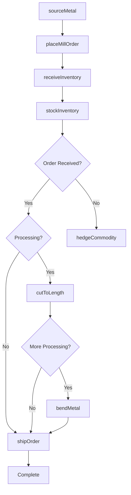
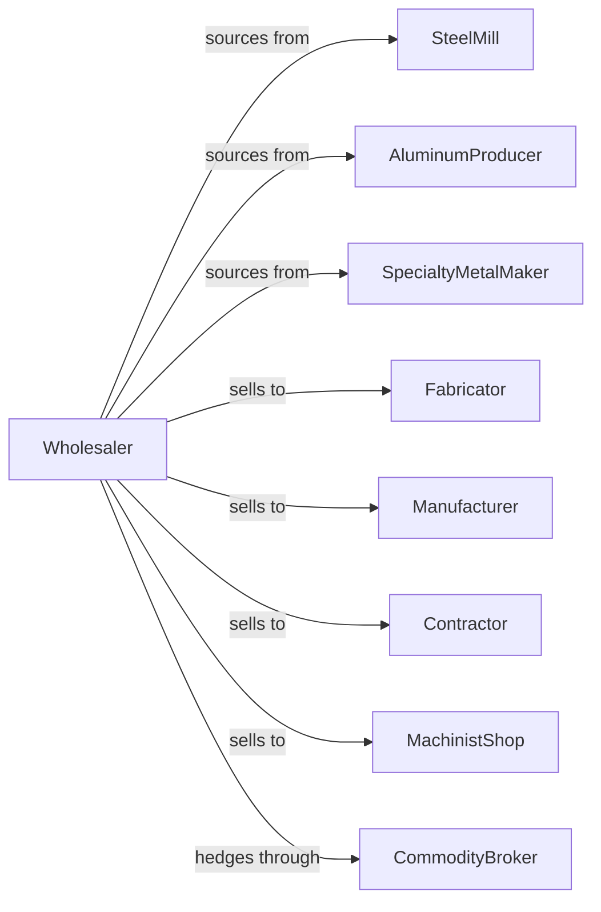

# Metal Service Centers and Other Metal Merchant Wholesalers

> Business-as-Code definition for metal service center operations. Models procurement, processing services, and fabricator fulfillment for steel, aluminum, and specialty metals.

## Overview

Metal service centers distribute steel, aluminum, stainless steel, and specialty metals while providing value-added processing including sawing, shearing, bending, and leveling to fabricators, manufacturers, and contractors. This definition exposes actions for metal sourcing, commodity management, processing services, and just-in-time delivery with events for price volatility and inventory optimization.

## Actors

| Actor | Description |
|-------|-------------|
| SteelMill | Produces flat and long steel products |
| AluminumProducer | Manufactures aluminum products |
| SpecialtyMetalMaker | Produces stainless and alloy metals |
| Fabricator | Custom metal fabrication shop |
| Manufacturer | OEM using metal components |
| Contractor | Construction company using metals |
| MachinistShop | Precision machining operation |
| CommodityBroker | Trades metal futures and contracts |

## Roles

| Role | Description |
|------|-------------|
| MetalBuyer | Sources metals and manages mill relationships |
| SalesRepresentative | Serves fabricator and OEM accounts |
| ProcessingManager | Oversees cutting and processing operations |
| InventoryManager | Manages metal stock and commodity position |
| LogisticsCoordinator | Schedules deliveries and fleet |
| SawOperator | Runs band saws, plasma cutters, and shearing equipment for value-added processing |

## Entities

| Entity | Description |
|--------|-------------|
| Metal | Steel, aluminum, or specialty metal product |
| Inventory | Stock by grade, size, and location |
| PurchaseOrder | Order placed with mill |
| SalesOrder | Customer order for metal |
| ProcessingOrder | Value-added processing work order |
| MillCertification | Material test report and certification |
| Quote | Price quotation for metal |
| HedgePosition | Commodity futures position |
| Delivery | Scheduled metal shipment |
| Remnant | Leftover material from processing |
| Coil | Rolled metal product |

## Actions

| Action | Description |
|--------|-------------|
| sourceMetal | Identify and contract with mills |
| placeMillOrder | Submit order to steel or aluminum mill |
| receiveInventory | Check in incoming metal shipment |
| stockInventory | Store metal in yard or warehouse |
| quotePrice | Generate customer price quotation |
| processOrder | Fulfill customer metal order |
| cutToLength | Saw or shear metal to specification |
| slitCoil | Cut coil to narrower widths |
| bendMetal | Form metal to specified angle |
| levelSheet | Flatten metal sheet or plate |
| shipOrder | Dispatch metal to customer |
| hedgeCommodity | Lock in metal pricing via futures |
| trackCertifications | Manage mill test reports |
| sellRemnant | Dispose of leftover material |

## Events

| Event | Description |
|-------|-------------|
| orderReceived | Customer placed metal order |
| inventoryReceived | Mill shipment arrived |
| processingCompleted | Value-added work finished |
| orderShipped | Metal dispatched to customer |
| orderDelivered | Customer received metal |
| priceChanged | Metal commodity price shifted |
| hedgeExecuted | Futures position established |
| certificationReceived | Mill test report arrived |
| stockDepleted | Inventory fell below reorder level |
| remnantBecameAvailable | Leftover material for sale |
| millAllocationReceived | Mill quota assigned |
| demandForecasted | Seasonal projection updated |

## Searches

| Search | Description |
|--------|-------------|
| findMetal | Search by grade, size, finish |
| getInventory | Check stock levels and locations |
| getOrders | Retrieve orders by status |
| getProcessingQueue | View pending work orders |
| getMillOrders | Track mill order status |
| getCertifications | Access mill test reports |
| getRemnants | List available remnants |

## Workflow



## Actor Relationships



## Usage

### Calling Actions

```typescript
import { wholesaleMetals } from '@headlessly/wholesale-metals'

const wholesaler = wholesaleMetals()

// Search steel inventory
const steel = await wholesaler.findMetal({
  type: 'hot-rolled-steel',
  grade: 'A36',
  thickness: '0.25',
  width: '48'
})

// Quote with processing
const quote = await wholesaler.quotePrice({
  customerId: 'fabricator-456',
  items: [
    { metalId: steel[0].id, quantity: 5000, unit: 'lbs' }
  ],
  processing: [
    { type: 'cut-to-length', length: 96 },
    { type: 'deburr', edges: 'all' }
  ]
})

// Process order with value-added services
await wholesaler.processOrder({
  customerId: 'fabricator-456',
  items: quote.items,
  processing: quote.processing,
  certificationRequired: true,
  deliveryDate: '2024-03-15'
})
```

### Event-Driven Automation

```typescript
// Auto-hedge on price volatility
wholesaler.priceChanged(async ({ metal, changePercent }) => {
  if (Math.abs(changePercent) > 3) {
    await wholesaler.hedgeCommodity({
      metal,
      direction: changePercent > 0 ? 'sell' : 'buy',
      quantity: calculateHedgeAmount(metal)
    })
  }
})

// Sell remnants automatically
wholesaler.remnantBecameAvailable(async ({ remnantId, metal, size }) => {
  await listRemnant({
    remnantId,
    discount: 30,
    channels: ['remnant-buyers', 'small-fab']
  })
})
```
