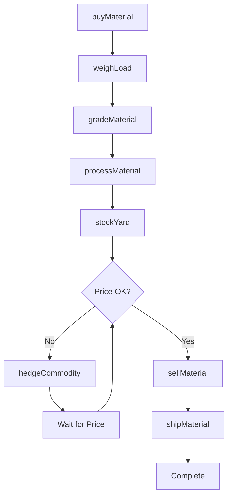
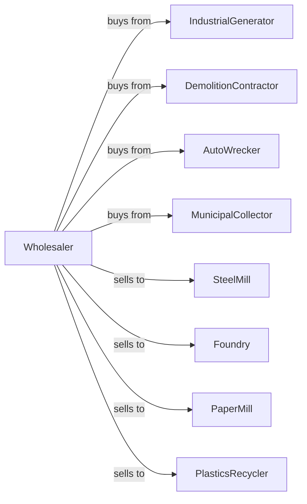

# Recyclable Material Merchant Wholesalers

> Business-as-Code definition for recyclable materials wholesale distribution. Models procurement, processing, and commodity trading for scrap metal, paper, plastics, and automotive salvage.

## Overview

Recyclable material wholesalers collect, process, and trade scrap metals, paper products, plastics, and automotive salvage materials to mills, foundries, and recycling processors. This definition exposes actions for material sourcing, grading and processing, and commodity trading with events for market pricing and environmental compliance.

## Actors

| Actor | Description |
|-------|-------------|
| IndustrialGenerator | Produces manufacturing scrap |
| DemolitionContractor | Generates building demolition materials |
| AutoWrecker | Salvages end-of-life vehicles |
| MunicipalCollector | Collects residential recyclables |
| SteelMill | Purchases ferrous scrap |
| Foundry | Buys non-ferrous metals |
| PaperMill | Purchases recycled paper |
| PlasticsRecycler | Processes plastic materials |

## Roles

| Role | Description |
|------|-------------|
| BuyingAgent | Purchases materials from generators |
| GradeSpecialist | Classifies and grades materials |
| CommodityTrader | Manages pricing and sales |
| YardManager | Oversees processing operations |
| ComplianceOfficer | Manages environmental regulations |
| ScaleOperator | Weighs inbound and outbound loads for settlement |
| BalerOperator | Operates baling and shredding equipment to process recyclables |

## Entities

| Entity | Description |
|--------|-------------|
| Material | Recyclable commodity by type |
| Inventory | Stock levels by grade |
| PurchaseTicket | Receipt for incoming material |
| SalesContract | Agreement to sell material |
| Grade | Material classification and quality |
| Load | Truckload of material |
| Vehicle | End-of-life auto for salvage |
| Commodity | Tradeable scrap material |
| Scale | Weight measurement record |
| Certificate | Environmental compliance document |
| Quote | Price quotation for material |

## Actions

| Action | Description |
|--------|-------------|
| buyMaterial | Purchase recyclables from generator |
| weighLoad | Record incoming material weight |
| gradeMaterial | Classify material quality |
| processMaterial | Sort, shred, or bale materials |
| stockYard | Store processed materials |
| quoteSale | Price material for buyer |
| sellMaterial | Execute commodity sale |
| shipMaterial | Dispatch materials to buyer |
| dismantleVehicle | Salvage auto parts and materials |
| trackCompliance | Monitor environmental requirements |
| hedgeCommodity | Lock in future pricing |
| reportInventory | Submit regulatory reports |
| recycleFluids | Process automotive fluids |
| crushVehicle | Flatten salvaged vehicles |

## Events

| Event | Description |
|-------|-------------|
| materialReceived | Incoming load arrived |
| materialGraded | Quality classification assigned |
| materialProcessed | Sorting or processing completed |
| saleCompleted | Material sold to buyer |
| materialShipped | Load dispatched |
| priceChanged | Commodity market shifted |
| vehicleDismantled | Auto salvage completed |
| complianceAudit | Environmental inspection occurred |
| inventoryUpdated | Stock levels changed |
| contractSigned | Sales agreement executed |
| hedgeExecuted | Futures position established |
| reportSubmitted | Regulatory filing completed |

## Searches

| Search | Description |
|--------|-------------|
| findMaterials | Search by type, grade, quantity |
| getInventory | Check stock by grade |
| getPurchases | Track incoming materials |
| getSales | View sales contracts |
| getPrices | Get current commodity prices |
| getVehicles | List salvage vehicles |
| getCompliance | Access regulatory status |

## Workflow



## Actor Relationships



## Usage

### Calling Actions

```typescript
import { wholesaleRecyclableMaterial } from '@headlessly/wholesale-recyclable-material'

const wholesaler = wholesaleRecyclableMaterial()

// Buy incoming scrap load
const purchase = await wholesaler.buyMaterial({
  generatorId: 'mfg-plant-456',
  materialType: 'steel-turnings',
  estimatedWeight: 20,
  unit: 'tons',
  pickupDate: '2024-04-15'
})

// Grade received material
const grading = await wholesaler.gradeMaterial({
  loadId: purchase.loadId,
  grade: '#1-busheling',
  contamination: 0.02,
  moisture: 0.01
})

// Sell to mill at market price
const { perTon } = await wholesaler.getPrices({ material: 'steel-turnings' })

await wholesaler.sellMaterial({
  buyerId: 'steel-mill-123',
  material: 'steel-turnings',
  grade: '#1-busheling',
  quantity: 500,
  unit: 'tons',
  price: perTon
})
```

### Event-Driven Automation

```typescript
// Auto-sell at target price
wholesaler.priceChanged(async ({ material, newPrice }) => {
  const targetPrice = getTargetPrice(material)

  if (newPrice >= targetPrice) {
    const inventory = await wholesaler.getInventory({ material })

    await wholesaler.sellMaterial({
      material,
      quantity: inventory.available,
      price: newPrice
    })
  }
})

// Track compliance deadlines
wholesaler.complianceAudit(async ({ auditType, findings }) => {
  if (findings.length > 0) {
    await createCorrectiveActions({
      findings,
      deadline: addDays(new Date(), 30)
    })
  }

  await wholesaler.reportInventory({
    reportType: 'post-audit',
    auditId: auditType
  })
})
```
