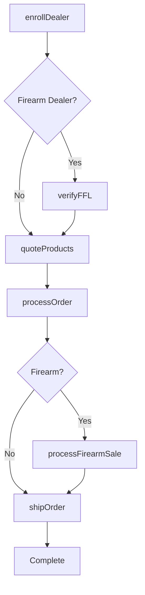
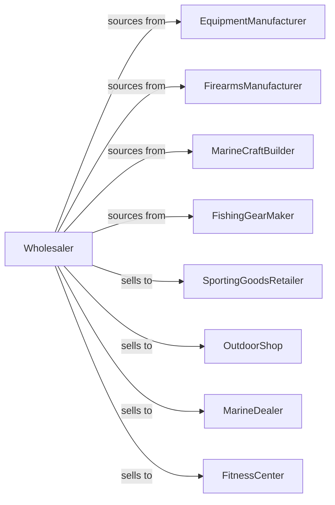

# Sporting and Recreational Goods and Supplies Merchant Wholesalers

> Business-as-Code definition for sporting goods wholesale distribution. Models procurement, dealer programs, and seasonal inventory management for athletic equipment, firearms, and marine recreational products.

## Overview

Sporting goods wholesalers distribute athletic equipment, fitness gear, firearms and ammunition, hunting and fishing supplies, and marine pleasure craft to sporting goods retailers, outdoor shops, and marine dealers. This definition exposes actions for product sourcing, dealer program management, and compliance tracking with events for seasonal demand and regulatory requirements.

## Actors

| Actor | Description |
|-------|-------------|
| EquipmentManufacturer | Produces sporting equipment and gear |
| FirearmsManufacturer | Makes sporting firearms and ammunition |
| MarineCraftBuilder | Manufactures pleasure boats and watercraft |
| FishingGearMaker | Produces fishing rods, reels, and tackle |
| SportingGoodsRetailer | Sells athletic and sporting equipment |
| OutdoorShop | Specializes in hunting and fishing supplies |
| MarineDealer | Sells boats and marine equipment |
| FitnessCenter | Purchases fitness equipment |

## Roles

| Role | Description |
|------|-------------|
| TerritoryManager | Oversees dealer accounts in region |
| ProductSpecialist | Provides expertise on product categories |
| ComplianceOfficer | Manages firearms regulations |
| MarineSpecialist | Supports boat and marine sales |
| WarehouseManager | Oversees inventory and fulfillment |

## Entities

| Entity | Description |
|--------|-------------|
| Product | Sporting or recreational item |
| Inventory | Stock levels by location |
| PurchaseOrder | Order placed with manufacturer |
| SalesOrder | Customer order for products |
| Firearm | Regulated sporting firearm |
| FFLRecord | Federal firearms license documentation |
| Vessel | Pleasure boat or watercraft |
| DealerProgram | Authorized dealer agreement |
| SeasonalPromotion | Seasonal incentive program |
| Catalog | Product catalog for dealers |
| Return | Customer return authorization |

## Actions

| Action | Description |
|--------|-------------|
| sourceProduct | Identify and onboard product lines |
| placeOrder | Submit purchase order to manufacturer |
| receiveInventory | Check in incoming products |
| stockWarehouse | Store products in locations |
| enrollDealer | Add dealer to authorized program |
| quoteProducts | Price products for dealer |
| processOrder | Fulfill dealer order |
| shipOrder | Dispatch products to customer |
| processFirearmSale | Complete regulated firearms transfer |
| verifyFFL | Validate federal firearms license |
| deliverVessel | Transport boat to dealer |
| runPromotion | Execute seasonal promotion |
| processReturn | Handle dealer returns |
| forecastSeasonal | Project seasonal demand |

## Events

| Event | Description |
|-------|-------------|
| orderReceived | Dealer placed order |
| inventoryReceived | Manufacturer shipment arrived |
| orderShipped | Products dispatched |
| orderDelivered | Customer received products |
| dealerEnrolled | New dealer authorized |
| firearmTransferred | Regulated sale completed |
| fflVerified | License validated |
| vesselDelivered | Boat delivered to dealer |
| seasonStarting | Peak season approaching |
| promotionLaunched | Seasonal special began |
| stockLow | Inventory below threshold |
| returnProcessed | Return completed |

## Searches

| Search | Description |
|--------|-------------|
| findProducts | Search by category, brand, specs |
| getInventory | Check stock levels |
| getOrders | Retrieve orders by status |
| getDealers | List authorized dealers |
| getFFLRecords | Access firearms documentation |
| getVessels | Search boat inventory |
| getPromotions | View active specials |

## Workflow



## Actor Relationships



## Usage

### Calling Actions

```typescript
import { wholesaleSportingGoods } from '@headlessly/wholesale-sporting-goods'

const wholesaler = wholesaleSportingGoods()

// Search fishing gear
const rods = await wholesaler.findProducts({
  category: 'fishing',
  type: 'rod',
  action: 'medium-heavy',
  length: 7,
  brand: 'shimano'
})

// Enroll dealer with FFL
const dealer = await wholesaler.enrollDealer({
  businessName: 'Outdoor Sports Pro',
  dealerType: 'full-line',
  ffl: {
    licenseNumber: '1-23-456-78-9A-12345',
    expiration: '2025-12-31'
  }
})

// Process firearm order
await wholesaler.processFirearmSale({
  dealerId: dealer.id,
  items: [
    { sku: 'REM-870-12GA', quantity: 5 },
    { sku: 'AMMO-12GA-00', quantity: 50 }
  ],
  fflVerification: true
})
```

### Event-Driven Automation

```typescript
// Prepare for hunting season
wholesaler.seasonStarting(async ({ season, region }) => {
  if (season === 'fall-hunting') {
    const forecast = await wholesaler.forecastSeasonal({ season, region })

    await wholesaler.placeOrder({
      items: forecast.recommendedStock,
      priority: 'pre-season'
    })
  }
})

// Track FFL expirations
wholesaler.fflVerified(async ({ dealerId, expirationDate }) => {
  const daysUntilExpiration = daysBetween(new Date(), expirationDate)

  if (daysUntilExpiration < 60) {
    await notifyDealer({
      dealerId,
      message: 'FFL renewal required within 60 days'
    })
  }
})
```
