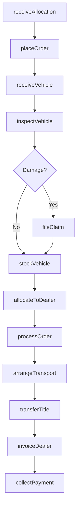
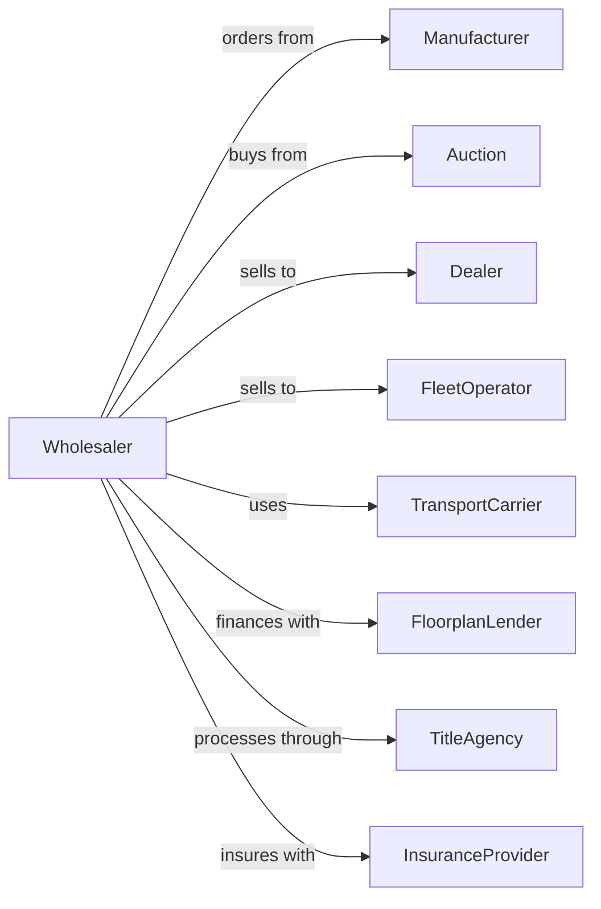

# Automobile and Other Motor Vehicle Merchant Wholesalers

> Business-as-Code definition for motor vehicle wholesale distribution operations. Models the complete vehicle acquisition, inventory management, and dealer sales cycle.

## Overview

Automobile merchant wholesalers distribute new and used passenger vehicles, trucks, motorcycles, and recreational vehicles to dealerships and fleet operators. This definition exposes actions for vehicle sourcing, inventory allocation, logistics coordination, and dealer account management with events for automated replenishment and pricing optimization.

## Actors

| Actor | Description |
|-------|-------------|
| Manufacturer | OEM producing vehicles and setting allocation quotas |
| Dealer | Retail automotive dealer purchasing inventory |
| FleetOperator | Commercial buyer acquiring multiple vehicles |
| Auction | Vehicle auction house for wholesale transactions |
| TransportCarrier | Vehicle hauler providing logistics services |
| FloorplanLender | Provides inventory financing for vehicle stock |
| TitleAgency | Processes vehicle titles and registrations |
| PortOperator | Receives and processes imported vehicles |
| InsuranceProvider | Covers inventory and transit risks |

## Roles

| Role | Description |
|------|-------------|
| InventoryManager | Manages vehicle stock levels and allocation |
| SalesRepresentative | Handles dealer accounts and order processing |
| LogisticsCoordinator | Schedules transport and delivery |
| TitleClerk | Processes documentation and registrations |
| FinanceManager | Manages floorplan and accounts receivable |

## Entities

| Entity | Description |
|--------|-------------|
| Vehicle | Individual unit with VIN, specs, and status |
| Inventory | Current stock with locations and availability |
| PurchaseOrder | Dealer order for specific vehicles |
| Allocation | Manufacturer-assigned vehicle quota |
| Invoice | Billing document for vehicle sale |
| Title | Legal ownership document |
| TransportOrder | Vehicle movement instruction |
| DealerAccount | Customer profile with credit terms |
| FloorplanLine | Financing arrangement for inventory |
| Lot | Physical storage location for vehicles |

## Actions

| Action | Description |
|--------|-------------|
| receiveAllocation | Accept manufacturer quota for new vehicles |
| placeOrder | Submit order to manufacturer or auction |
| receiveVehicle | Check in vehicle at warehouse or port |
| inspectVehicle | Verify condition and document any damage |
| stockVehicle | Add to available inventory |
| allocateToDealer | Reserve vehicle for specific dealer |
| processOrder | Fulfill dealer purchase request |
| arrangeTransport | Schedule carrier for vehicle delivery |
| transferTitle | Process ownership documentation |
| invoiceDealer | Generate and send billing |
| collectPayment | Process dealer payment |
| manageFloorplan | Track and pay inventory financing |
| auctionVehicle | List aged inventory for wholesale sale |
| reportSales | Submit manufacturer sales reports |

## Events

| Event | Description |
|-------|-------------|
| allocationReceived | New vehicle quota assigned by manufacturer |
| vehicleReceived | Unit arrived at facility |
| vehicleInspected | Condition assessment completed |
| vehicleStocked | Added to available inventory |
| orderPlaced | Dealer submitted purchase order |
| vehicleAllocated | Reserved for specific dealer |
| vehicleShipped | Left facility for delivery |
| vehicleDelivered | Arrived at dealer location |
| titleTransferred | Ownership documentation completed |
| invoiceSent | Billing transmitted to dealer |
| paymentReceived | Dealer payment processed |
| inventoryAged | Vehicle exceeded target days in stock |
| floorplanDue | Financing payment deadline approaching |

## Searches

| Search | Description |
|--------|-------------|
| findVehicles | Search inventory by make, model, color, options |
| getInventoryAging | List vehicles by days in stock |
| getDealerOrders | Retrieve pending orders by dealer |
| getAllocations | View manufacturer allocations and status |
| getTransitVehicles | Track vehicles in transport |
| findDealerAccounts | Search dealer profiles and credit status |
| getFloorplanStatus | View inventory financing positions |

## Workflow



## Actor Relationships



## Usage

### Calling Actions

```typescript
import { wholesaleAutomobile } from '@headlessly/wholesale-automobile'

const wholesaler = wholesaleAutomobile()

// Search inventory by make, model, color, options
const findVehiclesResult = await wholesaler.findVehicles({ status: 'available', make: 'toyota' })

// List vehicles by days in stock
const getInventoryAgingResult = await wholesaler.getInventoryAging({ status: 'active' })

// Receive manufacturer allocation
const allocation = await wholesaler.receiveAllocation({
  manufacturerId: 'ford-motor-co',
  period: '2024-Q1',
  models: [
    { model: 'F-150', quantity: 250 },
    { model: 'Explorer', quantity: 100 }
  ]
})

// Stock incoming vehicle
const vehicle = await wholesaler.receiveVehicle({
  vin: '1FTFW1E50KFA12345',
  locationId: 'lot-north',
  source: 'manufacturer',
  invoicePrice: 42500
})

// Process dealer order
await wholesaler.processOrder({
  dealerId: 'dealer-123',
  vehicleId: vehicle.id,
  salePrice: 44200,
  deliveryDate: '2024-02-15'
})
```

### Event-Driven Automation

```typescript
// Auto-alert on aged inventory
wholesaler.inventoryAged(async ({ vehicleId, daysInStock }) => {
  if (daysInStock > 60) {
    await wholesaler.auctionVehicle({
      vehicleId,
      reservePrice: calculateAuctionFloor(vehicleId)
    })
  }
})

// Auto-process title on delivery confirmation
wholesaler.vehicleDelivered(async ({ vehicleId, dealerId }) => {
  await wholesaler.transferTitle({
    vehicleId,
    buyerId: dealerId,
    expedited: true
  })
})
```
