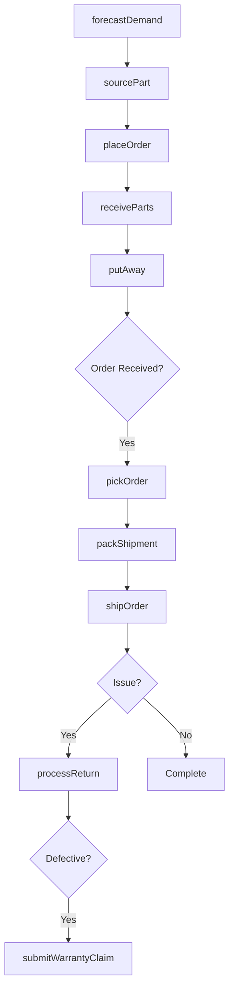
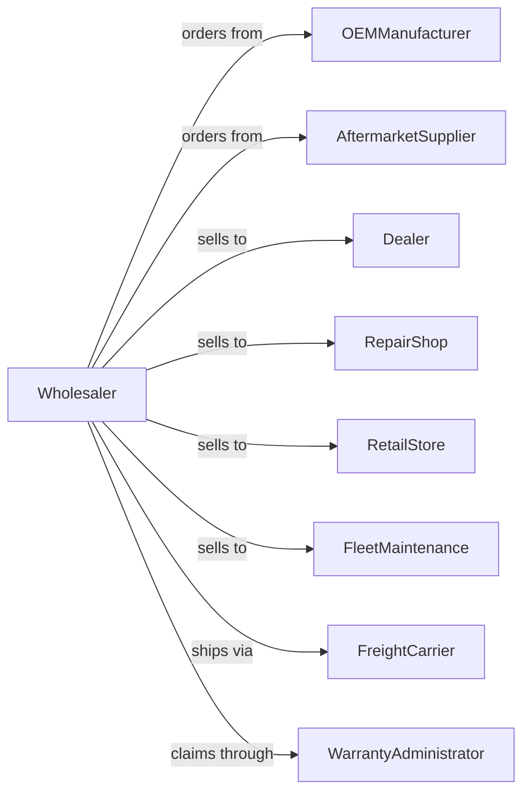

# Motor Vehicle Supplies and New Parts Merchant Wholesalers

> Business-as-Code definition for new automotive parts and supplies wholesale distribution. Models procurement, warehouse operations, and dealer fulfillment.

## Overview

Motor vehicle supplies and new parts wholesalers distribute OEM and aftermarket components including engines, transmissions, body parts, and accessories to dealers, repair shops, and retailers. This definition exposes actions for parts sourcing, inventory management, order fulfillment, and returns processing with events for demand planning and stock optimization.

## Actors

| Actor | Description |
|-------|-------------|
| OEMManufacturer | Original equipment manufacturer producing parts |
| AftermarketSupplier | Produces replacement and performance parts |
| Dealer | Automotive dealership parts department |
| RepairShop | Independent automotive service center |
| RetailStore | Auto parts retail chain or store |
| FleetMaintenance | Commercial fleet service operation |
| FreightCarrier | Ground shipping and logistics provider |
| WarrantyAdministrator | Processes manufacturer warranty claims |

## Roles

| Role | Description |
|------|-------------|
| PurchasingManager | Manages vendor relationships and ordering |
| WarehouseManager | Oversees receiving, storage, and shipping |
| PartsSpecialist | Identifies correct parts and applications |
| AccountManager | Handles customer relationships and sales |
| InventoryAnalyst | Forecasts demand and optimizes stock levels |

## Entities

| Entity | Description |
|--------|-------------|
| Part | Individual component with SKU and fitment data |
| Inventory | Stock levels across warehouse locations |
| PurchaseOrder | Order placed with supplier |
| SalesOrder | Customer order for parts |
| Shipment | Outbound delivery with tracking |
| Return | Customer return authorization and processing |
| Catalog | Parts catalog with applications and pricing |
| Warehouse | Distribution center or storage facility |
| BinLocation | Specific storage location within warehouse |
| CustomerAccount | Buyer profile with pricing and terms |
| WarrantyClaim | Defective part claim submission |

## Actions

| Action | Description |
|--------|-------------|
| sourcePart | Identify and select supplier for part |
| placeOrder | Submit purchase order to supplier |
| receiveParts | Check in incoming shipment |
| putAway | Move parts to designated bin locations |
| pickOrder | Retrieve parts for customer order |
| packShipment | Prepare order for delivery |
| shipOrder | Dispatch via carrier |
| processReturn | Handle returned parts and credit |
| submitWarrantyClaim | File claim for defective part |
| updateCatalog | Maintain parts data and pricing |
| forecastDemand | Project future parts requirements |
| reorderStock | Trigger replenishment orders |
| transferStock | Move inventory between locations |
| cycleCount | Verify physical inventory accuracy |

## Events

| Event | Description |
|-------|-------------|
| orderReceived | Customer placed parts order |
| partsReceived | Supplier shipment arrived |
| partsPutAway | Stock placed in bin locations |
| orderPicked | Parts retrieved for shipment |
| orderShipped | Delivery dispatched to customer |
| orderDelivered | Customer received shipment |
| returnRequested | Customer initiated return |
| returnProcessed | Return completed and credited |
| stockLow | Inventory below reorder point |
| stockOut | Part unavailable in warehouse |
| priceChanged | Supplier updated pricing |
| newPartAdded | New SKU added to catalog |
| warrantyApproved | Manufacturer approved claim |

## Searches

| Search | Description |
|--------|-------------|
| findParts | Search by part number, VIN, or application |
| getInventory | Check stock levels and locations |
| getOrders | Retrieve customer orders by status |
| getPurchaseOrders | List supplier orders and receipts |
| findCustomers | Search customer accounts |
| getReturns | Track return authorizations |
| getBackorders | List pending out-of-stock orders |

## Workflow



## Actor Relationships



## Usage

### Calling Actions

```typescript
import { wholesaleMotorVehicle } from '@headlessly/wholesale-motor-vehicle'

const wholesaler = wholesaleMotorVehicle()

// Search for parts by application
const parts = await wholesaler.findParts({
  year: 2022,
  make: 'Toyota',
  model: 'Camry',
  category: 'brakes'
})

// Place customer order
const order = await wholesaler.pickOrder({
  customerId: 'repair-shop-456',
  items: [
    { partNumber: 'BP-2022-CAM-F', quantity: 4 },
    { partNumber: 'RT-2022-CAM-F', quantity: 2 }
  ],
  priority: 'same-day'
})

// Ship order
await wholesaler.shipOrder({
  orderId: order.id,
  carrier: 'fedex-ground',
  signature: true
})
```

### Event-Driven Automation

```typescript
// Auto-reorder when stock is low
wholesaler.stockLow(async ({ partNumber, currentQty, reorderPoint }) => {
  const forecast = await wholesaler.forecastDemand({ partNumber })

  await wholesaler.placeOrder({
    partNumber,
    quantity: forecast.recommended,
    urgency: currentQty < reorderPoint / 2 ? 'rush' : 'standard'
  })
})

// Notify customer on shipment
wholesaler.orderShipped(async ({ orderId, trackingNumber, customerId }) => {
  await notifyCustomer({
    customerId,
    message: `Order ${orderId} shipped. Track: ${trackingNumber}`
  })
})
```
